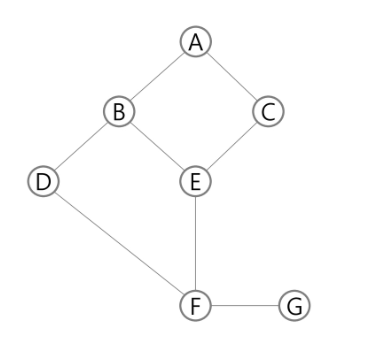

# Algorithm

---

## Stack

- 물건을 쌓아 올리듯 자료를 쌓아 올린 형태의 자료구조

- 스택에 저장된 자료는 **선형구조**
  
  - 선형구조 : 자료 간의 관계가 1대 1 구조
  
  - 비선형구조 : 자료 간의 관계가 1대 N 구조 (ex) 트리)

- 스택에 자료를 삽입하거나 꺼낼 수 있다.

- 마지막에 넣은 것을 가장 먼저 꺼낸다 
  
  - **후입 선출(LIFO : last-in-first-out)**

---

- 스택을 구현하기 위한 자료구조와 연산
  
  - 자료구조 : 자료를 선형으로 저장할 저장소
    
    - 배열 사용 가능
    
    - 저장소 자체를 스택으로 부르기도 한다
    
    - **마지막 삽입된 원소의 위치를 top = stack pointer**이라 부른다
  
  - 연산
    
    - **삽입 (push) : 저장소에 자료를 저장**
      
      - append 메소드를 통해 리스트의 마지막에 데이터 삽입
        
        ```python
        def push(item):
            s.append(item)
        ```
    
    - **삭제 (pop) : 저장소에서 자료를 꺼낸다 꺼낸 자료는 삽입한 자료의 역순으로**
      
      - ```python
        def pop():
            if len(s) == 0:
                # underflow
                return
            else:
                return s.pop(-1);
        ```
    
    - **isEmpty : 스택이 공백인지 아닌지를 확인하는 연산**
    
    - **peek : 스택의 top에 있는 item(원소)을 반환하는 연산**

---

- 스택의 장단점
  
  - 장점 : 1차원 배열로 사용하여 스택을 구현할 경우 용이
  
  - 단점 : 스택의 크기를 변경하기 어려움
  
  - 해결책 : 저장소를 동적으로 할당하여 스택을 구현하는 방법
    
    - 동적 연결리스트를 이용하여 구현하는 방법을 의미
    
    - 구현이 복잡한 단점, 메모리를 효율적으로 사용하는 장점
    
    - 스택의 동적구현은 생략

---

- 괄호검사 (스택의 응용)
  
  - 괄호의 종류 : 대괄호 [] / 중괄호 {} /소괄호 ()
  
  - 조건
    
    1. 왼쪽과 오른쪽의 괄호의 개수가 같아야한다.
    
    2. 같은 괄호에서 왼쪽 괄호는 오른쪽보다 먼저 나와야한다
    
    3. 괄호 사이에는 포함 관계만 존재
  
  - 괄호를 조사하는 알고리즘
    
    - 문자열에 있는 괄호를 차례대로 조사하면서 왼쪽 괄호를 만나면 스택에 삽입, 오른쪽 괄호를 만나면 스택의 top 괄호를 삭제한 후 오른쪽 괄호와 짝 맞는지 검사
    
    - 스택이 비어 있으면 조건 1,2 위배 / 괄호의 짝이 안맞으면 조건 3 위배
    
    - 마지막 괄호까지 조사 후에도 스택에 괄호가 남아 있으면 조건 1 위배

---

- fuction call (스택의 응용2)
  
  - 프로그램의 함수 호출과 복귀에 따른 수행 순서 관리
    
    - 가장 마지막에 호출 된 함수가 가장 먼저 실행을 완료하고 복귀하는 후입선출 구조의 스택을 이용하여 수행순서 관리
    
    - 함수 호출 시, 함수 수행에 필요한 지역변수, 매개변수 및 수행 후 복귀할 주소 등의 정보를 스택프레임(stack frame)에 저장하여 시스템 스택에 삽입
    
    - 함수의 실행이 끝나면 시스템 스택의 top 원소(스택 프레임)를 삭제(pop)하면서 프레임에 저장된 복귀 주소를 확인하고 복귀
    
    - 함수 호출과 복귀에 따라 이 과정이 반복, 전체 프로그램 수행이 종료되면 시스템 스택은 공백

---

## 재귀호출

- 자기 자신을 호출하여 순환 수행

- 함수에서 실행해야 하는 작업의 특성에 따라 일반적인 호출방식보다 재귀호출방식을 사용하여 함수를 만들면 프로그램의 크기를 줄이고 간단하게 작성 가능

- 재귀 호출 시 일정 수 이상 반복 시 에러 생김 (재귀는 깊이가 낮을 때 사용하기 때문)
  
  ```python
  def func(a, N):          # a = 현재단계 N = 목표단계
      if a == N:
          return
      else:
          func(a+1, N)
  ```
  
  - factorial 
    
    - 1부터 n까지의 모든 자연수를 곱하여 구하는 연산 
    
    - 마지막에 구한 하위 값을 이용하여 상위 값을 구하는 작업을 반복
    
    ```python
    n! = n * (n-1)!
    
    def f(n):      # 팩토리얼
        if n <= 1:
            return 1
        else:
            return n * f(n-1)
    
    for i in range(N):
        print(i, f(i)
    ```
  
  - 피보나치
    
    - 0 과 1로 시작하고 이전 두 수 합을 다음 항으로 하는 수열
    
    ```python
    F(i) = F(i-1) + F(i-2) (for i >= 2)
    
    def fibo(n):
        if n < 2:
            return n
        else:
            return fibo(n-1) + fibo(n-2)
    ```
  
  - Memoization
    
    - 엄청난 중복 호출이 존재할 때 사용 (ex) 피보나치 재귀 함수)
    
    - 컴퓨터 프로그램을 실행할 때 이전에 계산한 값을 메모리에 저장해서 매번 다시 계산하지 않도록 하여 전체적인 실행 속도를 빠르게 하는 기술(동적계획법의 핵심 기술)
    
    - memoization은 메모리에 넣기(to put in memory)라는 의미
      
      - 라틴어 memorandum(기억되어야할 것)에서 파생
      
      - memorization(기억/암기)과 혼동 되지만, memoization(동사형memoize)이다.
    
    - memoization 알고리즘 : recursive 방식
      
      ```python
      # memo를 위한 배열을 할당하고, 모두 0으로 초기화
      # memo[0]을 0으로 memo[1]은 1로 초기화
      
      def fibo1(n):
          if n >= 2 and len(memo) <= n:
              memo.append(fibo1(n-1) + fibo(n-2))
          return memo[n]
      memo = [0, 1]
      ```

---

## DP(Dynamic Programing)

- 동적계획(DP) 알고리즘은 그리디 알고리즘 같이 최적화 문제 해결을 위한 알고리즘

- 먼저 입력 크기가 작은 부분 문제들을 모두 해결한 후에 그 해들을 이용하여 보다 큰 크기의 부분 문제들을 해결하여, 최종적으로 원래 주어진 입력의 문제를 해결하는 알고리즘

- 피보나치 수는 부분 문제의 답으로부터 본 문제의 답을 얻을 수 있으므로 최적 부분 구조로 이루어져있다
  
  1. 문제를 부분 문제로 분할
  
  2. 부분 문제로 나누는 일을 끝냈으면 가장 작은 부분 문제부터 해를 구함
  
  3. 그 결과는 상위 테이블에 저장하고 테이블에 저장된 부분 문제의 해를 이용하여 상위 문제의 해를 구함

- 알고리즘 : iterative 방식
  
  ```python
  def fibo2(n):
      f = [0, 1]
  
      for i in range(2, n+1):
          f.append(f[i-1] + f[i-2])
      return f[n]
  ```
  
  - memoization을 재귀적 구조에 사용하는 것보다 반복적 구조로 DP를 구현한 것이 성능 면에서 보다 효율적
  
  - 재귀적 구조는 내부에 시스템 호출 스택을 사용하는 오버헤드가 발생하기 때문

---

## DFS(깊이 우선 탐색) / BFS(너비 우선 탐색)

- 비선형구조인 그래프 구조는 그래프로 표현된 모든 자료를 빠짐없이 검색하는 것이 중요

- 탐색방법
  
  - 깊이우선탐색(DPS : depth first search)
    
    - 시작 정점의 한 방향으로 갈 수 있는 경로가 있는 곳까지 깊이 탐색해 가다가 더이상 갈 곳이 없게되면 가장 마지막에 만났던 갈림길 간선이 있는 정점으로 되돌아와서 다른 방향의 정점으로 탐색을 계속 반복하여 모든 정점을 방문 순회
    
    - 가장 마지막에 만났던 갈림길의 정점으로 되돌아가서 다시 깊이 우선 탐색을 반복해야 하므로 후입선출 구조의 스택 사용
    
    - 알고리즘
      
      1. 시작 정점 v를 결정하여 방문
      
      2. 정점 v에 인접한 정점 중에서
         
         1. 방문하지 않은 정점 w가 있으면, 정점 v를 스택에 push하고 정점 w를 방문한다. 그리고 w를 v로 하여 다시 반복한다.
         
         2. 방문하지 않은 정점이 없으면, 탐색의 방향을 바꾸기 위해 스택을 pop하여 받은 가장 마지막 방문 정점을 v로 하여 다시 반복한다
      
      3. 스택이 공백이 될 때까지 반복한다
      
      ```python
      visited[], stack[] 초기화
      DFS(v)
          시작점 v 방문;
          visited[v]  #true;
          while{
              if (v의 인접 정점 중 방문 안 한 정점 w가 있으면)
                  push(v);
                  v <-w에 방문
              else    
                  if (스택이 비어 있지 않으면)
                      v <- pop(stack);
                  else
                      break
      }
      ```
    
    - ex)
      
      
      
      1. 초기상태 : 배열 visited를 False로 초기화하고, 공백 스택을 생성
      
      2. 정점 A를 시작으로 깊이 우선탐색 시작
      
      3. 정점 A에 방문하지 않은 정점 B,C가 있으므로 A를 스택에 push하고, 인접정점 중 B와 C중에서 오름차순에 따라 B를 선택하여 탐색을 계속한다
      
      4. 정점 B에 방문하지 않은 정점 D,E가 있으므로 B를 스택에 push하고 인접정점 D와 E 중에서 오름차순에 따라 D를 선택하여 탐색을 계속한다.
      
      5. 정점 D에 방문하지 않은 정점 F가 있으므로 D를 스택에 push하고 인접정점 F를 선택하여 탐색을 계속한다.
      
      6. 정점 F에 방문하지 않은 정점 E, G가 있으므로 F를 스택에 push하고 인접정점 E, G 중에서 오름차순에 따라 E를 선택하여 탐색을 계속한다.
      
      7. 정점 E에 방문하지 않은 정점 C가 있으므로 E를 스택에 push하고 인접정점 C를 선택하여 탐색을 계속한다.
      
      8. 정점 C에서 방문하지 않은 인접정점이 없으므로 마지막 정점으로 돌아가기 위해 스택을 pop하여 받은 정점E에 대해서 방문하지 않은 인접정점이 있는지 확인한다.
      
      9. 정점 E는 방문하지 않은 인접정점이 없으므로 다시 스택을 pop하여 받은 정점 F에 대해서 방문하지 않은 인접정점이 있는지 확인한다.
      
      10. 정점 F에 방문하지 않은 정점 G가 있으므로 F를 스택에 push하고 인접정점 G를 선택하여 탐색을 계속한다.
      
      11. 정점 G에서 방문하지 않은 인접정점이 없으므로 마지막 정점으로 돌아가기 위해 스택을 pop하여 받은 정점F에 대해서 방문하지 않은 인접정점이 있는지 확인한다.
      
      12. 정점 F에서 방문하지 않은 인접정점이 없으므로 마지막 정점으로 돌아가기 위해 스택을 pop하여 받은 정점D에 대해서 방문하지 않은 인접정점이 있는지 확인한다.
      
      13. 정점 D에서 방문하지 않은 인접정점이 없으므로 마지막 정점으로 돌아가기 위해 스택을 pop하여 받은 정점B에 대해서 방문하지 않은 인접정점이 있는지 확인한다.
      
      14. 정점B에서 방문하지 않은 인접정점이 없으므로 마지막 정점으로 돌아가기 위해 스택을 pop하여 받은 정점A에 대해서 방문하지 않은 인접정점이 있는지 확인한다.
      
      15. 정점 A에서 방문하지 않은 인접정점이 없으므로 마지막 정점으로 돌아가기 위해 스택을 pop하는데 스택이 공백이므로 깊이 우선 탐색을 종료한다.
      
      16. 탐색경로 A-B-D-F-E-C-G
      
      ```python
      
      ```
  
  - 너비우선탐색(BFS : breadth first search)
