# Algorithm

---

## Tree

- 비선형구조

- 원소들 간에 1:n 관계를 가지는 자료구조

- 원소들 간에 계층관계를 가지는 계층형 자료구조

- 상위 원소에서 하위 원소로 내려가면서 확장되는 트리(나무) 모양의 구조

---

- 정의
  
  - 한 개 이상의 노드로 이루어진 유한집합
  
  - 부 트리(subtree)도 각각 하나의 트리가 된다(재귀적) 

- 용어정리
  
  - node(노드) : 트리의 원소
  
  - edge(간선) : 노드를 연결하는 선, 부모 노드와 자식 노드를 연결
  
  - root node(루트 노드) : 트리의 시작 노드
  
  - sibling node(형제 노드) : 같은 부모 노드의 자식 노드
  
  - 조상 노드 : 간성을 따라 루트 노드까지 이리는 경로에 있는 모든 노드
  
  - sub tree(서브 트리) : 부모 노드와 연결된 간선을 끊었을 때 생성되는 트리
  
  - 자손 노드 : 서브 트리에 있는 하위 레벨의 노드
  
  - degree(차수)
    
    - 노드의 차수 : 노드에 연결된 자식 노드의 수
    
    - 트리의 차수 : 트리에 있는 노드의 차수 중 가장 큰 값
    
    - 단말 노드(리프 노드) : 차수가 0인 노드(자식 노드가 없는 노드)
  
  - 높이
    
    - 노드의 높이 : 루트에서 노드에 이르는 간선의 수, 노드의 레벨
    
    - 트리의 높이 : 트리에 있는 노드의 높이 중 가장 큰 값

---

## 이진트리

- 모든 노드들이 2개의 서브트리를 갖는 특별한 형태의 트리

- 각 노드가 자식노드를 최대한 2개 까지만 가질 수 있는 트리
  
  - 왼쪽 자식 노드(left child node)
  
  - 오른쪽 자식 노드(right child node)

- 레벨 i에서 노드의 최대 개수 : 2**i

- 높이가 h인 이진트리가 가질 수 있는 노드
  
  - 최소 개수 : h + 1
  
  - 최대 개수 : 2**(h + 1) - 1

---

- 종류
  
  - Full Binary Tree(포화 이진 트리)
    
    - 모든 레벨에 노드가 포화 상태인 이진트리
    
    - 높이가 h일 때, 최대의 노드 개수인 (2**(h + 1) - 1) 노드를 가진 이진트리
    
    - 루트를 1번으로 하여 2**(h + 1) - 1까지 정해진 위치에 대한 노드 번호를 가짐
  
  - Complete Binary Tree(완전 이진 트리)
    
    - 높이가 h이고, 노드 수가 n개 일 때(h+1 < n < 2**(h + 1) - 1)
      
      - 포화 이진트리의 노드 번호 1번부터 n번까지 빈자리가 없는 이진 트리
  
  - Skewed Binary Tree(편향 이진 트리)
    
    - 높이 h에 대한 
      
      - 최소 개수의 노드를 가지면서 한쪽 방향의 자식 노드만을 가진 이진트리

---

## Traversal(순회)

- 트리의 각 노드를 중복되지 않게 전부 방문하는 것

- 트리는 비선형 구조이기 때문에 선형구조에서와 같이 선후 연결 관계를 알 수 없다

---

- 방법
  
  - V(루트) / L(왼쪽 서브트리) / R(오른쪽 서브트리)
  1. preorder traversal(전위 순회) : VLR
     
     - 부모노드 방문 후 자식노드를 좌, 우 순서로 방문한다
     
     - 수행방법
       
       1. 현재 노드 n을 방문하여 처리한다(V)
       
       2. 현재 노드 n의 왼쪽 서브트리로 이동한다(L)
       
       3. 현재 노드 n의 오른쪽 서브트리로 이동한다(R)
     
     - 알고리즘
       
       ```python
       def preorder_traverse(T):            # 전위 순회
           if T:                            # T is not none       
               visit(T)                     # print(T.item)
               preorder_traverse(T.left)    
               preorder_traverse(T.right)
       ```
     
     - ex
       
       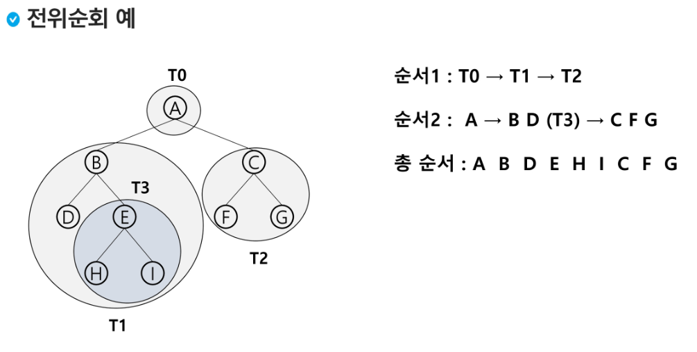
     
     ---
  
  2. inorder traversal(중위 순회) : LVR
     
     - 왼쪽 자식노드, 부모노드, 오른쪽 자식노드 순으로 방문한다
     
     - 수행 방법
       
       1. 현재 노드 n의 왼쪽 서브트리로 이동한다(L)
       
       2. 현재 노드 n을 방문하여 처리한다(V)
       
       3. 현재 노드 n의 오른쪽 서브트리로 이동한다(R)
     
     - 알고리즘
       
       ```python
       def inorder_traverse(T):             # 중위 순회
           if T:                            # T is not none
               inorder_traverse(T.left):       
               visit(T)                     # print(T.item)    
               inorder_traverse(T.right)
       ```
     
     - ex
       
       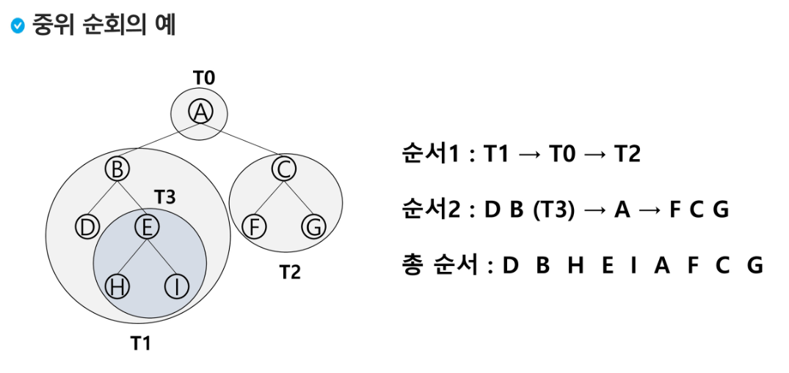
     
     ---
  
  3. postorder traversal(후위 순회) : LRV
     
     - 자식노드를 좌우 순서로 방문한 후, 부모노드로 방문한다
     
     - 수행 방법
       
       1. 현재 노드 n의 왼쪽 서브트리로 이동한다(L)
       
       2. 현재 노드 n의 오른쪽 서브트리로 이동한다(R)
       
       3. 현재 노드 n을 방문하여 처리한다(V)
     
     - 알고리즘
       
       ```python
       def postorder_traverse(T):           # 후위 순회
           if T:                            # T is not none
               postorder_traverse(T.left):       
               postorder_traverse(T.right)        
               visit(T)                     # print(T.item)    
       ```
     
     - ex
       
       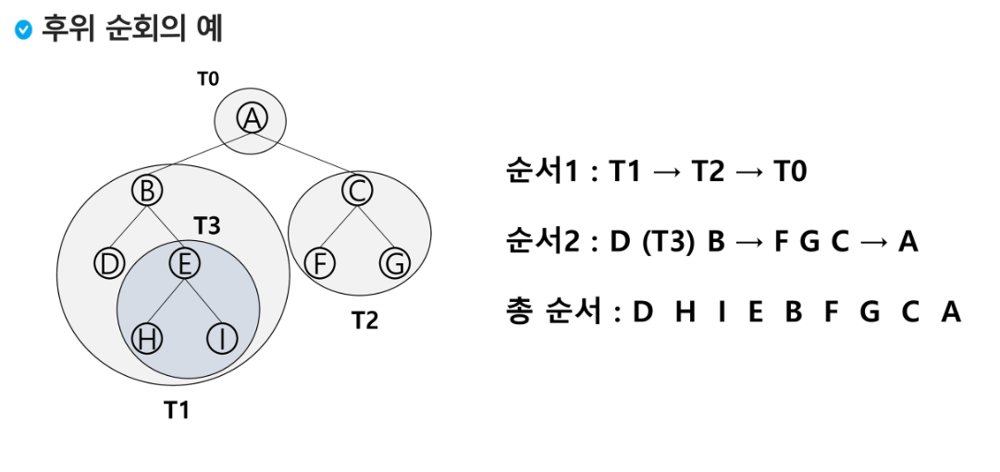
     
     ---
     
     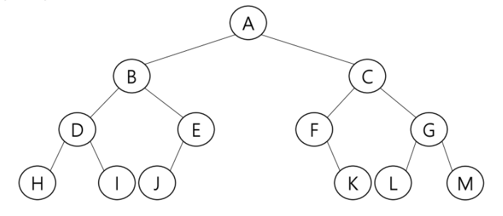
     
     - 전위 순회
       
       - A > B > D > H > I > E > J > C > F > K > G > L > M
     
     - 중위 순회
       
       - H > D > I > B > J > E > A > F > K > C > L > G > M
     
     - 후위 순회
       
       - H > I > D > J > E > B > K > F > L > M > G > C > A

---

## 표현

- **배열**을 이용한 이진트리의 표현
  
  - 루트의 번호를 1로 지정
  
  - 레벨 n에 있는 노드에 대해 왼쪽부터 오른쪽으로 2**n부터 2\**n - 1까지 번호를 차레로 부여 

- 배열
  
  - 노드 번호의 성질 (완전 트리일 경우)
    
    - 노드 번호가 i 인 노드의 부모 노드 번호 : i // 2
    
    - 노드 번호가 i 인 노드의 왼쪽 자식 노드 번호 : 2*i
    
    - 노드 번호가 i 인 노드의 오른쪽 자식 노드 번호 : 2*i + 1
  
  - 배열을 이용한 이진 트리의 표현
    
    - 노드 번호를 배열의 인덱스로 사용
    
    - 높이가 h인 이진 트리를 위한 배열의 크기는
      
      - 2**(h + 1) - 1

---

[참고] 이진 트리의 저장

- 부모 번호를 인덱스로 자식 번호를 저장
  
  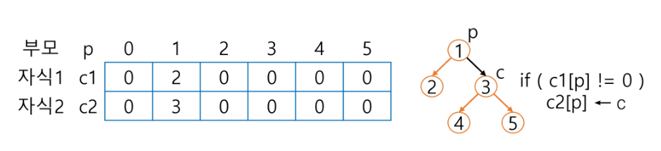

- 자식 번호를 인덱스로 부모 번호를 저장
  
  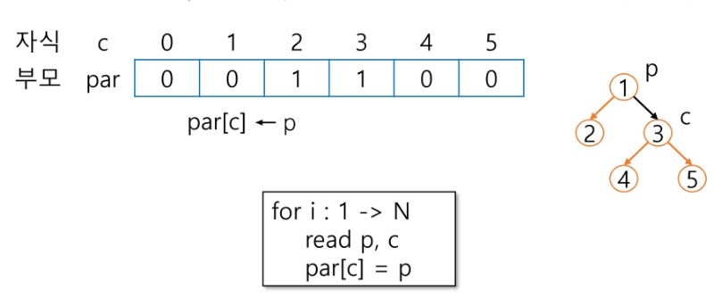
  
  - 루트 찾기 / 조상찾기
    
    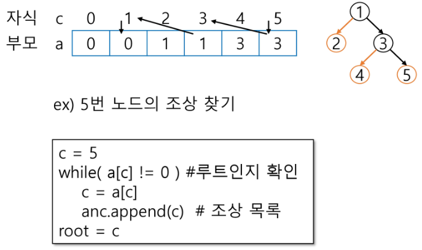

---

- 배열을 이용한 이진 트리 표현의 단점
  
  - 편향 이진 트리의 경우에 사용하지 않는 배열 원소에 대한 메모리 공간 낭비 발생
  
  - 트리의 중간에 새로운 노드를 삽입하거나 기존의 노드를 삭제할 경우 배열 크기 변경이 어려워 비효율적

---

- **연결리스트**
  
  - 배열을 이용한 이진 트리의 표현의 단점을 보완하기 위해 연결리스트를 이용하여 트리를 표현
  
  - 연결 자료구조를 이용한 이진트리의 표현
    
    - 이진 트리의 모든 노드는 최대 2개의 자식 노드를 가지므로 일정한 구조의 단순 연결 리스트 노드를 사용하여 구현

---

## 수식 트리 (수식 이진 트리(Expression Binary tree))

- 수식을 표현하는 이진 트리

- 연산자는 루트 노드이거나 가지 노드

- 피연산자는 모두 잎 노드
  
  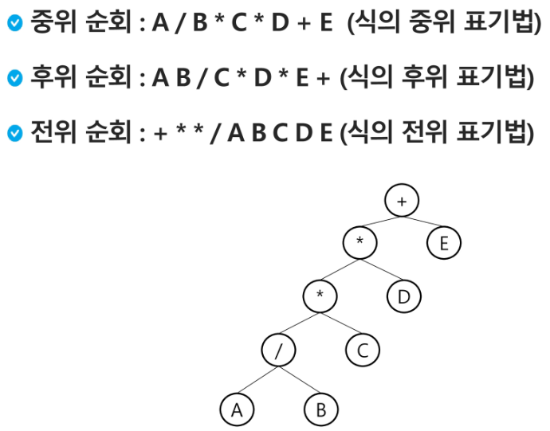

---

## 이진 탐색 트리

- 탐색 작업을 효율적으로 하기위한 자료구조

- 모든 원소는 서로 다른 유일한 키를 갖는다

- key(왼쪽 서브트리) < key(루트 노드) < key(오른쪽 서브트리)

- 왼쪽 서브트리와 오른쪽 서브트리도 이진탐색 트리이다.

- 중위 순회를 하면서 오름차순으로 정렬된 값을 얻는다

---

- 연산
  
  1. 탐색연산
     
     - 루트에서 시작한다
     
     - 탐색할 키 값 x를 루트 노드의 키 값과 비교한다
       
       - (키 값X = 루트 노드의 키 값) : 원하는 원소를 찾았으므로 탐색연산 성공
       
       - (키 값X < 루트 노드의 키 값) : 루트노드의 왼쪽 서브트리에 대해 탐색연산
       
       - (키 값X > 루트 노드의 키 값) : 루트노드의 오른쪽 서브트리에 대해 탐색연산
     
     - 서브트리에 대해 순환적으로 탐색 연산을 반복
       
       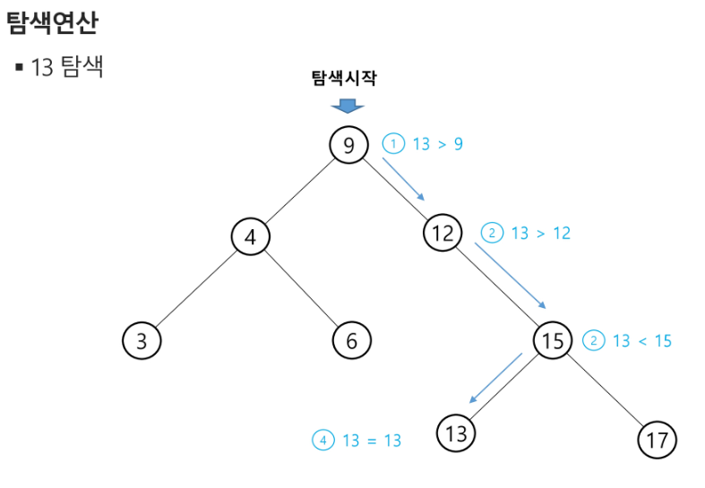
  
  2. 삽입연산
     
     - 탐색연산을 먼저 수행
       
       - 삽입할 원소와 같은 원소가 트리에 있으면 삽입할 수 없으므로, 같은 원소가 트리에 있는지 탐색하여 확인
       
       - 탐색에서 탐색 실패가 결정되는 위치가 삽입 위치가 된다
     
     - 탐색 실패한 위치에 원소를 삽입한다
       
       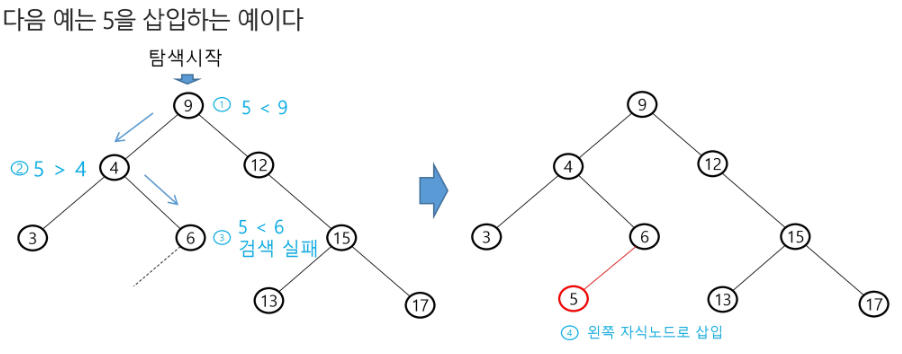
  
  3. 삭제연산

---

- 성능
  
  - searching(탐색), 삽입(insertion), 삭제(deletion) 시간은 트리의 높이만큼 걸린다
    
    - O(h) / h = BST의 깊이
  
  - 평균의 경우
    
    - 이진트리가 균형적으로 생성되어 있는 경우
    
    - O(log n)
  
  - 최악의 경우
    
    - 한쪽으로 치우친 경사 이진트리
    
    - O(n) / 순차탐색과 시간 복잡도가 같다
  
  - 검색 알고리즘의 비교
    
    - 배열에서의 순차 검색 : O(N)
    
    - 정렬된 배열에서의 순차 검색 : O(N)
    
    - 정렬된 배열에서의 이진탐색 : O(logN)
      
      - 고정 배열 크기와 삽입 삭제 시 추가연산 필요
    
    - 이진탐색트리의 평균 : O(logN)
      
      - 최악의 경우 : O(N)
      
      - 완전 이진 트리 또는 균형트리로 바꿀 수 있다면 최악의 경우를 없앨 수 있다
        
        - 새로운 원소를 삽입할 때 삽입시간을 줄인다
        
        - 평균과 최악의 시간이 같다 : O(logN)
      
      - 해쉬 검색 : O(1)
        
        - 추가 저장공간 필요

---

## heap(힙)

- 완전 이진 트리에 있는 노드 중에서 **키값이 가장 큰 노드**나 **키값이 가장 작은 노드**를 찾기 위해 만든 자료구조

- max heap(최대 힙)
  
  - 키 값이 가장 큰 노드를 찾기 위한 완전 이진 트리
  
  - 부모노드의 키값 > 자식노드의 키값
  
  - 루트노드 : 키값이 가장 큰 노드

- min heap(최소 힙)
  
  - 키 값이 가장 작은 노드를 찾기 위한 완전 이진 트리
  
  - 부모노드의 키값 < 자식노드의 키값
  
  - 루트노드 : 키값이 가장 작은 노드

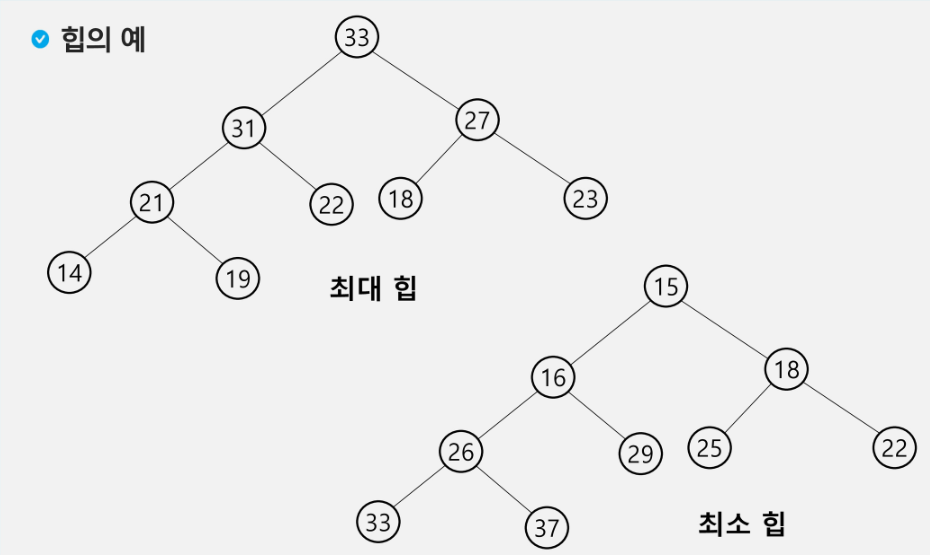

- 연산
  
  - 삽입
    
    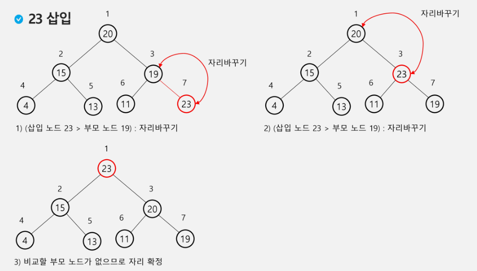
  
  - 삭제
    
    - 루트 노드의 원소만을 삭제할 수 있다
    
    - 루트 노드의 원소를 삭제해서 반환한다
    
    - 힙의 종류에 따라 최대값 또는 최소값을 구한다
    
    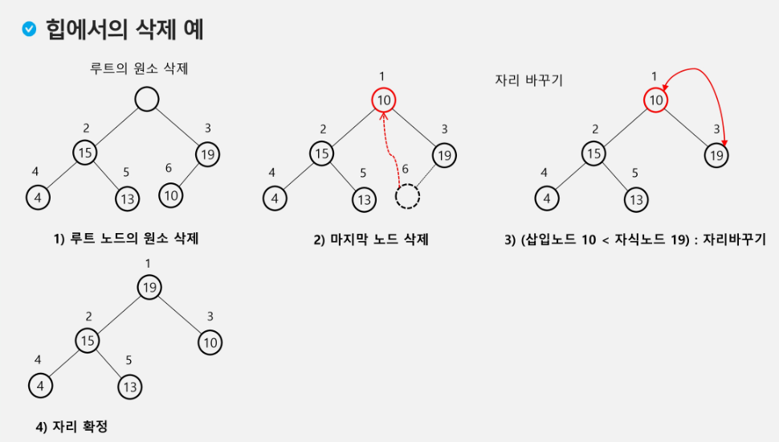
