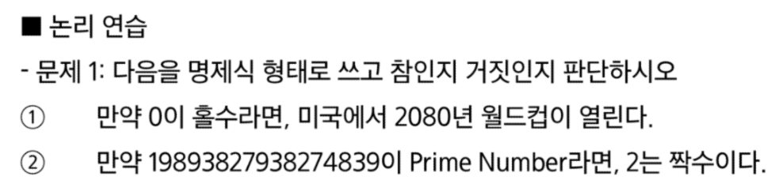
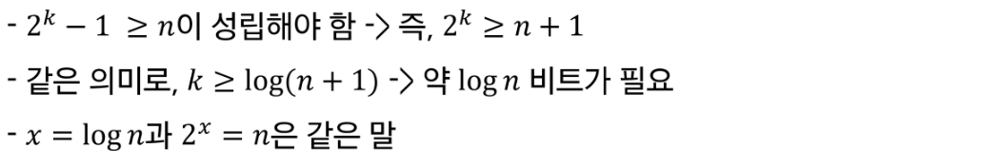
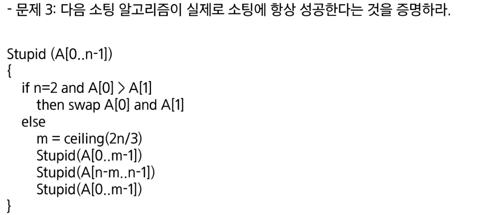

# Algorithm

---

## Computational Thinking

- 프로그래밍의 어려운 점
  
  - 프로그래밍 언어 문법과 라이브러리 사용
  
  - 논리(Hard logic)

- Hard logic(논리) vs soft logic(직관)
  
  - 직관은 논리적인 느낌을 주는 것
    
    - 빠르다는 장점이 있지만, 정확하지 않다는 단점이 있다

---

- 명제
  
  - 참이나 거짓을 알 수 있는 식이나 문장 ( p, q, r로 표현 )
  
  - ex) 1+1 =3이다 / 서울은 대한민국 수도다

- 진리값
  
  - 참이나 거짓을 표현
  
  - T, F or 1, 0

- 연산(결합)
  
  - 부정 NOT
    
    - p가 명제일 때 명제의 진릿값이 반대
    
    - ~p or ㄱp 로  표기 (not p 또는 p의 부정으로 읽음)
  
  - 논리곱 AND
    
    - p, q가 명제일 때, p,q 모두 참일 때만 참이 되는 명제
    
    - p ^ q (p and q)
  
  - 논리합 OR
    
    - p, q가 명제일 때, p,q 모두 거짓일 때만 거짓이 되는 명제
    
    - p V q (p or q)
  
  - 배타적 논리합 XOR
    
    - p, q가 명제일 때, p,q 하나만 참일 때 참이 되는 명제
    
    - p ⊕ q (p xor q)
  
  - 합성
    
    - 연산자 우선순위
      
      - ~       >      V , ^        >        ->, <->
    
    - 항진명제 : 진릿값이 항상 참
    
    - 모순명제 : 진릿값이 항상 거짓
    
    - 사건명제 : 항진명제도 모순명제도 아닌 명제

---

- 조건명제
  
  - p,q가 명제일 때, 명제 p가 조건(원인), q가 결론(결과)로 제시되는 명제
  
  - p이면 q이다 (p -> q)
    
    

- 쌍방조건명제
  
  - p,q가 명제일 때, 명제 p와 q가 모두 조건이면서 결론인 명제
  
  - p면 q고, q면 p이다 (p <-> q)
    
    

- 조건명제의 역, 이, 대우
  
  - 역 : q -> p
  
  - 이 : ~p -> ~q
  
  - 대우 : ~q -> ~p
  
  

---

1. 참(F,T > T)

2. 참(?,T > T)

---

1. 참(F,T > T)

2. 참(T^F > T)

3. 참(F,T > T)

---

1. 역 : 미국에서 2080월드컵이 열리지 않는다면 0은 홀수이다
   
   이 : 0이 짝수라면, 미국에서 2080년 월드컵이 열리지 않는다
   
   대우 : 미국에서 2080월드컵이 열리지 않는다면 0은 짝수이다(?,T > T)

2. 역 : 2가 짝수라면, 19893827938274839는 prime number가 이다
   
   이 : 19893827938274839는 prime number가 아니라면, 2는 홀수이다
   
   대우 : 2가 홀수라면, 19893827938274839는 prime number가 아니다(F,? > ?)

---

---

- 증명
  
  - 정확한 명제식으로 표현할 수 있는 것
  
  - 보통은 정확한 명제식까지 쓰지는 않으나 근본적으로 명제식으로 바꿀 수 있음
  
  - 증명에 대한 수많은 오해가 p -> q를 p<->q와 혼동하는 것에서 일어남

---

- Q(x)가 참이므로 전체 명제가 참이 된다

---

- P(x)가 항상 거짓이므로 전체 명제가 참이된다

---

## 논리와 증명

---

---

---

1. p ^ (~q V q) = p ^ U = p

2. (p ^ ~p) V ~q = O V ~q = O

---

1. 모든 실수에 대해 , x**2은 x보다 같거나 크다
   
   - 0 < x < 1 인 경우가 반례

2. 모든 정수에 대해, x**2은 x보다 같거나 크다
   
   - 참

3. 어떤 실수에 대해, x**2은 x보다 작다
   
   - 참 (0 < x < 1 인 경우)

4. 어떤 정수에 대해, x**2은 x보다 작다
   
   - 거짓, 같은 경우는 있지만 작은 경우는 없다
   
   -  (x가 양수인 경우, x < 1)(x가 음수인 경우, x > -1)

---

- n = 2k

- 6k + 5 = 2(3k+2) + 1 이므로 항상 홀수 이다

---

- n = 2k + 1

- (2k + 1)**2 + (2k + 1) = 4k\**2 + 4k + 1 + 2k + 1 = 4k**2 +6k + 2 = 2(2k\**2 +3k+1)이므로 짝수이다

---

- m = 2k / n = 2j + 1

- 2(2k) + 3(2j+1) = 4k + 6j + 3 = 2(2k + 3j + 1) + 1 이므로 홀수이다

---

- 대우로 풀이

- n = 2k + 1

- (2k + 1 )**2 + 5 = 4k\**2 + 4k + 1 + 5 = 2(2k**2+2k+ 3) 이므로 짝수이다

---

- 대우 : n이 홀수이면 n**2은 홀수이다

- n = 2k + 1

- (2k + 1)**2 = 2(2k\**2 + 2k) + 1 이므로 홀수이다

---

---

- 대우 : n이 3의 배수가 아니라면, n**2은 3의 배수가 아니다

- n = 3k - 1
  
  - (3k-1)**2 = 9k\**2 - 6k + 1 = 3(3k**2 - 2k) + 1 이므로 3의 배수가 아니다

- m = 3k -2
  
  - (3k-2)**2 = 9k\**2 - 12k + 4 = 3(3k**2 - 4k + 1) + 1 이므로 3의 배수가 아니다

---

## 수와 표현

- 설명
  
  - 컴퓨터는 0과 1을 표현할 수 있는 비트들을 모아 수를 표현
  
  - k개의 비트를 사용하면 0부터 2**k-1까지 표현가능
  
  - 약속하는 방식에 따라 다르지만 어떤 경우든 최대 2**k가지의 값을 표현하는 것이 가능
  
  - 10진수로 k자리를 쓰면 0부터 10**k-1까지 표현이 가능한 것과 동일한 과정

- n을 표현하기 위해 몇개의 비트가 필요한가?
  
  

---

- 2**logn = n\**log2 = n

---

- 2**20가지

---

1. < (n>2 일때)

2. ?

3. 2**nlogn = 2\**logn**n = n\**n > n! (n > 1일때)

---

---

1. y = log(x-3) -5
   
   - 역함수 : x = log(y-3) -5
   
   - x+5 = log(y-3)
   
   - 2**(x+5) = y - 3
   
   - y = 2**(x+5) + 3

---

## 집합과 조합론

- 두 집합 A와 B에 대해 A가 B의 부분집합임을 증명한다는 것은 A의 임의의 원소가 B에 포함됨을 보이는 것과 같다
  
  - ex) 모든 4의 배수는 2의 배수라는 것을 증명, 4k =2(2k)

- 두 집합 A와 B가 같다는 것을 증명하기 위해서는, A가 B의 부분집합이고, B가 A의 부분집합임을 증명하면 된다

---

- n!/((n-k)!k!) + n!/((n-k+1)!(k-1)!) = (n+1)!/((n-k+1)!k!)

---

---

---

- 명제의 부정을 참이라 가정했을 때 거짓이 나오면, 명제가 참임을 증명

---

---

---

---

---

---

---

---

## 기초수식

- 알고리즘의 시간 복잡도를 표현할 수 있는 다양한 수식들이 존재

- 풀이법을 익혀 두어야 알고리즘 시간 복잡도를 계산하고 예측할 수 있다

---

- O(n)

---

---

---

---

---

---

---

---

## 재귀

- 자기 자신을 호출하는 함수

- 함수 입력이 있으며, 자기 자신의 입력과 동일한 입력을 자기 자신을 호출하면 끝나지 않음

---

---

---

---

---

## 동적 프로그래밍

- 재귀 함수에서 동일한 입력의 함수 호출이 반복적으로 일어날 때 그 결과 값을 저장해 두고 불러 쓰는 것(memoization)

- 최초 입력에서 파생되는 모든 가능한 입력에 대한 답을 모두 저장할 수 있는 메모리가 있어야 한다

- 단순히 재귀에서 저장된 값을 찾아보는 것으로도 가능하지만, 결과 값을 순서를 정해서 계산할 수도 있다.(dynamic programming)

---

---

