# Algorithm

---

- 문제해결과정
  
  1. 문제 읽고 이해하기
  
  2. 문제를 익숙한 용어로 재정의하기
  
  3. 해결 계획 세우기
  
  4. 계획 검증하기
  
  5. 프로그램 구현하기
  
  6. 리뷰 후 개선점 찾기

---

## 복잡도 분석

- 알고리즘
  
  - 유한한 단계를 통해 문제를 해결하기 위한 절차나 방법
    
    - 컴퓨터가 어떤 일을 수행하기 위한 단계적 방법을 말한다
  
  - 효율
    
    - 효율성의 반대는 복잡도가 된다(복잡도가 높을수록 효율성이 저하된다)
    
    - 공간적 효율성
      
      - 연산량 대비 얼마나 적은 공간을 요하는가
    
    - 시간적 효율성
      
      - 연산량 대비 얼마나 적은 시간을 요하는 가
      
      - 시간적 복잡도 분석
        
        - 하드웨어 환경에 따라 처리시간이 달라진다
        
        - 부동소수 처리 프로세서 존재 유무
        
        - 나눗셈 가속기능 유무
        
        - 입출력 장비의 성능, 공유여부
      
      - 소프트웨어 환경에 따라 처리시간이 달라진다
        
        - 프로그램 언어의 종류
        
        - 운영체제, 컴파일러의 종류
      
      - 이러한 환경적 차이로 분석이 어렵다
  
  ---
  
  - 복잡도의 점근적 표기
    
    - 시간(또는 공간)복잡도는 입력 크기에 대한 함수로 표기하는데, 이 함수는 주로 여러개의 항을 가지는 다항식
    
    - 단순한 함수로 표현하기 위해 점근적표기(Asympotic Notation) 사용
    
    - 입력크기 n이 무한대로 커질 때의 복잡도를 간단히 표현하는 표기법
      
      ---
      
      1. O(Big-Oh) 표기
         
         - 복잡도의 점근적 상항을 나타낸다
         
         - 복잡도가 f(n) = 2n**2-7n+4라면 f(n)의 O표기는 O(n\**2)
         
         - f(n)의 단순화된 표현은n**2이다
         
         - 단순화 된 함수 n**2에 임의의 상수 c를 곱한 cn\**2이 n이 증가함에 따라 f(n)의 상한이 된다
           
           - 단순히 실행시간이 n**2에 비례하는 알고리즘
         
         - n이 증가함에 따라 cn**2이 점근적 상한이 된다.
           
           - n이 어느 지점 이상으로 커지게 되면 항상 n\**2보다 크다
         
         ---
      
      2. Ω(Big-Omega)
         
         - 복잡도의 점근적 하한을 의미한다
         
         - 복잡도가 f(n) = 2n**2-7n+4라면 f(n)의 Ω표기는 Ω(n\**2)
         
         - Ω(n**2)은 n이 증가함에 따라 2n\**2-7n+4이 cn**2보다 작을 수 없다
           
           - 이 때 c = 1 
         
         - O표기 처럼 Ω 표기도 복잡도 다항식의 최고차항만 계수 없이 취하면 된다
           
           - 최소한 이만한 시간은 걸린다
         
         - n이 증가함에 따라 cn**2이 점근적 상한이 된다.
           
           - n이 어느 지점 이상으로 커지게 되면 항상 n**2보다 작다
         
         ---
      
      3. Θ(Big_Theta)
         
         - O표기와 Ω표기가 같은 경우에 사용
         
         - f(n) = 2n**2+8n+3 = O(n\**2) = Ω(n\**2) 이므로 f(n) = Θ(n**2)
         
         - f(n)은 n이 증가함에 따라 'n**2과 동일한 증가율을 갖는다'는 의미
         
         ---
      
      4- 자주 사용하는 O표기
         
         - O(1)
           
           - 상수시간(constant time)
         
         - O(logn)
           
           - 로그(대수)시간 (logarithmic time)
         
         - O(n)
           
           - 선형 시간(linear time)
         
         - O(nlogn)
           
           - 로그 선형 시간(log-linear time)
         
         - O(n**2)
           
           - 제곱시간(quadratic time)
         
         - O(n**3)
           
           - 세제곱시간(cubic time)
         
         - O(2**n)
           
           - 지수시간(exponential time)
    
    ---
    
    - 효율적인 알고리즘이 필요한 이유
      
      - 10억개의 숫자를 정렬할 때 O(n**2) 알고리즘은 PC에서 300년 걸림
        
        - 반면에 O(nlogn) 알고리즘은 5분만에 정렬
      
      - 효율적인 알고리즘은 슈퍼컴퓨터만큼의 가치가 있으며
        
        - H/W 기술 개발보다 효율적인 알고리즘 개발이 경제적이다

---

## 표준입출력 방법

- 입력
  
  - raw 값의 입력 : `input()`
    
    - 받은 입력값을 문자열로 취급
  
  - evaluated된 값의 입력 : `eval(input())`
    
    - 받은 입력값을 평가된 데이터 형으로 취급

- 출력
  
  - `print()`
    
    - 표준출력함수. 출력값의 마지막에 개행문자 포함
  
  - `print('text', end='')`
    
    - 출력시 마지막 개행문자 제외
  
  - `print('%d'% number)`
    
    - formatting된 출력

- 파일의 내용을 표준입력으로 읽어오는 방법
  
  ```python
  import sys
  sys.stdin = open('input.txt', 'r or w')
  sys.stdout = open('output.txt', 'r or w')
  ```

---

## 비트연산

- 비트 연산자
  
  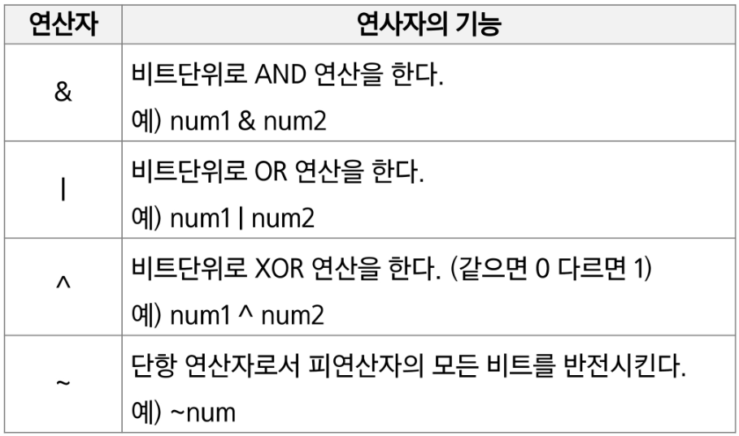
  
  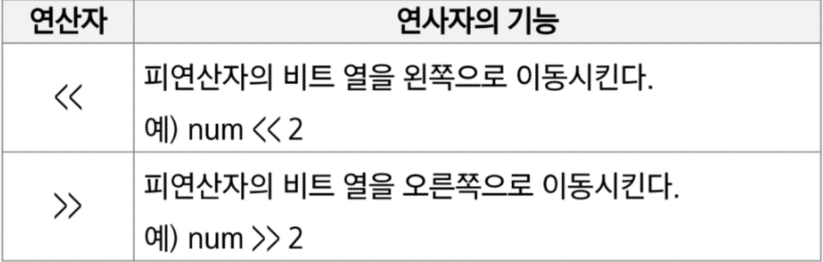

- 1 << n
  
  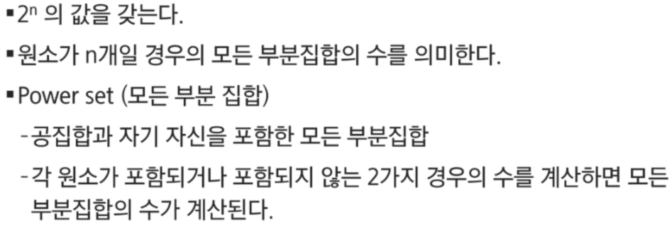

- i & (1 << j)
  
  

---

- ex) 1번예제
  
  ```python
  def Bbit_print(i):
      output = ''
      for j in range(7, -1, -1):
          output += '1' if i & (1 << j) else '0'
      print(output)
  
  for i in range(-5, 6):
      print('%3d ='% i, end = '')
      Bbit_print(i)
  ```
  
  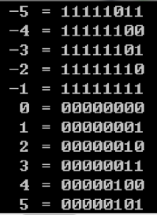

---

- ex) 2번예제
  
  ```python
  def Bbit_print(i):
      output = ''
      for j in range(7, -1, -1):
          output += '1' if i & (1 << j) else '0'
      print(output, end='')
  
  a= 0x10
  x = 0x01020304
  print('%d ='% a, end = '')
  Bbit_print(a)
  print()
  print('0%X = '% x, end='')
  for i in range(0,4):
      Bbit_print((x>>i*8) & 0xff)
  ```
  
  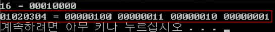

---

- 엔디안(Endianness)
  
  - 컴퓨터의 메모리와 같은 1차원의 공간에 여러 개의 연속된 대상을 배열하는 방법을 의미하며 HW아키텍처마다 다르다
  
  - 주의 : 속도 향상을 위해 바이트 단위와 워드 단위를 변환하여 연산 할 때 올바로 이해하지 않으면 오류를 발생 시킬 수 있다
  1. 빅 엔디안(big-endian)
     
     - 큰 단위가 앞에 나옴 / 네트워크
  
  2. 리틀 엔디안(little-endian)
     
     - 작은 단위가 앞에 나옴 / 대다수 데스크탑 컴퓨터
  
  3. 
     
     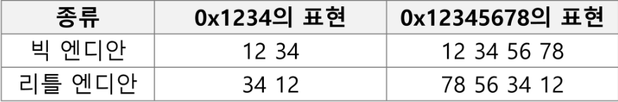
  
  4. 엔디안 확인 코드
     
     ```python
     import sys
     print(sys.byteorder)
     ```

---

- ex) 3번예제
  
  ```python
  def ce(n): # change endian
      p = []
      for i in range(0, 4):
          p,append((n >> (24 - i * 8)) & 0xff)
      return p
  
  x = 0x01020304
  p = []
  for i in range(0,4):
      p.append((n >> (24 - i * 8)) & 0xff)
  print('x = %d%d%d%d' % (p[0], p[1], p[2], p[3]))
  print(ce(x))
  print('x = %d%d%d%d' % (p[0], p[1], p[2], p[3]))
  ```

- ex) 4번예제
  
  ```python
  def ce1(n): 
      return (n << 24 & 0xff000000) | (n << 8 & 0xff0000)
          | (n >> 8 & 0xff00) | (n >> 24 & 0xff)
  ```

- ex) 5번예제
  
  - 비트 연산자 ^를 두번 연산하면 처음 값을 반환한다
  
  ```python
  def Bbit_print(i):
      output = ''
      for j in range(7, -1, -1):
          output += '1' if i & (1 << j) else '0'
      print(output)
  
  a= 0x86
  x = 0xAA
  
  print('a      ==> ', end='')
  Bbit_print(a)
  print('a^=key ==> ', end='');
  a ^= key;
  Bbit_print(a)
  print('a^=key ==> ', end='');
  a ^= key;
  Bbit_print(a)
  ```

---

## 진수

- 10진수를 타진법의 수로 변환
  
  - 원하는 타진법의 수로 나눈 뒤 나머지를 거꾸로 읽는다
    
    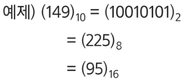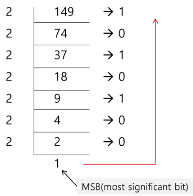

- 타진수에서 10진수로 변환
  
  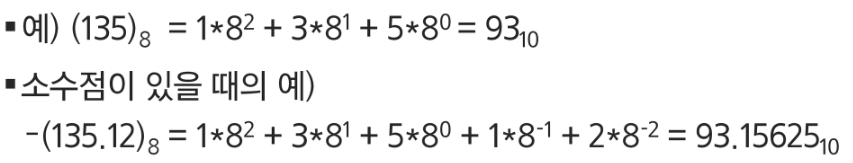

- 2진수, 8진수, 16진수간 변환
  
  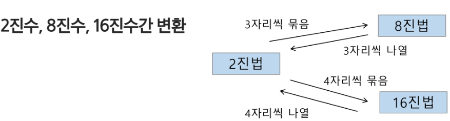

---

- 컴퓨터에서의 음의 정수 표현방법
  
  - 1의 보수 : 부호와 절대값으로 표현된 값을 부호 비트를 제외한 나머지 비트들을 0은 1로, 1은 0으로 변환
    
    - 부호와 절대값 표현
      
      - 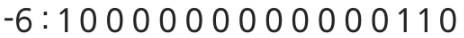
    
    - 1의 보수 표현
      
      - 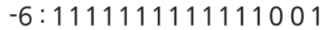
  
  - 2의 보수 : 1의 보수방법으로 표현된 값의 최하위 비트에 1을 더한다
    
    - 2의 보수표현
      
      - 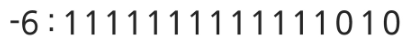

---

- ex) 연습문제
  
  - 
    
    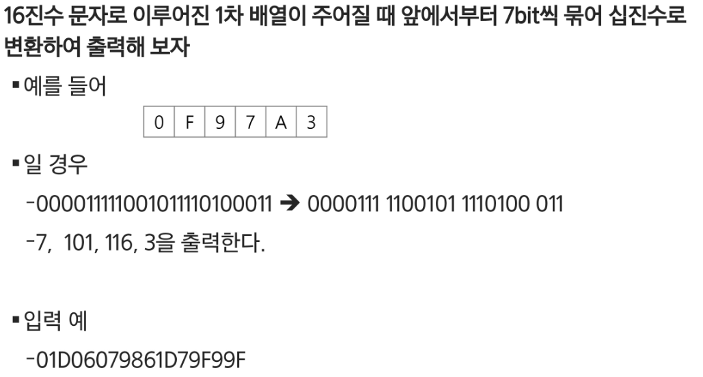

---

## 실수

- 소수점이하 4자리를 10진수로 나타내보면
  
  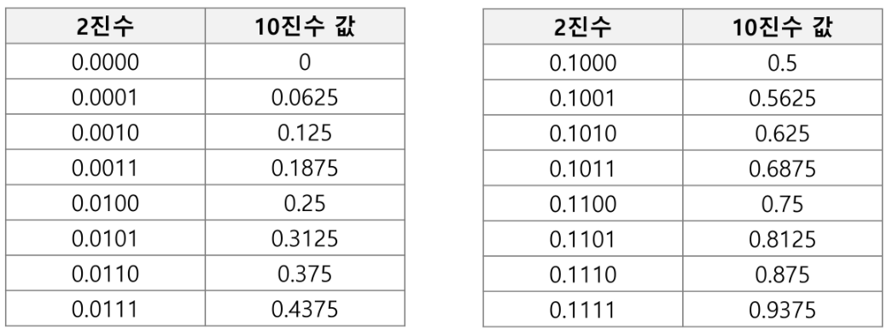

- 2진 실수를 10진수로 변환하기
  
  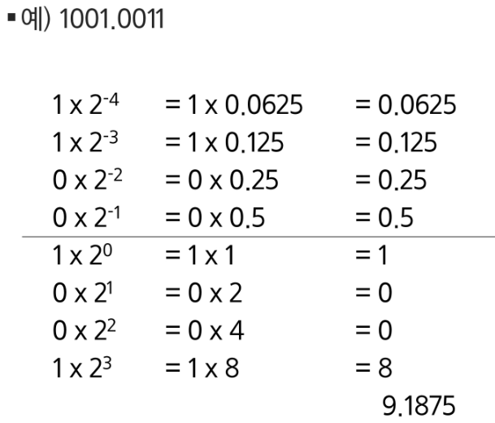

- 실수의 표현
  
  - 컴퓨터는 실수를 표현하기 위해 부동소수점(floating-point) 표기법을 사용
  
  - 부동 소수점 표기 방법은 소수점의 위치를 고정시켜 표현하는 방식
    
    - 소수점의 위치를 왼쪽의 가장 유효한 숫자 다음으로 고정시키고 밑수의 지수승으로 표현
    
    - 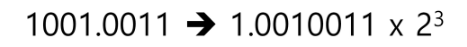

- 실수를 저장하기 위한 형식
  
  
  
  - 단정도 실수(32비트)
  
  - 배정도 실수(64비트)
    
    - 가수부(mantissa)
      
      - 실수의 유효 자리수들을 부호화된 고정 소수점으로 표현
        
        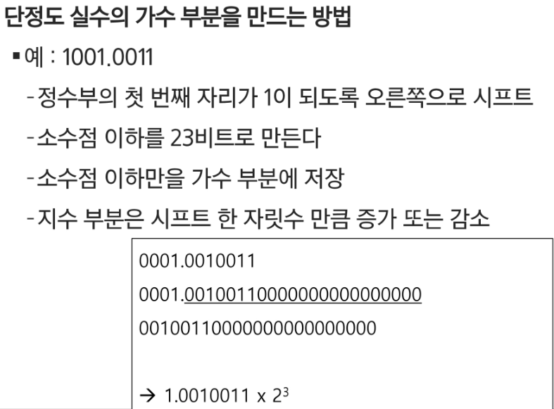
    
    - 지수부(exponent)
      
      - 실제 소수점의 위치를 지수승으로 표현
        
        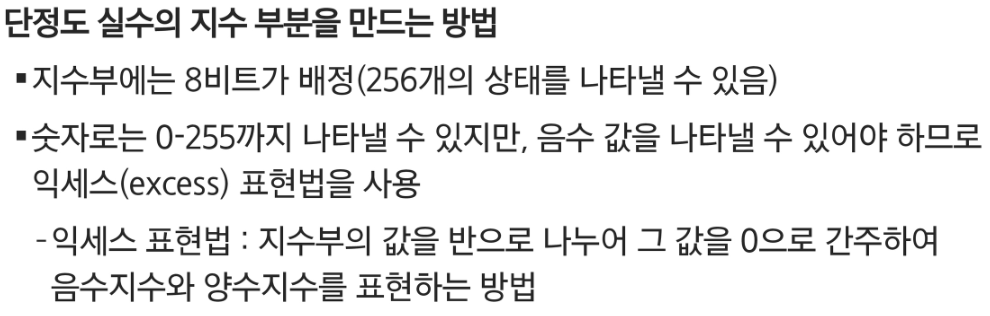

---

- 컴퓨터는 실수를 근사적으로 표현
  
  - 이진법으로 표현할 수 없는 형태의 실수는 정확한 값이 아니라 근사 값으로 저장
    
    - 이때 생기는 오차가 계산과정에서 다른 결과로 이어진다

- 실수 자료형의 유효 자릿수
  
  - 32비트 실수형 유효자릿수(십진수) : 6
  
  - 32비트 실수형 유효자릿수(십진수) : 15

- 파이썬에서의 실수표현 범위
  
  - 파이썬 내부에서는 더 많은 비트를 사용해서 훨씬 넓은 범위의 실수를 표현
  
  - 최대 값은 1.8 * 10**308 이 이상은 inf
  
  - 최소 값은 5.0 * 10**-324 이 이하는 0

---

- ex) 연습문제
  
  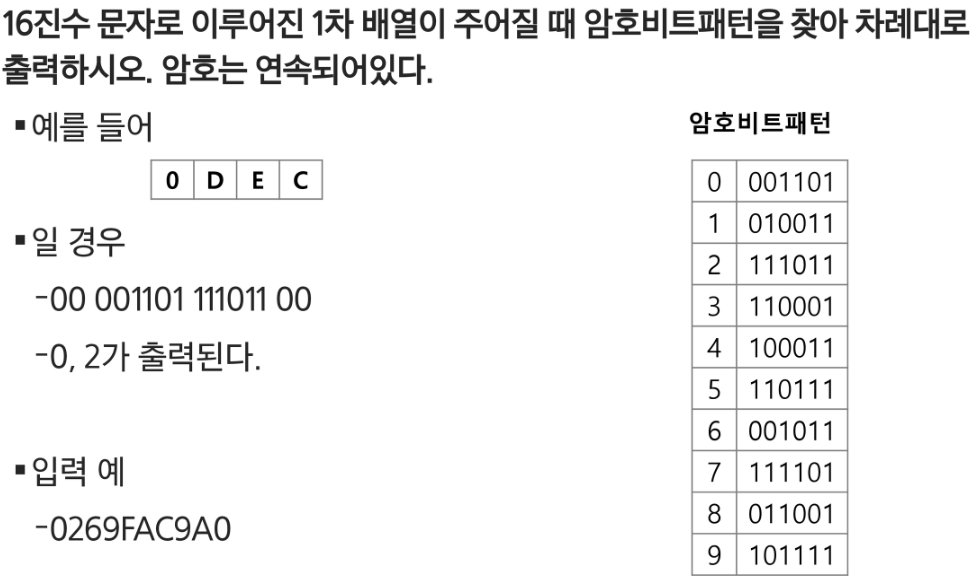
