# Algorithm

---

## 완전검색&그리디

- 반복구조(iteration)
  
  - 초기화
    
    - 반복되는 명령문을 실행하기 전에 조건 검사에 사용할 변수의 초기값 설정
  
  - 조건검사(check control expression)
  
  - 반복할 명령문 실행 (action)
  
  - 업데이트(loop update)
    
    - 무한 루프(infinite loop)가 되지 않게 조건이 False가 되어야 한다
  
  - 선택정렬
    
    ```python
    def selectionsort(A):
        n = len(A)
        for i in range(0, n-1):
            mini = i
            for j in range(i+1, n):
                if A[j] < A[mini]:
                    mini = j
            A[mini], A[i] = A[i], A[mini]
    ```

---

- 재귀적 알고리즘
  
  - 재귀적 정의는 두 부분으로 나뉜다
    
    - 하나 또는 그 이상의 기본 경우(basis case or rule)
      
      - 집합에 포함되어 있는 원소로 induction을 생성하기 위한 시드(seed) 역할
    
    - 하나 또는 그 이상의 유도된 경우(inductive case or rule)
      
      - 새로운 집합의 원소를 생성하기 위해 결합되어지는 방법

- 재귀함수(recursive function)
  
  - 함수 내부에서 직접 혹은 간접적으로 자기 자신을 호출하는 함수
  
  - 일반적으로 재귀적 정의를 이용해서 재귀 함수를 구현
  
  - 기본부분(basis part)와 유도부분(inductive part)로 구성된다
  
  - 재귀적 프로그램을 작성하는 것은 반복 구조에 비해 간결하고 이해하기 쉽다
    
    - 재귀에 대해 익숙하지 않다면 재귀적 프로그램에 어려움을 느낀다
  
  - 함수 호출은 프로그램 메모리 구조에서 스택을 사용한다
    
    - 재귀호출은 반복적인 스택의 사용을 의미하며 메모리 및 속도에서 성능저하가 발생한다

- 팩토리얼 재귀함수
  
  - 재귀적 정의
    
    - basis rule
      
      - N <= 1일때, n=1
    
    - inductive rule
      
      - N>1 d일때, n!=nX(n-1)!
    
    - n!의 재귀함수
      
      ```python
      def fact(n):
          if N <= 1:
              return 1
          else:
              return n* fact(n-1)
      ```

---

- 해결할 문제를 고려해서 반복 또는 재귀 선택

- 재귀는 문제해결을 위한 알고리즘 설계가 간단하고 자연스럽다
  
  - 추상 자료형 (list, tree)의 알고리즘은 재귀적 구현이 간단하고 자연스러운 경우가 많다

- 일반적으로, 재귀적 알고리즘은 반복(iterative) 알고리즘보다 더 많은 메모리와 연산을 필요로 한다

- 입력값 n이 커질수록 반복에 비해 비효율적일 수 있다

- 반복과 재귀의 비교
  
  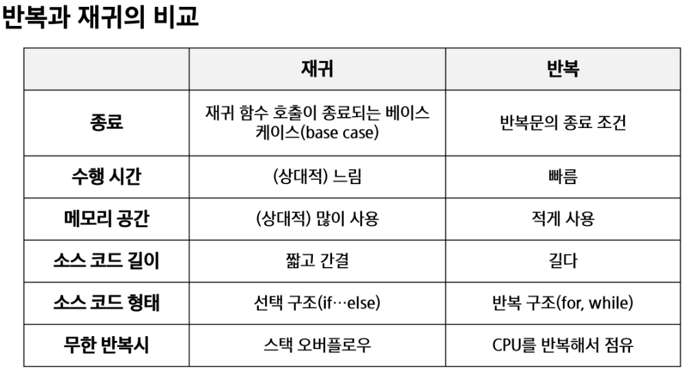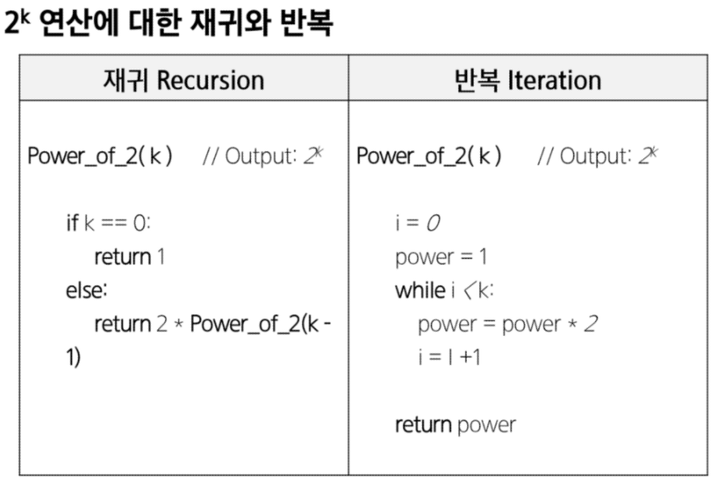

- ex) 연습문제
  
  - 선택 정렬 함수(selection sort) 재귀적 알고리즘 작성하기
    
    ```python
    def
    ```

---

## 완전 검색 기법

- brute-force(고지식한 방법)
  
  - 문제해결을 위한 간단하고 쉬운 접근법
    
    - just do it
    
    - force의 의미는 사람보다는 컴퓨터의 force를 의미
  
  - brute force 방법은 대부분 문제에 적용 가능
  
  - 상대적으로 빠른시간 내에 알고리즘 설계가능
  
  - 문제에 포함된 자료(요소, 인스턴스)의 크기가 작다면 유용하다
  
  - 학술적 또는 교육적 목적을 위해 알고리즘의 효율성을 판단하기 위한 척도

- brute-force 탐색(sequential search)
  
  - 자료 리스트에서 키 값을 찾기 위해 첫 번째 자료부터 비교하면서 진행
    
    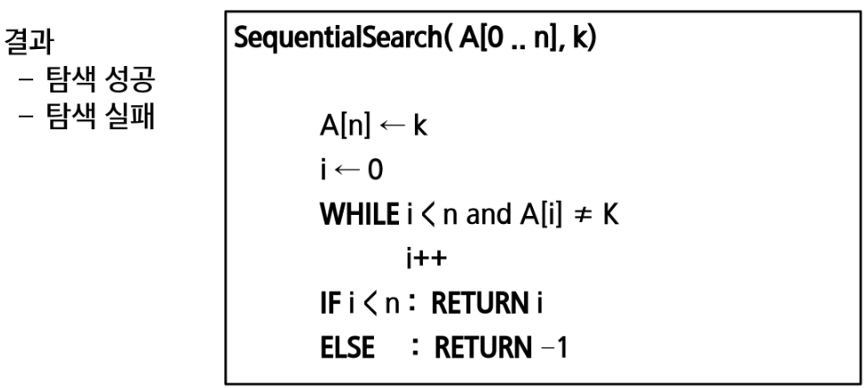

---

- 완전검색
  
  - 모든 경우의 수를 생성하고 테스트
    
    - 수행속도는 느리지만, 답을 못찾을 확률이 작다
    
    - 완전 검색은 입력의 크기를 작게해서 간편하고 빠르게 답을 구하는 프로그램 작성
  
  - 이를 기반으로 그리디 기법이나 동적 계획법을 이용해서 효율적인 알고리즘을 찾을 수 있다
  
  - 검정등에서 주어진 문제를 풀 때, 완전 검색으로 접근하여 해답을 도출한 후 성능 개선을 위해 다른 알고리즘을 사용하고 해답을 확인하는 것이 바람직

- 완전검색
  
  - 많은 종류의 문제들이 특정 조건을 만족하는 경우나 요소를 찾는 것
  
  - 이들은 전형적으로 순열, 조합, 부분집합과 같은 조합적문제와 연결
  
  - 완전검색은 조합적 문제에 대한 brute-force

---

## 순열

- 서로 다른 것들 중 몇 개를 뽑아서 한줄로 나열

- 서로 다른 n개중 r개를 택하는 순열 = nPr
  
  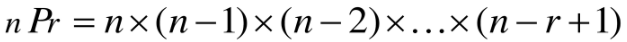

- nPn = n! = Factorial
  
  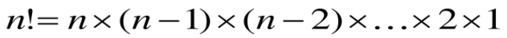

- 다수의 알고리즘 문제들은 순서화된 요소들의 집합에서 최선의 방법을 찾는 것과 관련
  
  - TSP(traveling salesman problem)

- N개의 요소들에 대해 n!개의 순열이 존재

---

- 단순하게 순열을 생성하는 방법
  
  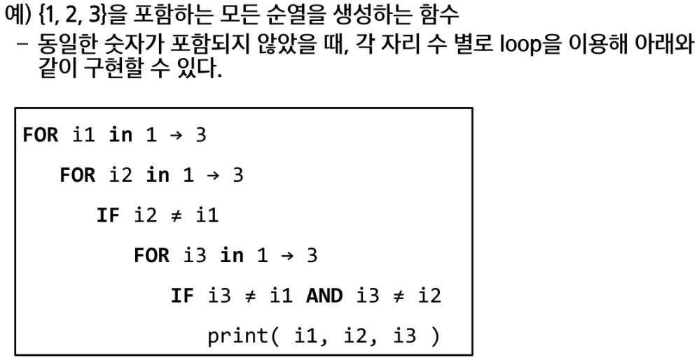
  
  ```python
  for i in range(1, 4):
      for j in range(1, 4):
          if i != j:
              for k in range(1, 4):
                  if k != i and k != j:
                      print(i,j,k)
  ```

---

- 사전적 순서(Lexicographic-order)
  
  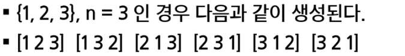

- 최소 변경을 통한 방법(Minimum-exchange requirement)
  
  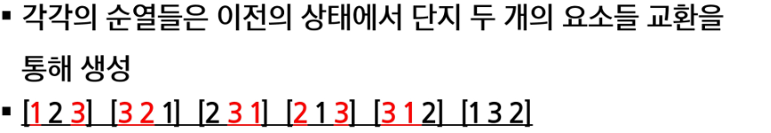

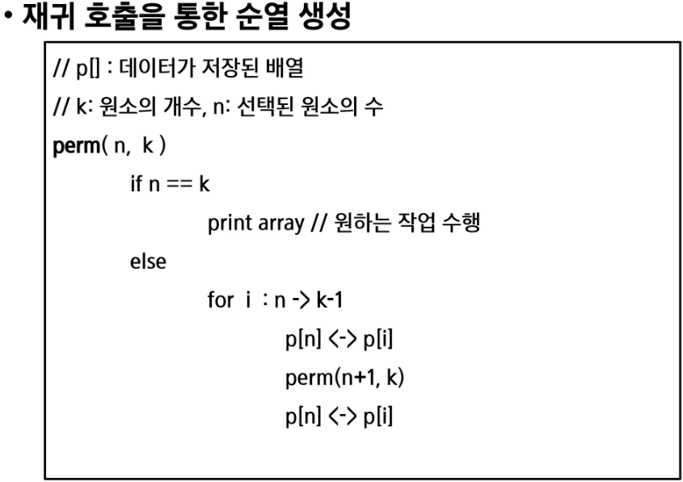

```python
def f(i, k):
    if i == k: # 인덱스 i == 원소의 개수
        print(p)
    else:
        for j in range(i, k):
            p[i], p[j] = p[j], p[i]
            f(i+1, k)
            p[i], p[j] = p[j], p[i]

p =[1,2,3]
f(0,3)
```

```python
# N개의 순서 정하기
def f(i, k):
    if i == k: 
        print(p)
    else:
        for j in range(i, k):
            if used[j] == 0:
                used[j] = 1
                p[i] = a[j]
                f(i+1, k) 
                used[j] = 0
N = 3    
a =[i for i in range(1,N+1)]
used = [0] * N
f(0,N)
```

```python
# N개 중 R개 고르기
def f(i, k, r):
    if i == r: 
        print(p)
    else:
        for j in range(i, k):
            if used[j] == 0:
                used[j] = 1
                p[i] = a[j]
                f(i+1, k, r) 
                used[j] = 0
N = 10
R = 3    
a = [i for i in range(1,N+1)]
p = [0] * N
used = [0] * N
f(0,N,R)
```

---

## 부분집합

- 집합에 포함된 원소를 선택

- 다수의 중요 알고리즘이 원소들의 그룹에서 최적의 부분 집합을 찾는 것

- N개의 원소를 포함한 집합
  
  - 자기 자신과 공집합 포함한 모든 부분집합(power set)의 개수는 2**n개
  
  - 원소의 수가 증가하면 부분집합의 개수는 지수적으로 증가

- 바이너리 카운팅을 통한 사전적 순서(Lexicographic order)
  
  - 부분집합을 생서하기 위한 가장 자연스러운 방법
  
  - 바이너리 카운팅은 사전적 순서로 생성하기 위한 가장 간단한 방법
    
    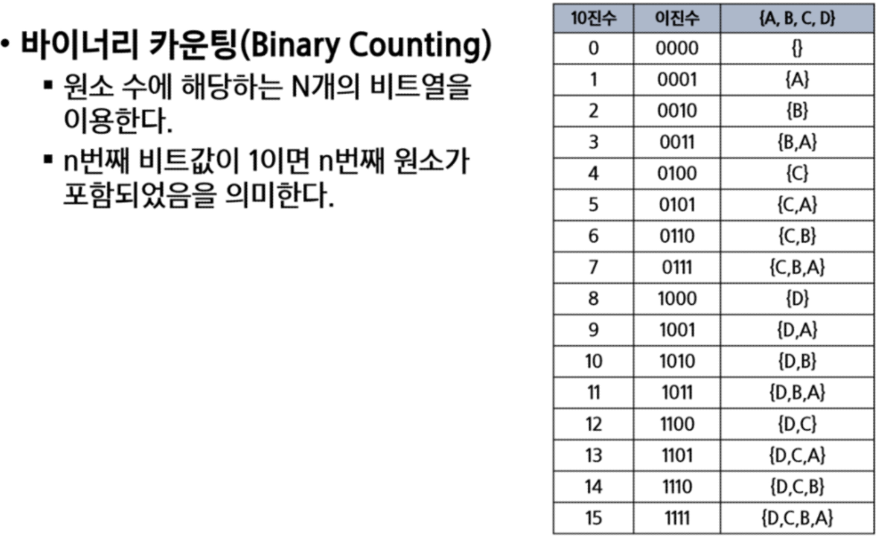
    
    ```python
    arr = [3,6,7]
    n = len(arr
    
    for i in range(0,(1 << n)):
        for j in range(0, n):
            if i & (1 << j):
                print('%d'%arr[j], end='')
        print()
    ```

---

## 조합

- combination : 서로 다른 n개의 원소 중 r개를 순서없이 골라낸 것

- 수식
  
  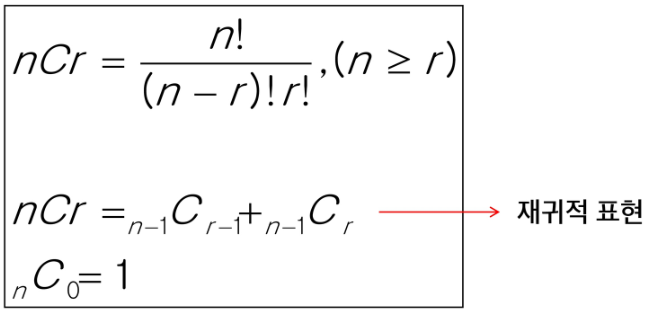

- 재귀 호출을 이용한 조합 생성 알고리즘
  
  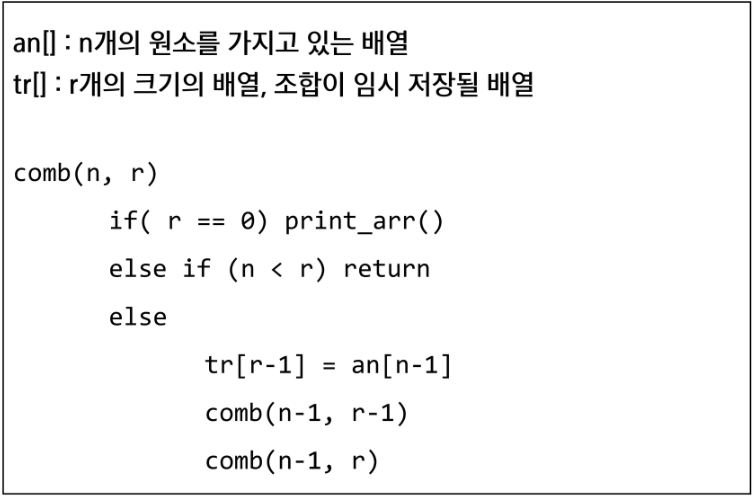
  
  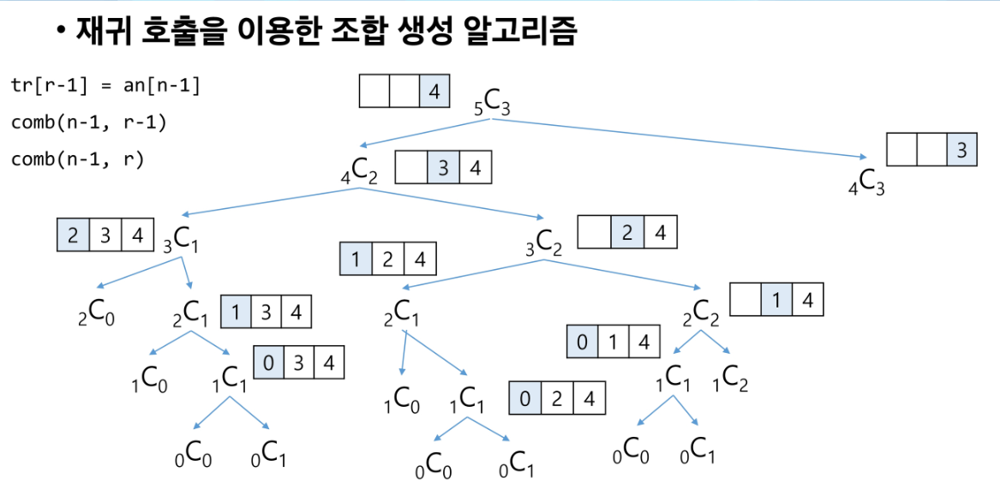

- 10개 중에 3개를 고르는 조합
  
  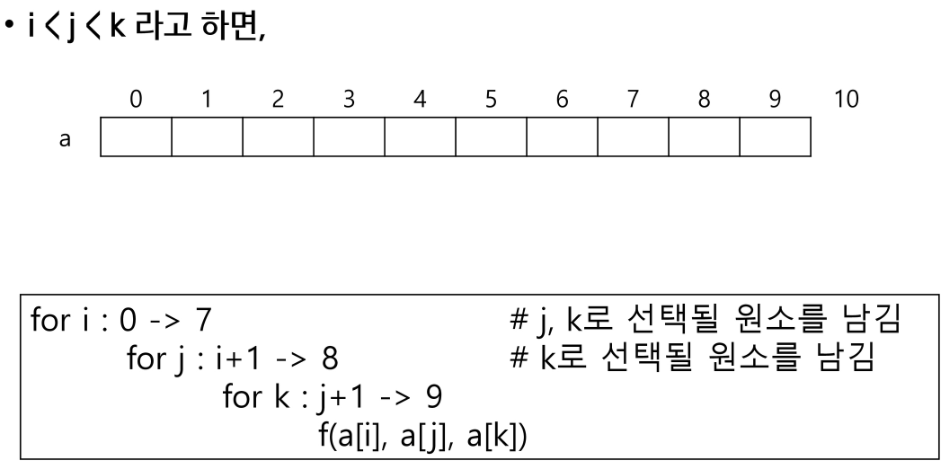

- n개에서 r개 고르는 조합(재귀)
  
  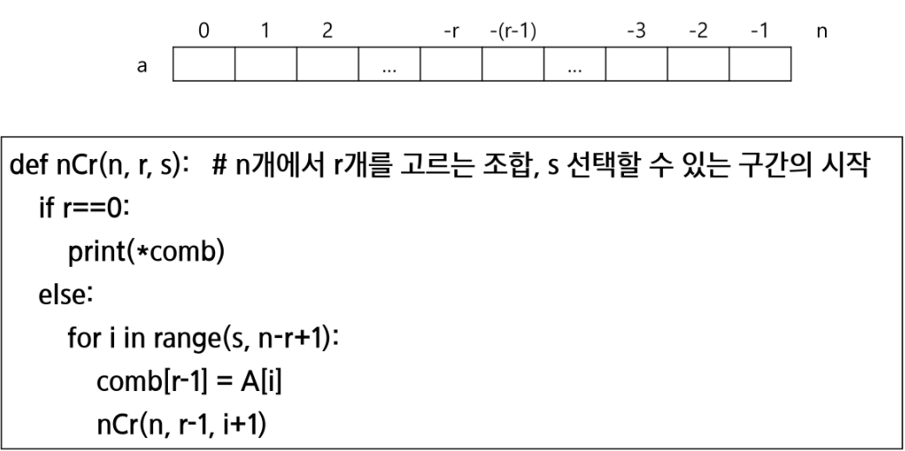

---

## 탐욕알고리즘

- 탐욕 알고리즘은 최적해를 구하는 데 사용되는 근시안적인 방법

- 일반적으로 머리속에 떠오르는 생각을 검증 없이 바로 구현하면 greedy 접근이 된다

- 여러 경우 중 하나를 선택할 때마다 그 순간에 최적이라고 생각되는 것을 선택해 나가는 방식으로 진행하여 해답에 도달

- 각 선택 시점에서 결정은 최적이지만 선택들의 모임이 최적이라는 보장은 없다
