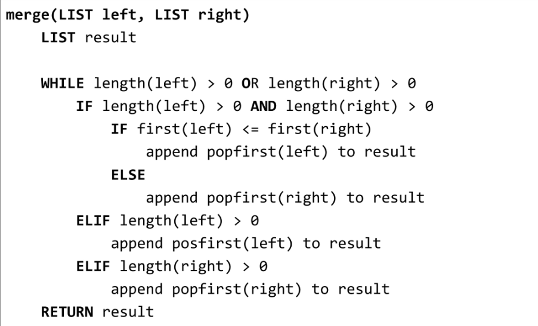
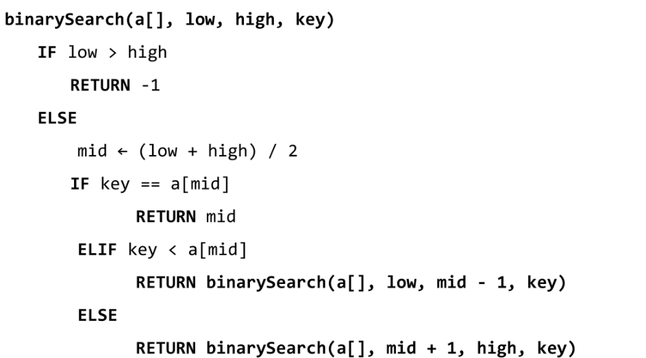

# Algorithm

---

## 분할정복

- 유래
  
  - 1805.12.02 아우스터리츠 전투에서 나폴레옹이 사용한 전략
  
  - 우세한 연합군을 공격하기 위해 중앙부로 처들어가 둘로 나눈 후 한부분씩 격파

- 설계전략
  
  - 분할(divide)
    
    - 해결할 문제를 여러개의 작은 부분으로 나눈다
  
  - 정복(conquer)
    
    - 나눈 작은 문제를 각각 해결한다
  
  - 통합(combine)
    
    - 해결된 해답을 모은다

- 반복(iterative)알고리즘
  
  - 분할 정복을 통해 시간복잡도를 줄일 수 있다
  
  
  
  

---

## 병합정렬

- 여러개의 정렬된 자료의 집합을 병합하여 한개의 정렬된 집합을 만드는 방식

- 분할 정복 알고리즘
  
  - 자료를 최소단위의 문제까지 나눈 후에 차례대로 정렬하여 최종 결과를 얻어냄
  
  - top down 방식

- 시간복잡도
  
  - O(nlogn)

- 분할 단계
  
  - 전체자료집합에 대해 최소크기의 부분집합이 될 때까지 분할 작업을 반복
    
    

- 병합단계
  
  - 부분집합을 정렬하면서 하나의 집합으로 병합하여 1개로 합쳐질때까지 반복
    
    

- 알고리즘
  
  - 분할과정
    
    
  
  - 병합과정
    
    

---

## 퀵정렬

- 주어진 배열을 두개로 분할하고 각각을 정렬
  
  - 병합정렬과의 차이점
    
    1. 병합정렬은 그냥 두부분으로 나누는 반면에, 퀵정렬은 분할할 때 기준 아이템(pivot item) 중심으로 이보다 작은 것은 왼편 큰 것은 오른편에 위치
    
    2. 병합정렬은 병합이라는 후처리 작업이 필요하지만, 퀵정렬은 필요하지 않다

- 알고리즘
  
  - Hoare-Partition
    
    
    
    - 아이디어
      
      1. p(피봇) 값들 보다 큰 값은 오른쪽, 작은 값은 왼쪽 집합에 위치
      
      2. 피봇을 두 집합의 가운데 위치
  
  - Lomuto-Partition
    
    

---

## 이진검색(Binary search)

- 자료의 가운데에 있는 항목의 키 값과 비교하여 다음 검색의 위치를 결정하고 검색을 진행
  
  - 목적 키를 찾을 때까지 이진 검색을 순환적으로 반복 수행함으로써 검색 범위를 반으로 줄여가면서 빠르게 검색 수행
  
  - 이진검색을 하기 위해서는 자료가 정렬된 상태여야한다

- 검색과정
  
  1. 자료의 중앙의 원소를 고른다
  
  2. 중앙 원소의 값과 찾고자하는 값을 비교
  
  3. 목표값이 중앙원소보다 작으면 왼편에서 검색, 크다면 오른편에서 검색
  
  4. 찾을 때까지 1~3반복

- 알고리즘 : 반복구조
  
  

- 알고리즘 : 재귀구조
  
  

---

## 백트래킹

- 여러가지 옵션들이 존재하는 상황에서 한가지를 선택

- 선택이 이루어지면 새로운 선택지의 집합 생성

- 이런 선택을 반복하면서 최종상태에 도달
  
  - 올바른 선택을 계속하면 목표상태(goal state)에 도달

- 백트래킹과 깊이우선탐색(dfs)의 차이
  
  - 어떤 노드에서 출발하는 경로가 해결책으로 이어질 것 같지 않으면 더 이상 그 경로를 따라가지 않음으로써 시도를 줄임(prunning 가지치기)
  
  - 깊이 우선 탐색은 모든 경로를 탐색하는 반면, 백트래킹은 불필요한 경로를 조기에 차단
  
  - 깊이 우선 탐색을 가하기에는 경우의 수가 너무나 많음. 즉 N! 가지의 경우의 수를 가진 문제에 대해 깊이 우선 탐색을 가하면 당연히 처리 불가능한 문제
  
  - 백트래킹 알고리즘을 적용하면 일반적으로 경우의 수가 줄어들지만 이 역시 최악의 경우에는 여전히 지수함수 시간(Exponential time)을 요하므로 처리 불가능

- 개념
  
  - 루트노드에서 리프노드까지의 경로는 해답후보(candidate solution)가 되는데, 깊이 우선 검색을 하여 그 해답후보 중에서 해답을 찾을 수 있다
  
  - 그러나 이 방법을 사용하면 해답이 될 가능성이 전혀 없는 노드의 후손 노드(descendant)들도 모두 검색해야 하므로 비 효율적이다
  
  - 백트래킹 기법
    
    - 어떤 노드의 유망성을 점검한 후에 유망(promising)하지 않다고 결정되면 그 노드의 부모로 되돌아가(backtracking) 다음 자식 노드로 감
    
    - 어떤 노드를 방문했을 때 그 노드를 포함한 경로가 해답이 될 수 없으면 그 노드는 유망하지 않다고 하며, 반대로 해답의 가능성이 있으면 유망하다고 한다
    
    - 가지치기(prunning) 
      
      - 유망하지 않는 노드가 포함되는 경로는 더 이상 고려하지 않는다
    
    - 백트래킹을 이용한 알고리즘은 다음과 같은 절차로 진행
      
      1. 상태 공간 트리의 깊이 우선 검색 실시
      
      2. 각 노드가 유망한지를 점검
      
      3. 만일 그 노드가 유망하지 않다면, 그 노드의 부모 노드로 돌아가서 검색지속
      
      

