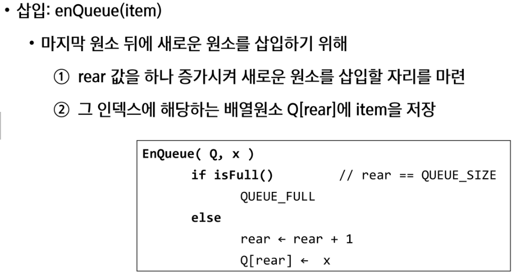

# Algorithm

---

## 그래프

- 아이템(사물 또는 추상적 개념)들과 이들 사이의 연결 관계를 표현한다

- 정점(vertex)들의 집합과 이들을 연견하는 간선(edge)들의 집합으로 구성된 자료구조
  
  - v 정점의 개수 / e 간선의 개수 일 때
    
    - v(v-1) 개의 간선이 가능한다

- 선형 자료구조나 트리 자료구조로 표현하기 어려운 N : N 관계를 가지는 원소들을 표현하기 용이

---

- 그래프의 유형
  
  1. 무향그래프(undirected graph)
     
     - 간선에 화살표가 없는 그래프
       
       
  
  2. 유향그래프(directed graph)
     
     - 간선에 화살표가 있는 그래프
       
       
  
  3. 가중치그래프(weighted graph)
     
     - 간선에 비용이 있는 그래프
       
       
  
  4. 사이클 없는 방향그래프(DAG, directed acyclic graph)
     
     
  
  5. 완전 그래프
     
     - 정점들에 대해 가능한 모든 간선들을 가진 그래프
       
       
  
  6. 부분 그래프
     
     - 원래 그래프에서 일부의 정점이나 간선을 제외한 그래프

---

- 인접(adjacency)
  
  - 두개의 정점의 간선이 존재(연결됨)하면 서로 인접해 있다고 한다
  
  - 완전 그래프에 속한 임의의 두 정점들은 모두 인접해 있다

- 그래프의 경로
  
  - 경로란 간선들을 순서대로 나열한 것
  
  - ex)
    
    - 간선 : (0,2), (2,4), (4,6)
    
    - 점점 0-2-4-6
  
  - 단순경로
    
    - 경로 중 한 정점을 한번만 지나는 경로
  
  - 사이클
    
    - 시작한 정점에서 끝나는 경로

---

- 그래프의 표현
  
  - 간선의 정보를 저장하는 방식, 메모리나 성능을 고래해서 결정
  
  - 인접행렬(adjacent matrix)
    
    - v*v 크기의 2차원 배열을 이용해서 간선 정보를 저장
    
    - 배열의 배열(포인터 배열)
    
      
    
    
    
    - 단점 
      
      - 정점이 많을 수록 빈 공간이 많아져서 데이터 관리 어려움
  
  - 인접리스트(adjacent list)
    
    - 각 정점마다 해당 정점으로 나가는 간선의 정보를 저장
    
      
    
      
  
  - 간선의 배열
    
    - 간선(시작정점, 끝 정점)을 배열에 연속적으로 저장

---

## DFS

- 그래프 순회(탐색)
  
  - 비선형구조인 그래프로 표현된 모든 자료(정점)를 빠짐없이 탐색하는 것을 의미
  
  - DFS / BFS 가 있다

---

- DFS
  
  - 시작 정점의 한 방향으로 갈 수 있는 경로 까지 탐색 후
    
    더이상 갈 곳이 없게 되면
    
    마지막 갈림길로 돌아와서 다른 정점의 방향으로 탐색을 반복하는 방법
  
  - 가장 마지막에 만났던 갈림길의 정점으로 되돌아서 다시 깊이 우선 탐색을 반복해야 하므로 후입선출 구조의 스택 사용

- 스택
  
  - 물건을 쌓아 올리듯 자료를 쌓아 올린 형태의 자료구조
    
    - 선형구조 : 자료간의 관계가 1대1 대응
    
    - 비선형구조 : 자료간의 관계가 1대 N 대응 (ex) 트리)
  
  - 마지막에 삽입한 자료를 가장 먼저 꺼낸다(
    
    - 후입선출(LIFO, Last-In-First_Out)

- 연산
  
  

---

## BFS

- BFS
  
  - 너비우선 탐색은 탐색 시작점의 인접한 정점들을 먼저 모두 차례로 방문한 후에, 방문했던 정점을 시작점으로 하여 다시 인접한 정점들을 차례로 방문하는 방식
  
  - 인접한 정점들에 대해 탐색을 한 후, 다시 너비우선탐색을 진행해야 하므로, 선입선출 형태의 자료구조인 큐를 활용함

- 큐
  
  - 스택과 마찬가지로 삽입과 삭제의 위치가 제한적인 자료구조
    
    - 큐의 뒤에서는 삽입만, 앞에서는 삭제만 이뤄지는 구조
  
  - 삽입한 순서대로 원소가 저장되어, 가장 먼저 삽입된 원소는 가장 먼저 삭제된다.
    
    - 선입선출구조(FIFO : First In First Out)
  
  
  
  
  
  

- 알고리즘
  
  

---

## 서로소 집합들(Disjoint-sets)

- 서로소 또는 상호배타 집합들은 서로 중복 포함된 원소가 없는 집합들이다. 
  
  - 교집합이 없다

- 집합에 속한 하나의 특정 멤버를 통해 각 집합을 구분
  
  -  특정 멤버를 대표자(representative)라고 한다

- 상호배타 집합을 표현하는 방법
  
  - 연결리스트
    
    - 같은 집합의 원소들은 하나의 연결리스트로 관리한다
    
    - 연결리스트의 맨 앞의 원소를 집합의 대표 원소로 삼는다
    
    - 각 원소는 집합의 대표원소를 가르키는 링크를 갖는다
      
      
  
  - 트리
    
    
    
    - 하나의 집합(a disjoint set)을 하나의 트리로 표현한다
    
    - 자식 노드가 부모 노드를 가리키며 루트 노드가 대표자가 된다
    
    
    
    

- 상호배타 집합 연산
  
  
  
  - 
