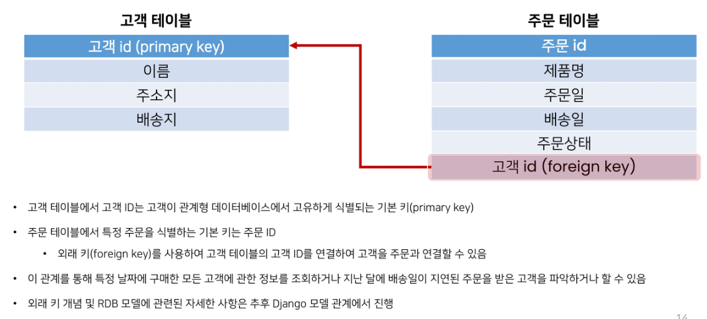
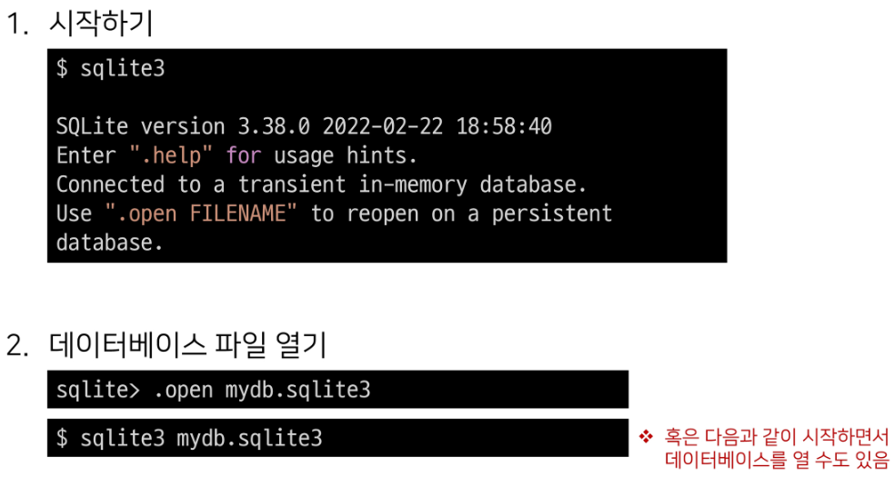

# SQL

---

## database

- 데이터베이스
  
  - 서비스 혹은 애플리케이션을 저장하는 곳 (데이터를 다루는 기술)
  1. 파일을 이용한 데이터 관리
     
     - 장점
       
       - 운영체제에 관계없이 쉽게 사용가능
       
       - 이메일이나 메신저를 이용해 간편하게 전송
     
     - 단점
       
       - 성능과 보안 측면의 한계가 명확
       
       - 대용량 데이터를 다루기에 적합하지 않음
       
       - 데이터를 구조적으로 정리하기에 어려움
       
       - 확장이 불가능한 구조
  
  2. 스프레드시트를 이용한 데이터 관리
     
     - 컬럼(열)을 통해 데이터의 유형을 지정하고
     
     - 레코드(행)를 통해 구체적인 데이터 값을 포함
     
     - 스프레드 시트 자체는 데이터 베이스라고 부를 수 없지만 데이터 베이스로 가는 길목
  
  3. 데이터베이스를 이용한 데이터 관리
     
     - 프로그래밍언어를 사용해 작동 가능
     
     - 데이터베이스의 형태는 다양하지만, 가장 많이 쓰이는 유형은 RDB(relational database)라고 부르는 관계형 데이터 베이스이다
     
     - RDB는 각각의 데이터를 테이블에 기입
     
     - 스프레드시트 파일 모음을 관계형 RDB

---

- database

- 장점
  
  - 데이터를 안전하고 편리하고 빠르게 보관하고 사용
  
  - 거대하고 복잡한 데이터를 다루기 위한 도구로 기능이 다양함
    
    - 기능의 다양성 : 데이터 관련해서 할 수 있는 일이 많다

- 기초
  
  - 데이터베이스에 데이터를 입력하고 출력하는 법

- 정의
  
  - 체계화된 데이터의 모임
  
  - 여러 사람이 공유하고 사용할 목적으로 통합 관리되는 정보의 집합
  
  - 검색 구조화 작업을 보다 쉽게 하기 위해 조직화된 데이터를 수집하는 저장 시스템
    
    - 내용을 고도로 구조화 함으로써 검색과 갱신의 효율화를 꾀한 것
    
    - 자료 파일을 조직적으로 통합하여 자료 항목의 중복을 없애고 구조화하여 기억시켜 놓은 자료의 집합체
  
  - database 조작 프로그램 = DBMS(database management system)
    
    - 종류 : oracle, mysql, sqlite
    
    - sql : 데이터베이스를 조작하기 위해 사용하는 언어
  
  - 데이터베이스는 RDBMS(관계형 데이터베이스 관리 시스템)을 사용하여 sql로 데이터와 프로그래밍을 구성

---

## RDB

- 관계형 데이터 베이스 (relational database)
  
  - 데이터를 테이블, 행, 열 등으로 나누어 구조화
  
  - 자료를 여러 테이블로 나누어 관리, 테이블간 관계를 설정해 여러 데이터를 쉽게 조작할 수 있는 장점
  
  - sql을 사용하여 데이터를 조회하고 조작

- 테이블간 관계 설정 예시
  
  

- 기본구조
  
  1. 스키마(schema)
     
     - 테이블의 구조(structure)
     
     - 데이터베이스에서 자료의 구조, 표현방법, 관계 등 전반적인 명세를 기술한 것
       
       
  
  2. 테이블
     
     - 필드와 레코드를 사용해 조직된 데이터 요소들의 집합
     
     - 관계(realtion)라고 부르기도 함
     1. 필드(field)
        
        - 속성 / 컬럼(column)
     
     2. 레코드(record)
        
        - 튜플 / 행(row)
        
        - 테이블의 데이터는 레코드에 저장
     
     3. 기본키(PK: primary key)
        
        - 각각의 레코드의 고유한 값
          
          - 각각의 데이터를 구분할 수 있는 고유값
          
          - 기술적으로 다른 항목과 절대 중복될 수 없는 단일 값(unique)

- 관계형 데이터베이스 장점
  
  - 데이터 직관적 표현
  
  - 데이터에 대한 접급 용이
  
  - 대량의 데이터 효율적 관리

- RDBMS
  
  - relational database management system(관계형 데이터베이스 관리 시스템)
  
  - 관계형 데이터베이스를 만들고 업데이트하고 관리하는 데 사용하는 프로그램
  
  - ex) sqlite / mysql / oracle 등
    
    - sqlite
      
      - 장점
        
        - 파일형식으로 넣어 사용하는 비교적 가벼운 데이터 베이스
        
        - 안드로이드 / ios / macos에 기본적으로 탑재
        
        - 임베디드 소프트웨어에서도 많이 활용
      
      - 단점
        
        - 대규모 동시 처리 작업 적합하지 않음
        
        - 다른 RDMBS에서 지원하는 sql 기능을 지원하지 않는 경우가 있음
      
      - 학습이유
        
        - 어떤 환경에서나 실행 가능한 호환성
        
        - 데이터 타입이 비교적 적고 강하지 않기 떄문에 유연한 학습 환경
        
        - django framework의 기본 데이터 베이스

---

## SQL

- structured query language

- RDBMS의 데이터를 관리하기 위해 설계된 특수 목적의 프로그래밍언어

- RDBMS에서 데이터베이스 스키마를 생성 및 수정

- 테이블에서의 자료 검색 및 관리

- 데이터베이스 객체에 대한 처리를 관리하거나 접근 권한을 설정하여 허가된 사용자만 RDBMS를 관리

- 많은 데이터베이스 관련 프로그램들이 SQL을 표준으로 채택

- 정리
  
  - SQL : 데이터베이스와 상호작용하는 방법

---

## sql commands

- sql commands의 종류
  
  1. DDL(data definition language)
  
  2. DML(data manipulation language)
  
  3. DCL(data control language)
  
  

---

## sql syntax

- 모든 sql문(statement)는 SELECT, INSERT, UPDATE 등과 같은 키워드로 시작
  
  - 하나의 SQL문은 세미콜론(;)으로 끝남
  
  - 세미콜론은 SQL문을 구분하는 표준방법

- SQL은 대소문자를 구분하지 않음
  
  - SELECT와 select는 같지만 대문자로 사용하는 것을 권장

---

- statement(문)
  
  - 독립적으로 실행할 수 있는 완전한 코드 조각
  
  - statement는 clause로 구성됨

- clause(절)
  
  - statement의 하위 단위
  
  - 완전한 코드가 아니라 단독적으로 사용할 수 없다

---

## DDL

- data definition / 테이블의 데이터를 정의하는 부분 (record 내용은 없음)

- SQL 데이터 정의 언어를 사용하여 테이블 데이터베이스 개체를 만드는 방법을 학습

- DDL은 테이블 구조를 관리
  
  - CREATE / ALTER /DROP

---

## CREATE TABLE

- CREATE TABLE statement
  
  - 데이터베이스에 새로운 테이블 생성
    
    
    
    `컬럼이름 / 데이터 타입 / 제약조건`형태로 컬럼을 정의한다 

- 실습
  
  1. 테이블 생성
     
     
  
  2. query 실행
     
     
  
  3. 쿼리 실행 후 스키마 확인
     
     
     
     - id 컬럼은 기본 키 역할의 컬럼을 지정하지 않는다면
       
       - 자동으로 **rowid**라는 컬럼으로 생성

---

## SQLite DATA TYPES

- 종류
  
  1. NULL
     
     - NULL value
     
     - 정보가 없거나 알 수 없음
  
  2. INTEGER
     
     - 정수
     
     - 크기에 따라 0,1,2,3,4,6,8바이트와 같은 가변 크기를 가짐
  
  3. REAL
     
     - 실수
     
     - 8바이트 부동 소수점을 사용하는 10진수 값이 있는 실수
  
  4. TEXT
     
     - 문자데이터
  
  5. BLOB(Binary Large Object)
     
     - 입력된 그대로 저장된 데이터 덩어리(대용 타입 없음)
     
     - 바이너리 등 멀티 미디어 파일
     
     - EX) 이미지
  
  ---
  
  - **SQLite에는 별도의 BOLLEAN 타입이 없음**
    
    - 대신 0 or 1로 저장한다
  
  - Data & Time datatype
    
    - SQLite에는 날짜 및 시간을 저장하기 위한 타입이 없음
    
    - 대신 built-in 'data and time functions'로 TEXT / REAL 또는 INTEGER 값으로 저장
  
  - Binary data
    
    - 데이터의 저장과 처리를 목적으로 0과 1의 이진 형식으로 인코딩 된 파일
    
    - 기본적으로 컴퓨터의 모든 데이터는 binary data
      
      - 이를 필요에 따라 텍스트 타입으로 변형해서 사용
  
  ---

- **SQLite 데이터 타입 결정**
  
  - 값에 둘러싸는 따옴표와 소수점 또는 지수가 없으면 - INTEGER
  
  - 값이 따옴표로 묶이면 - TEXT
  
  - 따옴표가 없고, 소수점/지수가 없으면 - REAL
  
  - 따옴표 없이 NULL이면 - NULL

- SQLite datatype 특징
  
  - 다른 모든 SQL 데이터베이스 엔진(mySQL / postgreSQL 등)
    
    - 정적이고 엄격한 타입(static, rigid system)
  
  - SQLite
    
    - **동적타입 시스템(dynamic type system)**
      
      - 컬럼에 데이터 타입을 선언해 놓더라도
        
        - **컬럼에 저장하는 값에 따라 데이터 타입이 결정** 된다.
      
      - 데이터 타입을 선언하지 않아도 됨
        
        - ex) 동일한 컬럼에 
          
          - 정수 1을 넣으면 INTEGER
          
          - 문자 1을 넣으면 TEXT
        
        - 동적 타입 시스템을 사용하면 기존의 엄격한 데이터베이스에서 불가능한 작업을 유연하게 수행가능
        
        - 정적데이터베이스에서 작동하는 것도 SQLite에서 동일하게 작동가능
        
        - 다른 데이터베이스와 호환성 문제가 있기 때문에 테이블 생성 시 
          
          - **데이터 타입을 지정하는 것을 권장**
      
      - 데이터 타입을 선언하면 SQLite는 입력된 타입을 지정된 형식으로 변환
        
        - EX) TEXT 타입 컬럼에 정수 1을 넣어도 / 문자 1로 저장
        
        
  
  ---
  
  - static / rigid typing 데이터 베이스
    
    - statically, rigidly typed databases라고도 부름
    
    - 저장되는 값의 데이터 타입은 컬럼에 선언된 데이터 타입에 의해 결정
    
    - ex) 
      
      - 컬럼 a에 '123' / 컬럼 b에 456 삽입하는 경우
        
        - a는 문자열 '123'을 정수 123으로 변환 / b는 정수 456을 문자'456'으로 변환
  
  ---

- TYPE AFFINITY(타입 선호도)
  
  - 특정 컬럼에 저장된 데이터에 권장되는 타입
  
  - 데이터 타입 작성 시 SQLite의 5가지 데이터 타입이 아닌 다른 데이터 타입을 선언한다면, 내부적으로 각 타입의 지정된 선호도에 따라 5가지 선호도로 인식
    
    1. INTEGER
    
    2. TEXT
    
    3. BLOB
    
    4. REAL
    
    5. NUMERIC
    
    
  
  - 타입 선호도 존재 이유
    
    - 다른 데이터베이스 엔진 간의 **호환성**을 최대화
    
    - 정적이고 엄격한 타입을 사용하는 데이터베이스의 SQL문을 SQLite에서도 작동하도록 하기 위해

---

## Costraints(제약조건)

- 입력하는 자료에 대한 제약 설정

- 제약에 맞지 않다면 입력 거부

- 사용자가 원하는 조건의 데이터만 유지
  
  - **데이터의 무결성을 유지**하기 위한 보편적인 방법 
  
  - 테이블의 특정 컬럼에 설정하는 제약

- 데이터 무결성
  
  

- 종류
  
  1. NOT NULL
     
     - 컬럼이 NULL 값을 허용하지 않도록 지정
     
     - 기본적으로 테이블의 모든 컬럼은 NOT NULL 제약 조건을 명시적으로 사용하지 않는다면 NULL값을 허용
  
  2. UNIQUE
     
     - 컬럼의 모든 값이 서로 구별되거나 고유한 값이 되도록 함
  
  3. PRIMARY KEY
     
     - 테이블에서 행의 고유성을 식별하는 데 사용되는 컬럼
     
     - 각 테이블에 하나의 기본키만 있음
     
     - 암시적으로 NOT NULL 제약 조건이 포함
       
       
  
  4. AUTOINCREMENT
     
     - 사용되지 않는 값이나 이전에 삭제된 행의 값을 재사용하는 것을 방지
     
     - INTEGER PRIMARY KEY 다음에 작성하면 해당 rowid를 다시 재사용하지 못하게 함
       
       
       
       - django에서 테이블 생성시 id컬럼에 기본적으로 사용하는 제약조건
  
  5. 그 외 기타 CONSTAINTS
     
     ---
     
     - rowid 특징
       
       - 테이블을 생성할 때마다 rowid(암시적 자동 증가 컬럼)가 자동으로 생성
       
       - 테이블의 행을 고유하게 식별하는 64비트 부호 있는 정수 값
       
       - 테이블에 새 행을 삽입할 때마다 정수 값을 자동으로 할당
         
         - 값은 1에서 시작
         
         - 데이터 삽입시 rowid 또는 INTEGER PRIMARY KEY 컬럼에 명시적으로 값이 지정되지 않은 경우, SQLite는 테이블에서 가장 큰 rowid보다 하나 큰 다음 순차 정수를 자동으로 할당(AUTOINCREMENT와 관계없이)
       
       - 만약 INTEGER PRIMARY KEY 키워드를 가진 컬럼을 직접 만들면 이 컬럼은 rowid 컬럼의 별칭(alias)이 됨
         
         - 즉 새 컬럼 이름으로 rowid에 액세스 할 수 있으며 rowid 이름으로도 여전히 액세스 가능
       
       - 데이터가 최대 값에 도달하고 새 행을 삽입하려고 하면 SQLite는 사용되지 않는 정수를 찾아 사용(limits in SQLite)
       
       - 만약 SQLite가 사용되지 않은 정수를 찾을 수 없다면 SQLITE_FULL에러발생
         
         - 또한 일부 행을 삭제하고 새 행을 삽입하면 SQLite는 삭제된 행에서 rowid 값을 재사용하려고 시도

---

## ALTER TABLE(기존 테이블의 구조를 수정(변경))

- 종류
  
  1. Rename a table(테이블명 변경)
     
     
  
  2. Rename a column(컬럼명 변경)
     
     
  
  3. Add a new column to a table(새 컬럼 추가)
     
     
     
     - 테이블에 기존 데이터가 있을 경우 에러발생
       
       
       
       - 이전에 이미 저장된 데이터들은 새롭게 추가되는 컬럼에 값이 없기 때문에 NULL이 작성
       
       - 새로 추가되는 컬럼에 NOT NULL 제약조건이 있기 때문에 기본 값 없이 추가될 수 없다는 ERROR 발생
     
     - 에러 해결
       
       - DEFAULT 제약조건
         
         - column의 제약조건 중 하나
         
         - 데이터를 추가할 때 값을 생략할 시 기본값을 설정
       
       
       
       - address 컬럼이 추가되면서 기존에 있던 데이터들의 address 컬럼 값은 'no address'가 된다
  
  4. Delete a column(컬럼 삭제)
     
     
     
     - 삭제하지 못하는 경우
       
       - 컬럼이 다른 부분에서 참조되는 경우
         
         - FOREIGN KEY(외래키) 제약조건에서 사용되는 경우
       
       - PRIMARY KEY인 경우
       
       - UNIQUE 제약 조건이 있는 경우
         
         

- 예시
  
  

---

## DROP TABLE

- 데이터베이스에서 테이블 제거
  
  

- 존재하지 않는 테이블을 제거하면 SQLite에서 오류 발생
  
  

- 특징
  
  - 한번에 하나의 테이블만 삭제 가능
  
  - 여러 테이블을 제거하려면 반복 실행
  
  - droptable은 실행 취소나 복구할 수 없음
    
    - 각별한 주의가 필요

---

## DML

- C(INSERT)

- R(SELECT)

- U(UPDATE)

- D(DELETE)
  
  ---
  
  - COMMAND-LINE PROGRAM(sqlite3)
    
    
  
  - 사용하기
    
    
  
  - 종료하기
    
    
  
  ---

- CSV 파일을 SQLite 테이블로 가져오기
  
  1. DML.sql 파일 생성
  
  2. 테이블 생성
     
     
  
  3. 데이터베이스 파일 열기
     
     
  
  4. 모드(.mode)를 csv로 설정
     
     
  
  5. .import 명령어를 사용하여 csv데이터를 테이블로 가져오기
     
     
  
  6. import된 데이터 확인한기
     
     - sqlite3 tool에서도 SQL문을 사용할 수 있지만, 실습의 편의와 명령어 기록을 위해 sql 확장자 파일에서 진행
     
     

---

## Simple query

- select 문을 사용하여 간단하게 단일 테이블에서 데이터를 조회
  
  
  
  - query data from a table
  
  - 특정 테이블에서 데이터를 조회하기 위해 사용
  
  - 문법규칙
    
    1. SELECT 절에서 컬럼 또는 쉼표로 구분된 컬럼 목록을 지정
    
    2. FROM절(clause)에서 데이터를 가져올 테이블을 지정
  
  - select문은 SQLite에서 가장 복잡한 문
  
  - 다양한 절과 함께 사용할 수 있음
    
    

- 실습
  
  1. 
  
  2. 
  
  3. 

---

## Sorting rows

- ORDER BY절을 사용하여 쿼리의 결과 정렬
  
  
  
  - SELECT 문에 추가하여 결과를 정렬
  
  - ORDER BY 절은 FROM 절 뒤에 위치
  
  - 하나 이상의 컬럼을 기준으로 결과를 오름차순, 내림차순으로 정렬
    
    - ORDER BY 뒤에 
      
      - ASC : 오름차순(기본값)
      
      - DESC : 내림차순

- 실습
  
  
  
  
  
  ---
  
  - SORTING NULLs
    
    - null의 정렬방식
    
    - 정렬과 관련하여 SQLite는 NULL을 다른 값보다 작은 것으로 간주
    
    - ASC 사용하는 경우 결과의 시작 부분에 NULL표시
    
    - DESC 사용하는 경우 결과의 마지막에 NULL표시

---

## FILTERING DATA

- 데이터를 필터링하여 중복 제거, 조건 설정 등 쿼리 제어하기

- Clause
  
  - SELECT DISTINCT
  
  - WHERE
  
  - LIMIT

- Operator
  
  - LIKE
  
  - IN
  
  - BETWEEN

- SELECT DISTINCT
  
  
  
  - 조회 결과에서 중복된 행을 제거
  
  - DISTINCT 절은 SELECT 에서 선택적으로 사용할 수 있는 절
  
  - 문법규칙
    
    1. DISTINCT 절은 SELECT 키워드 바로 뒤에 나타나야 함
    
    2. DISTINCT 키워드 뒤에 컬럼 또는 컬럼 목록을 작성
  
  - 실습
    
    
    
    
    
    
    
    ---
    
    - NULL with DISTINCT
      
      - SQLite는 NULL 값을 중복으로 간주
      
      - NULL 값이 있는 컬럼에 DISTINCT 절을 사용하면 SQLite는 NULL값의 한 행을 유지

---

- WHERE
  
  
  
  - 조회 시 특정 검색 조건을 지정
  
  - WHERE 절은 SELECT 문에서 선택적으로 사용할 수 있는 절
    
    - SELECT 문 외에도 UPDATE 및 DELETE 문에서  WHERE 절을 사용할 수 있음
  
  - FROM 절 뒤에 작성
  
  - 검색 조건 작성 형식
    
    
  
  - SQLite comparison operators(비교연산자)
    
    - 두 표현식이 동일한지 테스트
      
      - =
      
      - <> or !=
      
      - <
      
      - > 
      
      - <=
      
      - \>=
  
  - SQLite logical operators(논리연산자)
    
    - 일부표현식의 truth를 테스트
    
    - 1 or 0 or NULL 값을 반환
    
    - SQLite는 Boolean 데이터 타입을 제공하지 않으므로 1은 T / 0은 F
    
    - ALL/ AND/ ANY/ BETWEEN/ IN/ LIKE/ NOT/ OR 등
  
  - 실습
    
    
    
    

---

- LIKE operator
  
  - 패턴 일치를 기반으로 데이터를 조회
  
  - SELECT, DELETE, UPDATE 문의 WHERE 절에서 사용
  
  - 기본적으로 대소문자는 구분하지 않음
    
    - 'A' LIKE 'a'는 T
  
  - SQLite는 패턴구성을 위한 두개의 와일드카드 제공
    
    1. %(percent)
       
       - 0개 이상의 문자가 올 수 있음
       
       - 예시
         
         
    
    2. _(underscore)
       
       - 단일(1개) 문자가 있음을 의미
       
       - 예시
         
         
    
    3. 
    
    4. 
  
  - 실습
    
    
    
    
    
    
    
    
    
    

---

- IN operator
  
  - 값이 값 목록 결과에 있는 값과 일치하는지 확인
  
  - 표현식이 값 목록의 값과 일치하는지 여부에 따라 true 또는 false 반환
  
  - IN 연산자를 부정하려면 NOT IN 연산자 사용
  
  - 실습
    
    
    
    

---

- BETWEEN operator
  
  
  
  - 값이 범위 안에 있는지 테스트
  
  - 값이 지정된 범위에 있으면 T반환
  
  - SELECT, DELETE 및 UPDATE 문의 WHERE절에서 사용할 수 있음
  
  - BETWEEN 연산자의 결과를 부정하려면 NOT BETWEEN 연산자를 사용
  
  - 실습
    
    

---

- LIMIT clause
  
  
  
  - 쿼리에서 반환되는 행 수를 제한
  
  - SELECT 문에서 선택적으로 사용할 수 있는 절
  
  - row_count는 반환되는 행 수를 지정하는 양의 정수를 의미
  
  - 실습
    
    

---

- OFFSET keyword
  
  - LIMIT 절을 사용하면 첫 번째 데이터부터 지정한 수만큼의 데이터를 받아올 수 있지만, OFFSET과 함께 사용하면 특정 지정된 위치에서부터 데이터를 조회할 수 있음
  
  - 실습
    
    

---

## GROUPING DATA

- GRUP BY clause
  
  - 특정 그룹으로 묶인 결과를 생성
  
  - 선택된 컬럼 값을 기준으로 데이터(행)들의 공통 값을 묶어서 결과로 나타냄
  
  - SELECT문에서 선택적으로 사용가능한 절
  
  - SELECT문의 FROM 절 뒤에 작성
    
    - WHERE 절이 포함된 경우 WHERE절 뒤에 작성
  
  - 각 그룹에 대해 MIN, MAX, SUM, COUNT, AVG 와 같은 집계함수(aggregate function)를 적용하여 각 그룹에 대한 추가적인 정보를 제공할 수 있음
  
  - 사용
    
    
    
    
  
  - 실습
    
    
  
  ---
  
  - 집계 함수(aggregate function)
    
    
  
  - 실습
    
    

---

## Changing data

- 데이터의 삽입, 수정, 삭제
  
  - INSERT
    
    
    
    
  
  - UPDATE
    
    
    
    - 실습
  
  - DELETE
    
    
    
    - 실습
