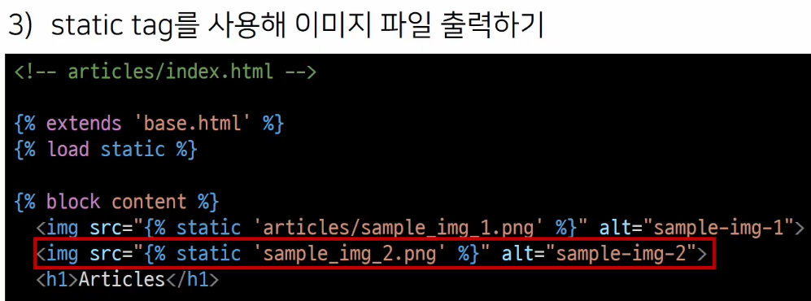
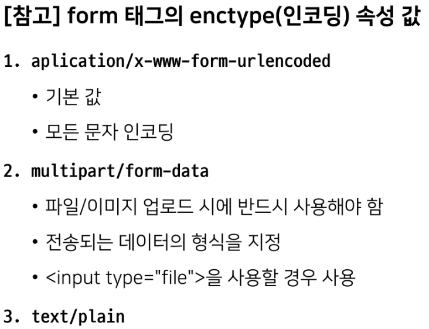
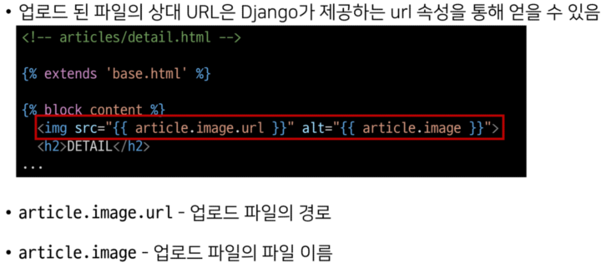
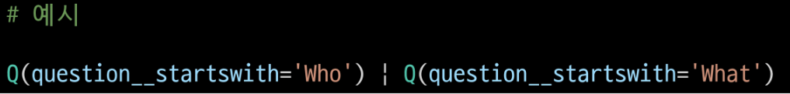
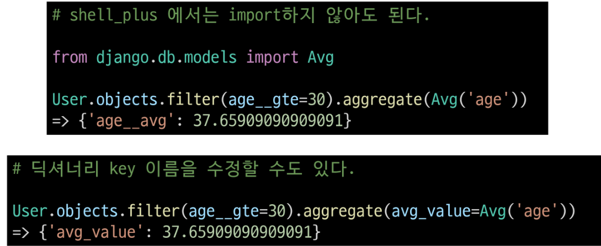
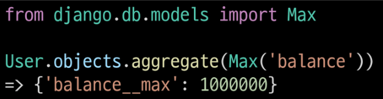

# static/media

---

## managing static files

- 개발자가 미리 준비하거나 사용자가 업로드한 정적파일을 클라이언트에게 제공하는 방법

- 정적파일
  
  - 응답할 때 별도의 처리 없이 파일 내용을 그대로 보여주면 되는 파일
    
    - 사용자의 요청에 따라 내용이 바뀌는 것이 아니라 요청한 것을 그대로 보여주는 파일
  
  - 파일자체가 고정, 서비스 중에도 추가되거나 변경되지 않고 고정되어 있음
    
    - 웹사이트는 일반적으로 이미지/자바스크립트/css와 같은 미리 준비된 추가 파일(움직이지 않는)을 제공해야함
  
  - django에서는 이러한 파일들을 ststic file이라 함
    
    - django의 staticfiles 앱을 통해 정적 파일과 관련된 기능 제공
  
  ---
  
  1. media file
     
     - 사용자가 웹에서 업로드하는 정적파일(user - uploaded)
     
     - 유저가 업로드한 모든 정적 파일
  - 웹 서버와 정적파일
    
    - 웹서버의 기본동작은
      
      - 특정위치(url)에 있는 자원을 요청(http request) 받아서
      
      - 응답(http response)을 처리하고 제공(serving)하는 것
    
    - 이는 자원과 자원에 접근 가능한 주소가 있다는 의미
      
      - ex) 사진파일은 자원이고 해당 사진파일을 얻기 위한 경로인 웹주소(url)가 존재
    
    - 웹서버는 요청받은 url로 서버에 존재하는 정적자원(statuc resource)

---

## static files 구성하기

---

- django template tag
  
  

- static files 관련 core settings
  
  1. STATIC_ROOT
     
     - Default : None
     
     - django 프로젝트에서 사용하는 모든 정적 파일을 한 곳에 모아 넣은 경로
     
     - `collectstatic`이 배포를 위해 정적 파일을 수집하는 디렉토리의 절대경로
       
       - `collectstatic`
         
         
     
     - 개발과정에서 settings.py의 DEBUG 값이 True 값으로 설정되어 있으면 해당 값은 작용되지 않음
     
     - 서비스 배포(배포환경)에서 django의 모든 정적 파일을 다른 웹 서버가 직접 제공하기 위해 사용
     
     - 배포환경에서 django를 직접 실행하는 것이 아니라 다른 서버에 의해 실행되기 때문에 실행하는 다른 서버는 django에 내장되어 있는 정적파일들을 인식하지 못함(내장되어 있는 정적파일을 밖으로 꺼내는 이유)
       
       - 소프트웨어 배포(deploy)
         
         - 프로그램 및 애플리케이션을 서버와 같은 기기에 설치하여 서비스를 제공하는 것
         
         - 클라우딩컴퓨팅서비스(AWS, google cloud, ms azure)에 프로그램 및 애플리케이션을 설치해 제공하는 것
  
  2. STATICFILES_DIRS
     
     - Default : [] (empty list)
     
     - app/static/ 디렉토리 경로를 사용하는 것(기본경로) 외에 추가적인 정적파일 경로 목록을 정의하는 리스트
     
     - 추가 파일 디렉토리에 대한 전체 경로를 포함하는 문자열 목록으로 작성되어야 함
       
       
  
  3. STATIC_URL
     
     - Default : None
     
     - STATIC_ROOT에 있는 정적 파일을 참조할 때 사용할 URL
     
     - 개발 단계에서는 실제 정적 파일들이 저장되어 있는 app/static/ 경로(기본경로) 및 STATICFILES_DIRS에 정의된 추가 경로들을 탐색
     
     - 실제 파일이나 디렉토리가 아니며, URL로만 존재
     
     - 비어있지 않은 값으로 설정한다면 반드시 slash(/)로 끝나야 함
       
       

---

- static file 가져오기
  
  1. 기본 경로에 있는 static file 가져오기
     
     - app/static/~
     
     
  
  2. 추가 경로에 있는 static file 가져오기
     
     - STATICFILES_DIRS
     
     

- STATIC_URL 확인하기
  
  - django가 해당 이미지를 클라이언트에게 응답하기 위해 만든 image url 확인하기
    
    - 개발자도구 - inspect버튼을 통해 확인
  
  - `STATIC_URL + static file 경로`로 설정
    
    - http://127.0.0.1:8000/static/articles/iu.jpg
  
  - 개발자도구 - network에서 request url 확인해보기
    
    - 클라이언트에게 이미지를응답하기 위한 요청 url을 만든 것

---

## image upload

- django ImageField를 사용해서 사용자가 업로드한 정적파일(미디어 파일) 관리

---

## ImageField

- 이미지 업로드에 사용하는 모델 필드

- FileField를 상속받는 서브 클래스이기 때문에 FileField의 모든 속성 및 메서드를 사용 가능

- 사용자에 의해 업로드 된 객체가 유효한 이미지인지 검사

- ImageField 인스턴스는 최대길이가 100자인 문자열로 DB에 생성되며, max_length 인자를 사용하여 최대길이를 변경할 수 있음

- FileField()
  
  

- FileField / ImageField를 사용하기 위한 단계
  
  

- MEDIA_ROOT
  
  - default : ''(empty string)
  
  - 사용자가 업로드한 파일(미디어파일)들을 보관할 디렉토리의 절대 경로
  
  - django는 성능을 위해 업로드 파일은 데이터베이스에 저장하지 않음
    
    - **데이터베이스에 저장하는 것은 파일 경로**
  
  - MEDIA_ROOT는 STATIC_ROOT와 반드시 다른 경로로 지정해야함
    
    

- MEDIA_URL
  
  - default : ''(empty string)
  
  - MEDIA_ROOT에서 제공되는 미디어 파일을 처리하는 URL
  
  - 업로드된 파일의 주소(URL)를 만들어 주는 역할
    
    - 웹 서버 사용자가 사용하는 public URL
  
  - 비어있지 않은 값으로 설정 한다면 반드시 slash(/)로 끝나야 함
  
  - MEDIA_URL은 STATIC_URL과 반드시 다른 경로로 지정해야 함
    
    

- 개발단계에서 사용자가 업로드한 미디어 파일 제공하기
  
  
  
  

---

## CREATE

- ImageField 작성
  
  
  
  - option
    
    1. blank
       
       - default : Fasle
       
       - True인 경우 필드를 비워 둘 수 있음
         
         - 이럴 경우 DB에는 ''(빈문자열)이 저장
       
       - 유효성 검사에서 사용됨(is_valid)
         
         - Validation-related
         
         - 필드에 blank = True가 있으면 form 유효성 검사에서 빈값을 입력 가능
    
    2. null
       
       - default : False
       
       - True인 경우 django는 빈 값을 DB에 NULL(문자열기반 필드의 빈값뿐만 아니라 다른 필드의 빈값을 표현)로 저장함
         
         - database-related
       
       - 주의사항
         
         

- migrations
  
  - ImageField를 사용하려면 반드시 pilow 라이브러리가 필요
    
    - pilow 설치 없이는 makemigrations 실행 불가
      
      
  
  - pilow
    
    - 광범위한 파일 형식 지원, 효율적이고 강력한 이미지 처리기능 제공하는 라이브러리
    
    - 이미지 처리 도구를 위한 견고한 기반 제공

- ArticleForm에서 image 필드 출력 확인
  
  - 확인 후 이미지를 첨부하여 게시글 작성 시도
    
    
  
  - 하지만 이미지가 업로드 되지 않음
  
  - 파일 또는 이미지 업로드 시에는 form 태그에 enctype 속성을 변경해야함
    
    - 인코딩 속성 값 변경
    
    

- request.FILES
  
  - 파일 및 이미지는 request의 POST 속성 값으로 넘어가지 않고 FILES 속성 값에 담겨 넘어감
    
    
    
    

- 이미지 첨부하기
  
  - 이미지를 첨부와 첨부하지 않은 게시글 작성
  
  - 이미지를 첨부하지 않으면 blank =True 속성으로 인해 빈 문자열이 저장
  
  - 이미지를 첨부한 경우는 MEDIA_ROOT 경로에 이미지가 업로드
    
    
  
  - 같은 이름의 파일을 업로드 한다면 django는 파일 이름 끝에 임의의 난수를 붙여 저장
    
    

---

## READ

- 업로드 이미지 출력하기
  
  
  
  

---

## UPDATE

- 이미지는 바이너리 데이터에기 때문에 텍스트처럼 일부만 수정하는 것은 불가능
  
  - 새로운 사진으로 대체하는 방식 사용

- 업로드 이미지 수정하기
  
  - enctype 속성값 추가
    
    
  
  - 이미지 파일이 담겨있는 request.FILES 추가 작성
    
    

---

## upload_to argument

- 사용자 지정 업로드 경로와 파일 이름 설정
  
  - ImageField는 업로드 디렉토리와 파일 이름을 설정하는 2가지 방법을 제공
    
    1. 문자열 값이나 경로 지정 방법
       
       - upload_to 인자에 새로운 이미지 저장 경로를 추가후 migration 진행
         
         
       
       - 이미지 업로드 후 변경된 업로드 경로 확인
       
       - MEDIA_ROOT 이후 경로가 추가 되는 것
         
         
       
       - 단순 문자열 뿐만 아니라 파이썬 time 모듈의 srtftime() 형식도 포함될 수 있으며, 이는 파일 업로드 날짜/시간으로 대체 됨
         
         
       
       - migration 과정 진행 후 이미지 업로드 결과 확인하기
         
         
    
    2. 함수 호출 방법
       
       - upload_to는 독특하게 함수처럼 호출이 가능하며 해당 함수가 호출되면서 반드시 2개의 인자를 받음
         
         
       1. instance
          
          - FileField가 정의된 모델의 인스턴스
          
          - 대부분 이 객체는 아직 데이터베이스에 저장되기 전이므로 아직 PK 값이 없을 수 있으니 주의
       
       2. filename
          
          - 기존 파일 이름
       - migraion 과정 진행 후 이미지 업로드 결과 확인하기
       
       - username이 test인 회원이 업로드한 결과
         
         

---

## Image Resizing

- 실제 원본 이미지를 서버에 그대로 로드 하는 것은 여러 이유로 부담이 큼

- HTML \ 태그에서 직접 사이즈를 조정할 수도 있지만, 업로드 될 때 이미지 자체를 resizing 하는 것을 사용해 볼 것

- 사전준비
  
  - django-imagekit 모듈 설치 및 등록
    
    
    
    - django-imagekit 
      
      - 이미지 처리를 위한 django 앱
        
        - 썸네일 /해상도 /사이즈 /색 조정 가능
      
      - 썸네일 만들기
        
        1. 원본 이미지 저장 X
           
           
           
           
           
           - 작아진 이미지 사이즈 확인
             
             - pilkit
               
               - processors에 작성하는 여러 클래스는 해당 라이브러리 문서를 별도로 확인
        
        2. 원본 이미지 저장 O
           
           
           
           

---

## QuertSet API advanced

- 사전 준비
  
  1.  가상환경 생성 및 활성화
  
  2. 패키지 목록 설치
  
  3. migrate 진행
  
  4. sqlite3에서 csv 데이터 import
  
  5. 테이블 확인
  
  6. shell_plus 실행

---

## CRUD 기본

- 모든 user 레코드 조회
  
  

- user 레코드 생성
  
  

- 101번 user 레코드 조회
  
  

- 01번 user 레코드 last_name을 김으로 수정
  
  

- 101번 user 레코드 삭제
  
  

- 전체 인원수 조회
  
  
  
  - .count()
    
    

---

## Sorting data

- 나이가 어린 순으로 이름과 나이 조회하기
  
  
  
  - `order_by()`
    
    
  
  - `values()`
    
    

- 이름과 나이를 나이가 많은 순서대로 조회하기
  
  

- 이름, 나이, 계좌 잔고를 나이가 어린 순으로, 만약 같은 나이라면 계좌 잔고가 많은 순으로 정렬해서 조회하기
  
  

- order_by 주의사항
  
  - 다음과 같이 작성할 경우 앞에 호출은 모두 지워지고 마지막 호출만 적용됨
    
    

---

## Filtering data

- 중복없이 모든 지역 조회하기
  
  

- 지역 순으로 오름차순 정렬하여 중복없이 모든 지역 조회하기
  
  

- 이름과 지역이 중복 없이 모든 이름과 지역 조회하기
  
  

- 이름과 지역 중복 없이 지역 순으로 오름차순 정렬하여 모든 이름과 지역 조회하기
  
  

- 나이가 30인 사람들의 이름 조회
  
  

- 나이가 30살 이상인  사람들의 이름과 나이 조회하기
  
  

- Field lookups
  
  - SQL WHERE 절의 상세한 조건을 지정하는 방법
  
  - QuertSet 메서드 filter(), exclude() 및 get()에 대한 키워드 인자로 사용
  
  - 문법규칙
    
    - 필드명 뒤에 'double-underscore' 이후 작성
    
    

- 나이가 30살 이상이고 계좌 잔고가 50만원 초과인 사람들의 이름, 나이, 계좌 잔고 조회
  
  

- 이름에 '호'가 포함되는 사람들의 이름과 성 조회하기
  
  

- 핸드폰 번호가 011로 시작하는 사람들의 이름과 핸드폰 번호 조회
  
  

- 이름이 '준'으로 끝나느 사람들의 이름 조회하기
  
  

- 경기도 혹은 강원도에 사는 사람들의 이름과 지역 조회하기
  
  

- 경기도 혹은 강원도에 살지 않는 사람들의 이름과 지역 조회하기
  
  

- exclude()
  
  - exclude(**kwargs)
  
  - 주어진 매개변수와 일치하지 않는 객체를 포함하는 QuerySet 반환

- 나이가 가장 어린 10명의 이름과 니이 조회
  
  

- 나이가 30이거나 성이 김씨인 사람들 조회
  
  

- 'Q' object
  
  - 기본적으로 filter()와 같은 메서드의 키워드 인자는 AND statement를 따름
  
  - 만약 더 복잡한 쿼리를 실행해야하는 경우가 있다면 Q 객체가 필요함
    
    - OR statement 같은 경우
      
      
  
  - '&' 및 '|'를 사용하여  Q 객체를 결합할 수 있음
    
    
  
  - 조회를 하면서 여러 Q객체를 제공할 수도 있음
    
    

---

## Aggregation(grouping data)

- aggregate()
  
  - 'aggregate calculates values for the entire queryset'
  
  - 전체 queryset에 대한 값을 계산
  
  - 특정 필드 전체의 합, 평균, 개수 등을 계산할 때 사용
  
  - 딕셔너리를 반환

- aggregation functions
  
  - Avg, Count, Max, Min, Sum 등

- 나이가 30살 이상인 사람들의 평균 나이 조회하기
  
  

- 가장 높은 계좌 잔액 조회하기
  
  

- 모든계좌 잔액 총액 조회하기
  
  

- annotate()
  
  - 쿼리의 각 항목에 대한 요약 값을 계산
  
  - SQL의 GROUP BY에 해당
  
  - 주석을 달다라는 사전적 의미를 지님

- 각 지역별로 몇 명씩 살고 있는지 조회
  
  

- 각 지역별로 몇명씩 살고 있는지 + 지역별 계좌 잔액 평균 조회
  
  

- 각 성씨가 몇명씩 있는지 조회하기
  
  

- N:1 예시
  
  

- 
