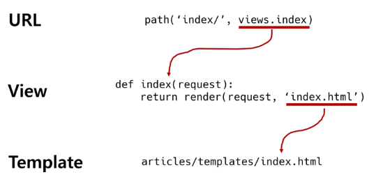

# Django

---

- **Framework** : 서비스 개발에 필요한 기능들을 미리 구현해서 모아 놓은 것
  
  - Frame(뼈대/틀) + work(일하다) : 일정한 뼈대/틀을 가지고 일하다
    
    - 제공받은 도구들과 뼈대 / 규약을 가지고 무언가를 만드는일
  
  - 특정 프로그램을 개발하기 위한 여러 도구들과 규약을 제공
  
  - 소프트웨어 프레임워크
    
    - 복잡한 문제를 해결하거나 서술하는 데 사용되는 기본 개념 구조

---

- Django를 배워야하는 이유
  
  1. python으로 작성된 프레임워크
     
     - python이라는 언어의 강력함과 거대한 커뮤니티
  
  2. 수많은 유용한 기능
  
  3. 검증된 웹 프레임워크
     
     - 화해 / toss / 두나무 / 당근마켓 / 요기요 /instagram
     
     - 유명한 많은 서비스들이 사용한다는 것 == 안정적 서비스 검증

---

- www(world wide web)
  
  - 인터넷이란?
    
    - 우리가 구글에 접속할 때
      
      1. 브라우저를 켠다
      
      2. 주소창에 주소를 입력한다
    
    - 전세계에 퍼져 있는 거미줄 같은 연결망
      
      - 거대한 유선으로 연결되어 있음
        
        - 유선에는 한계가 있어 오지나 개발 도상국에는 충분한 인프라가 없어 정보의 빈곤이 발생
    
    - 전세계를 무선으로 연결
      
      - 스타링크 프로젝트(space X)
        
        - 지구를 소형위성으로 감싸 케이블이 아닌 위성끼리 데이터를 교환
        
        - 단점
          
          1. starlink train(별관측에 어려움)
          
          2. 우주 쓰레기
    
    - 인터넷을 이용한다는 것 : 전세계의 컴퓨터가 연결되어 있는 하나의 인프라 이용

---

- 클라이언트 - 서버 구조
  
  - 대부분의 웹서비스 동작의 기반
  
  - 클라이언트와 서버 역시 하나의 컴퓨터이며 이들의 상호작용
  
  - **클라이언트**
    
    - 웹 사용자의 인터넷에 연결된 장치
    
    - chrome 또는 firefox와 같은 웹 브라우저
    
    - 서비스를 요청하는 주체
  
  - **서버**
    
    - 웹 페이지/ 사이트 또는 앱을 저장하는 컴퓨터
    
    - 클라이언트가 웹페이지에 접근하려고 할 때 서버에서 클라이언트 컴퓨터로 웹페이지 데이터를 응답해 사용자의 웹 브라우저에 표사
    
    - 요청에 대해 서비스를 응답하는 주체
  
  - 상호작용예시
    
    - 구글 홈페이지의 접속
      
      1. 구글 컴퓨터에 '구글홈페이지.html 파일'을 달라고 요청하는 것
      
      2. 구글 컴퓨터는 우리의 요청을 받고 '구글홈페이지.html 파일'을 인터넷을 통해 우리 컴퓨터에게 응답
      
      3. 전달 받은 '구글홈페이지.html 파일'을 웹 브라우저가 우리가 볼 수있도록 해석
  
  - 정리
    
    - 클라이언트 : '구글홈페이지.html 파일'를 달라고 요청한 컴퓨터
      
      - 자원을 요청하는 쪽
    
    - 서버 : '구글홈페이지.html 파일'을 제공한 컴퓨터
      
      - 자원을 제공해주는 쪽

---

- web browser와 web page
  
  - web browser
    
    - 웹에서 페이지를 찾아 보여주고, 사용자가 하이퍼링크를 통해 다른 페이지로 이동할 수 있도록 하는 프로그램
    
    - 렌더링 프로그램 : 웹페이지 파일를 우리가 보는 화면으로 바꿔주는 프로그램
    
    - 웹 브라우저 예시
      
      - 웹페이지는 HTML 문서 파일 하나
      
      - html 파일을 우리가 보는 화면으로 바꿔주는 것이 웹 브라우저
  
  - web page
    
    - 웹에 있는 문서 : 우리가 보는 화면 각각 한장 한장이 웹페이지
    
    - 웹페이지 종류
      
      1. 정적 웹페이지
         
         - static web page
         
         - 있는 그대로 제공하는 것(served as-is)
         
         - 우리가 지금까지 작성한 웹 페이지이며 한번 작성된 html 파일의 내용이 변하지 않고 모든 사용자에게 동일한 모습으로 전달
           
           == 서버에 미리 저장된 html 파일 그대로 전달된 웹페이지
           
           == 같은 상황에서 모든 사용자에게 동일한 정보 표시
      
      2. 동적 웹페이지
         
         - dynamic web page
         
         - 사용자의 요청에 따라 웹페이지에 추가적인 수정이 되어 클라이언트에게 전달되는 웹페이지
         
         - 웹페이지의 내용을 바꿔주는 주체 == 서버
           
           - 서버에 동작하고 있는 프로그램이 웹페이지를 변경해줌
           
           - 사용자의 요청을 받아 적절한 응답을 만들어주는 프로그램을 쉽게 만들 수있게 도와주는 프레임 워크가 바로 Django
         
         - 다양한 서버 사이드 프로그래밍 언어 사용 가능
         
         - 파일을 처리하고 데이터베이스와의 상호작용이 이뤄짐

---

## Django 구조 이해하기

- Design pattern
  
  - 자주 사용되는 구조를 일반화해서 하나의 공법으로 만들어 둔 것
  
  - 소프트 웨어 관점
    
    - 각기 다른 기능을 가진 다양한 응용 소프트웨어를 개발할 때 공통적인 설계 문제가 존재하며, 이를 처리하는 해결책 사이에도 공통점이 있다는 것을 발견
    
    - 이러한 유사점을 패턴이라고 함
  
  - 소프트웨어 디자인 패턴
    
    - 소프트웨어도 자주 사용되는 구조와 해결책이 있다는 것을 알게 됨
    
    - 클라이언트-서버 구조도 소프트웨어 디자인 패턴 중 하나
    
    - 자주 사용되는 소프트웨어 구조를 건축의 공법처럼 일반적인 구조화를 해둔 것
  
  - 소프트웨어 디자인 패턴의 목적
    
    - 특정 문맥에서 공통적으로 발생하는 문제에 대해 재사용 가능한 해결책 제시
    
    - 프로그래머가 어플리케이션이나 시스템을 디자인할 때 발생하는 공통된 문제들을 해결하는데 형식화 된 가장 좋은 관행
  
  - 소프트웨어 디자인 패턴의 장점
    
    - 디자인 패턴을 알고 있다면 커뮤니케이션이 간단해짐
    
    - 다수의 엔지니어들이 일반화된 패턴으로 소프트웨어 개발을 할 수 있도록 한 규칙, 커뮤니케이션의 효율성을 높이는 기법

---

- Django 디자인 패턴
  
  - Django에도 이러한 디자인 패턴이 적용 되어 있는데, Django에 적용된 디자인 패턴은 MTV 패턴이다
  
  - MTV 패턴은 MVC 디자인 패턴을 기반으로 조금 변형된 패턴

- MVC 디자인 패턴
  
  - MVC는 model-view-controller의 준말
  
  - 데이터 놀리 제어를 구현하는데 널리 사용되는 소프트웨어 디자인 패턴
  
  - 하나의 큰 프로그램을 세가지 역할로 구분한 개발 방법론
    
    1. model : 데이터와 관련된 로직을 관리
    
    2. view : 레이아웃과 화면을 처리
    
    3. cotroller : 명령을 model과 view 부분을 연결
  
  - 목적
    
    - 관심사 분리
    
    - 업무의 분리와 향상된 관리 제공
    
    - 각 부분을 독립적으로 개발할 수있어, 하나를 수정하고 싶을 때 모두건들지 않아도 됨
      
      - 개발 효율성 및 유지 보수 용이
      
      - 다수의 멤버로 개발 용이

- Django에서의 디자인 패턴
  
  - Django는 MVC 패턴을 기반으로 MTV패턴을 사용
    
    - 두 패턴은 서로 크게 다른점은 없으면 일부 역할에 대해 부르는 이름이 다름
      
      - MVC = MTV
      1. model = model
      
      2. view = template
      
      3. controller = view

- MTV 디자인 패턴
  
  - model
    
    - mvc 패턴에서 model의 역할에 해당
    
    - 데이터와 관련된 로직을 관리
    
    - 응용프로그램의 데이터 구조를 정의하고 데이터 베이스의 기록을 관리
  
  - template
    
    - 레이아웃과 화면을 처리
    
    - 화면상의 사용자 인터페이스 구조와 레이아웃을 정의
    
    - MVC 패턴에서 view 역할에 해당
  
  - view
    
    - model & template과 관련한 로직을 처리해서 응답을 반환
    
    - 클라이언트의 요청에 대해 처리를 분기하는 역할
    
    - 동작예시
      
      - 데이터가 필요하다면 model에 접근해서 데이터를 가져오고 가져온 데이터를 template로 보내 화면을 구성하고 구성된 화면을 응답으로 만들어 클라이언트에게 반환
    
    - MVC 패턴에서 controller의 역할에 해당
  
  - 정리
    
    - Django는 디자인 패턴을 가지고 있음
    
    - model : 데이터관련
    
    - template : 화면관련
    
    - view : model & template 중간 처리 및 응답 반환

---

- Django Quick start
  
  - LTS (long term support) : 장기 지원 버전
    
    - 일반적인 경우보다 장기간에 걸쳐 지원하도록 고안된 소프트웨어버전
    
    - 컴퓨터 소프트웨어의 제품 수명주기 관리 정책
    
    - 배포자는 LTS 확정을 통해 장기적이고 안정적인 지원을 보장

---

- 순서
  
  1. $ mkdir <폴더명>
  
  2. $ cd <폴더명>
  
  3. $ python -m venv venv
  
  4. $ source venv/Scripts/activate
     (venv)
  
  5. $ pip install django==3.2.13
  
  6. $ pip freeze > requirments.txt
  
  7. $ django-admin startproject firstpjt .
     
     - 프로젝트 이름에는 python이나 django에서 사용중인 키워드 및 ' - ' (하이픈) 사용 불가
     
     - '.' 을 붙이지 않을 경우 현재 디렉토리에 프로젝트 디렉토리를 새로 생성
  
  8. $ python manage.py runserver (서버 실행)
     
     - 로켓이 나오는 메인 페이지로 연결되는지 확인

---

- 프로젝트 구조
  
  - _\_init_\_.py
    
    - python에게 이 디렉토리를 하나의 python 패키지로 다루도록 지시
    
    - 별도로 추가 코드를 작성하지 않음
  
  - asgi.py
    
    - asynchronous server gateway interface
    
    - django 애플리케이션이 비동기식 웹 서버와 연결 및 소통하는 것을 도움
    
    - 추후 배포 시에 사용하며 지금은 수정하지 않음
  
  - settings.py
    
    - django 프로젝트 설정을 관리
  
  - urls.py
    
    - 사이트의 url과 적절한 views의 연결을 지정
  
  - wsgi.py
    
    - web server gateway interface
    
    - django 애플리케이션이 웹서버와 연결 및 소통하는 것을 도움
    
    - 추후 배포 시에 사용하며 지금은 수정하지 않음
  
  - manage.py
    
    - django 프로젝트와 다양한 방법으로 상호작용하는 커맨드라인 유틸리티

---

- 순서
  
  9. $ python manage.py startapp articles (애플리케이션 생성)
     
     - 일반적으로 애플리케이션 이름은 복수형으로 작성하는 것을 권장
  
  10. settings.py 파일에 INSTALLED_APPS = ['articles', (추가)]
      
      - (애플리케이션 등록)
      
      - 프로젝트에서 앱을 사용하기 위해 반드시 INSTALLED_APPS에 추가해야함
      
      - INSTALLED_APPS
        
        - django installation에 활성화 된 모든 앱을 지정하는 문자열 목록
      
      - 주의사항
        
        1. INSTALLED_APPS에 먼저 작성하고 애플리케이션 생성하면 생성되지 않음
           
           -  **반드시 생성 후 등록**
        
        2. INSTALLED_APPS 에 추가할 때 local apps / 3rd party apps / django apps 순서로 추가한다
           
           - 순서는 지키지 않아도 되지만 추후 advanced 내용에선 지키는 것을 권장

---

- 애플리케이션 구조
  
  - admin.py
    
    - 관리자용 페이지를 설정하는 곳
  
  - apps.py
    
    - 앱의 정보가 작성된 곳
    
    - 별도로 추가 코드를 작성하지 않음
  
  - models.py
    
    - 애플리케이션에서 사용하는 model을 정의하는 곳
    
    - MTV 패턴의 M에 해당
  
  - tests.py
    
    - 프로젝트의 테스트 코드를 작성하는 곳
  
  - views.py
    
    - view 함수들이 정의 되는 곳
    
    - MTV 패턴의 V에 해당

---

- project & application
  
  - project
    
    - collection of apps
    
    - 프로젝트는 앱의 집합
    
    - 프로젝트에는 여러 앱이 포함될 수 있음
    
    - 앱은 여러 프로젝트에 있을 수 있음
  
  - application
    
    - 앱은 실제 요청을 처리하고 페이지를 보여주는 등의 역할을 담당
    
    - 일반적으로 앱은 하나의 역할 및 기능 단위로 작성하는 것을 권장

---

- 요청과 응답
  
  - urls.py -> views.py -> template(폴더 생성 후 html 파일 저장) 순으로 코드 작성 (데이터의흐름)
  
  - urls
    
    - urlpatterns = [
      
          path('admin/', admin.site.urls),
      
          path('index/', views.index),
      
      ]
  
  - views.py
    
    - http 요청을 수신하고 http 응답을 반환하는 함수 작성
    
    - template에게 http 응답 서식을 맡김
    
    - def index(request):
      
          return render(request, 'index.html')
  
  - render(request, template_name, context)
    
    - 주어진 템플릿을 주어진 컨텍스트 데이터와 결합하고 렌더링 된 텍스트와 함께 httpresponse(응답) 객체를 반환하는 함수
      
      1. request
         
         - 응답을 생성하는 데 사용되는 요청 객체
      
      2. template_name
         
         - 템플릿의 전체 이름 또는 템플릿 이름의 경로
      
      3. context
         
         - 템플릿에서 사용할 데이터(딕셔너리 타입으로 작성)
  
  - templates(파일명.html)
    
    - 실제 내용을 보여주는데 사용되는 파일
    
    - 파일의 구조나 레이아웃을 정의
    
    - template 파일의 기본 경로
      
      - app 폴더 안의 templates폴더
      
      - app_name/teplates/ (템플릿 폴더 이름은 반드시 templates라고 지정)
    
    - ```html
      <!DOCTYPE html>
      <html lang="en">
      <head>
        <meta charset="UTF-8">
        <meta http-equiv="X-UA-Compatible" content="IE=edge">
        <meta name="viewport" content="width=device-width, initial-scale=1.0">
        <title>Document</title>
      </head>
      <body>
        <p>navbar</p>
        <a href="/index/">index로 가자!</a>
        
      
        
        <p>footer</p>
      </body>
      </html>
      ```
      
      
  
  - 추가 설정
    
    - language_code
      
      - 번역을 결정하는 것
      
      - use_i18n이 활성화(True)되어 있어야 함
    
    - Time zone
      
      - 데이터 베이스 연결의 시간대를 나타내는 문자열 지정
      
      - use_tz가 true이고 이 옵션이 설정된 경우 데이터 베이스에서 날짜 시간을 읽으면, UTC 대신 새로 설정한 시간대의 인식 날짜, 시간이 반환
      
      - use_tz가 False이면 error 발생
    
    - USE_I18N
      
      - 번역 시스템 활성화 여부
    
    - USE_L10N
      
      - 데이터의 지역화된 형식을 기본적으로 활성화 여부
      
      - True일 경우 현재 local의 형식을 사용하여 숫자 날짜 표시
    
    - USE_TZ
      
      - datetimes가 기본적으로 시간대를 인식하는지 여부를 지정
      
      - True일 경우 내부적으로 시간대 인식 날짜 시간 사용

---

- **Django template**
  
  - **데이터 표현**을 제어하는 도구이자 표현에 관련된 로직
  
  - Django template를 이용한 HTML 정적부분관 동적 컨텐츠 삽입
  
  - Template system의 기본 목표를 숙지
  
  - 데이터 표현을 제어하는 도구이자 표현에 관련된 로직을 담당

- DTL(django template language)
  
  - django template에서 사용하는 built in template system
  
  - 조건 반복 변수치환 필터 등의 기능을 제공
    
    - 파이썬 처럼 일부 프로그래밍 구조 (if, for 등)을 사용할 수 있지만
    
    - **python 코드로 실행되는 것은 아님**
    
    - django 템플릿 시스템은 단순히 python이 html에 포함된 것이 아니니 주의
    
    - 프로그래밍적 로직이 아니라 프레젠테이션을 표현하기 위한 것임을 명심

---

- DTL syntax
  
  1. variable / {{variable}}
     
     - 변수명은 영어 숫자와 밑줄의 조합으로 구성될 수 있으나 밑줄로는 시작할 수 없음
       
       - 공백이나 구두점 문자 사용 불가
     
     - dot(.)의 세번째 인자로 {'key':value}와 같이 딕셔너리 형태
       
       - 여기서 정의한 key에 해당하는 문자열이 template에서 사용가능한 변수명
  
  2. filters / {{variable|filter}}
     
     - 표시할 변수를 수정할 때 사용
     
     - 60개의 bulit in template filters 제공
     
     - chained가 가능하며 일부 필터는 인자를 받기도 함
  
  3. tags / 
     
     - 출력 텍스트를 만들거나, 반복 또는 논리를 수행하여 제어 흐름을 만드는 등 변수보다 복잡한 일들을 수행
     
     - 일부 태그는 시작과 종료 태그가 필요 
     
     - 24개의 bulit in template filters 제공
  
  4. comments / {# #}
     
     - 주석을 표현하기 위해 사용
     
     - 아래처럼 유효하지 않은 템플릿 코드가 포함될 수 있음
       
       {#  text  #}
     
     - 한줄 주석에서만 사용 가능 (줄바꿈 불가)
     
     - 여러줄 주석은 사이에 입력

---

- template inheritance
  
  - 템플릿은 기본적으로 코드의 재사용성에 초점을 맞춤
  
  - 템플릿 상속을 사용하면 사이트의 모든 공통 요소를 포함하고 하위 템플릿이 재정의(override) 할 수 있는 블록을 정의하는 기본 skeleton 템플릿을 만들 수 있음
  
  - 
    
    - 자식템플릿이 부모 템플릿을 확장한다는 것을 알림
    
    - **반드시 템플릿 최상단에 작성되어야함 (즉 2개 이상을 사용할 수 없음)**
  
  - 
    
    - 하위 템플릿에서 재지정(override)할 수 있는 블록을 정의
    
    - 하위 템플릿이 채울 수 있는 공간
    
    - 가독성을 높이기 위해 선택적으로 endblock 태그에 이름을 지정

---

- sending and retrieving form data
  
  - 데이터를 보내고 가져오기
  
  - html form element를 통해 사용자와 애플리케이션 간의 상호작용 이해하기
  
  - client & server architecture
    
    - 웹은 다음과 같이 가장 기본적으로 클라이언트 - 서버 아키텍처를 사용
      
      - 클라이언트(일반적으로 웹 브라우저)가 서버에 요청을 보내고, 서버는 클라이언트의 요청에 응답
    
    - 클라이언트 측에서 HTML form은 HTTP 요청을 서버에 보내는 가장 편리한 방법
    
    - 이를 통해 사용자는 HTTP 요청에서 전달할 정보를 제공할 수 있음

---

- sending form data(client)
  
  - html\<form>element
    
    - 데이터가 전송되는 방법을 정의
    
    - 웹에서 사용자 정보를 입력하는 방식(text, button, submit 등)을 제공하고, **사용자로부터 할당된 데이터를 서버로 전송**하는 역할을 담당
    
    - 데이터를 어디(action)로 어떤 방식(method)으로 보낼지
    
    - 핵심속성
      
      1. action
         
         - 입력 데이터가 전송될 URL 지정
         
         - 데이터를 어디로 보낼 것인지 지정하는 것 (반드시 유효한 URL)
         
         - 이 속성을 지정하지 않으면 데이터는 현재 form이 있는 페이지의 URL로 보내짐
      
      2. method
         
         - 데이터를 어떻게 보낼지 정의
         
         - 입력 데이터의 HTTP request methods를 지정
         
         - HTML form 데이터는 오직 2가지 방법으로만 전송할 수 있는데 바로 GET 방식과 POST 방식
  
  - html\<input>element
    
    - 사용자로부터 데이터를 입력 받기 위해 사용
    
    - type 속성에 따라 동작 방식이 달라진다
      
      - input 요소의 동작방식은 type 특성에 따라 현격히 달라지므로 각각의 type은 별도로 MDN 문서에서 참고하여 사용
      
      - type을 지정하지 않는 경우 기본값은 text
    
    - 핵심속성
      
      1. name
         
         - form을 통해 데이터를 제출(submit)했을 때 name 속성에 설정된 값을 서버로 전송하고, 서버는 name 속성에 설정된 값을 통해 사용자가 입력한 데이터 값에 접근 가능
         
         - 주요 용도는 GET/POST 방식으로 서버에 전달하는 파라미터(name은 key, value는 value)로 매핑
           
           - GET방식에서는 URL에서 '?key=value&key=value/' 형식으로 데이터를 전달
  
  - HTTP request methods
    
    - http
      
      - http 문서와 같은 리소스(데이터,자원)들을 가져올 수 있도록 해주는 프로토콜(규칙, 규약)
    
    - 웹에서 이뤄지는 모든 데이터 교환 기초
    
    - http는 주어진 리소스가 수행 할 원하는 작업을 나타내는 request method를 정의
    
    - 자원에 대한 행위(수행하고자하는 동작)을 정의
    
    - 주어진 리소스(자원)에 수행하길 원하는 행동을 나타냄
    
    - http method 예시
      
      - GET,POST,PUT,DELETE
  
  - GET
    
    - 서버로 부터 정보를 조회하는데 사용
      
      - 즉 서버에게 리소스를 요청하기 위해 사용
    
    - 데이터를 가져올 때만 사용해야함
    
    - 데이터를 서버로 전송할 때 query string parameters를 통해 전송
      
      - 데이터는 url에 포함되어 서버로 보내짐
    
    - GET과 get은 모두 동작하지만 대문자 사용 권장
  
  - query string parameters
    
    - 사용자가 입력 데이터를 전달하는 방법 중 하나 url 주소에 데이터를 파라미터를 통해 넘기는 것
    
    - 이러한 문자열은 앰퍼샌드(&)로 연결된 key = value 쌍으로 구성되며 기본 URL과 물음표(?)로 구분됨
    
    - 정해진 주소 이후에 물음표를 쓰는 것으로 query string이 시작함을 알림
    
    - ket = value로 필요한 파라미터의 값을 적음
      
      - = 로 key와 value 구분
    
    - 파라미터가 여러개일 경우 &를 붙여 여러개의 파라미터를 넘김

---

- Retrieving the data(server)
  
  - 데이터 가져오기 (검색하기)
  
  - 서버는 클라이언트로 받은 key-value 쌍의 목록과 같은 데이터를 받게 됨
  
  - 이러한 목록에 접근하는 방법은 사용하는 특정 프레임워크에 따라다름
  
  - 우리는 Django 프레임 워크에서 어떻게 데이터를 가져올 수 있을 지 알아볼 것
    
    - throw가 보낸 데이터를 catch에서 가져오기

---

- Trailing slashes
  
  - Django는 url 끝에 /(Trailing slashes)가 없다면 자동으로 붙여주는 것이 기본 설정
    
    - 그래서 모든 주소가 /로 끝나도록 구성
    
    - 모든 프레임워크가 이렇게 동작하는 것은 아님
    
    - / 유무로 다른 주소가 되기 때문에 url 정규화가 필요
  
  - url 정규화
    
    - 정규 url을 명시하고 복수의 컨텐츠가 존재하는 것을 방지

---

- variavble routing
  
  - url 주소를 변수로 사용
  
  - url 일부를 변수로 지정하여 view 함수의 인자로 넘길 수 있다
  
  - 변수 값에 따라 하나의 path()에 여러 페이지를 연결
  
  - 작성
    
    - 변수는 <>에 정의하며 view함수의 인자로 할당
    
    - 기본 타입은 string이며 5가지 타입으로 명시
      
      1. str
         
         - /를 제외하고 비어있지 않은 모든 문자열
         
         - 작성하지 않으면 기본 값
      
      2. int
         
         - 0 또는 양의 정수와 매치
      
      3. slug
      
      4. uuid
      
      5. path

---

- App URL mapping
  
  - 앱이 많아졌을 때 urls.py를 각 app에 매핑하는 방법
  
  - app의 view함수가 많아지면 사용하는 path() 또한 많아진다. 
  
  - app 또한 더 많이 작성되기 때문에 프로젝트의 urls.py에서 모두 관리하는 것은 프로젝트 유지보수에 좋지 않음
  
  - 각 앱의 view 함수를 다른 이름으로 import 할 수 있음

---

- naming url pattern의 필요성
  
  - 문자열 주소를 바꿀 때 모든 곳을 찾아가서 바꾸는데 번거로움이 발생
    
    - url을 직접 작성하는 것이 아니라 path 함수의 name인자를 정의해서 사용
    
    - DTL의 tag 중 하나인 URL 태그를 사용해서 path  함수에 작성한 name을 사용
    
    - 이를 통해 URL 설정에 정의 된 특정한 경로들의 의존성 제거
  
  - bulit in tag - url
    
    - 
      
      - 주어진 url 패턴 이름 및 선택적 매개 변수와 일치하는 절대 경로 주소를 반환
      
      - 템플릿에 url을 하드코딩하지 않고도 dry원칙을 위반하지 않으면서 링크를 출력하는 방법
    
    - dry 원칙
      
      - don't repeat yourself 의 약어
      
      - 더 품질 좋은 코드를 작성하기 위해 
      
      - 소스코드에서 동일한 코드를 반복하지 말자는 의미
      
      - 동일한 코드의 반복은 잠재적인 버그의 위협이 증가

---

- Django의 설계 철학  
  
  1. 표현과 로직을 분리
     
     - 템플릿 시스템은 표현을 제어하는 도구이자 표현에 관련된 로직일 뿐
     
     - 즉 템플릿 시스템은 이러한 기본 목표를 넘어서는 기능을 지원하지 말아야 함
  
  2. 중복을 배제
     
     - 웹사이트는 공통 디자인을 갖음
     
     - 이러한 요소를 한곳에 저장ㅎ기 쉽게하여 중복코드를 없애야 함
     
     - 템플릿 상속의 기초가 되는 철학

- Frame work의 성격
  
  1. 독선적(opinionated)
     
     - 독선적인 프레임워크들은 어떤 특정 작업을 다루는 올바른 방법에 대한 분명한 의견을 가지고 있음
     
     - 대체로 특정 문제 내에서 빠른 개발방법을 제시
     
     - 어떤 작업에 대한 올바른 방법이란 보통 잘 알려져있고 문서화가 잘 되어 있기 때문
     
     - 하지만 주요 상황을 벗어난 문제에 대해서는 그리 유연하지 못한 해결책 제시
  
  2. 관용적(unopinionated)
     
     - 관용적인 프레임워크들은 구성요소를 한데 붙여서 해결해야 한다거나 심지어 어떤 도구를 써야 한다는 올바른 방법에 대한 제약이 거의 없음
     
     - 이는 개발자들이 특정 작업을 완수하는데 가장 적절한 도구들을 이용할 수 있는 자유도가 높음
     
     - 개발자 스스로가 도구를 찾아야하는 수고가 필요

- Django framework의 성격
  
  1. 다소 독선적
     
     - 양쪽 모두에 최선의 결과를 준다고 강조
  
  2. 생산성에 집중하고 / 온전히 만들고자하는 것에 집중할 수 있게 도와줌


