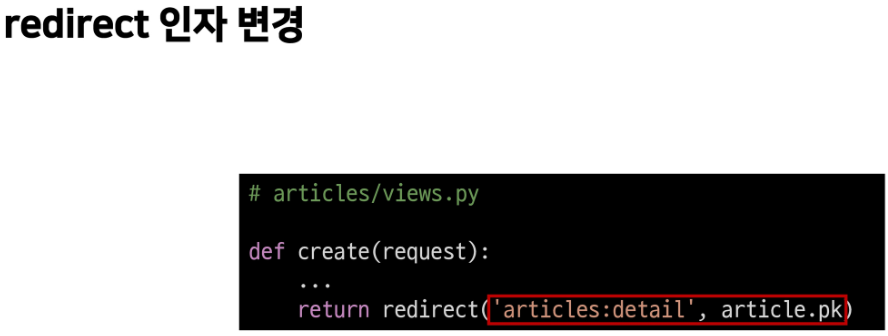

# Django - index

---

## namespace

- 개요
  
  - 개체를 구분할 수 있는 범위를 나타내는 namespace

- 필요성
  
  - 앱이 두개 이상 만들어 졌을 때
    
    1. 두번 째 app의 index로 이동하는 하이퍼링크를 눌러도 현재페이지로 들어온다
       
       - URL namespace
    
    2. url로 직접 이동해도 처음 만든 앱의 index로 이동함
       
       - Template namespace

---

- URL namespace
  
  - 서로 다른 앱에서 동일한 URL 이름을 사용하는 경우에도 이름이 지정된 URL을 고유하게 사용할 수 있음
  
  - urls.py 에서 app_name = '' 을 사용하여 URL namespace를 설정해준다
  
  - .html에서 url 태그를  으로 설정한다

- Template namespace
  
  - Django는 기본적으로 app_name/templates/ 경로에 있는 파일만 찾을 수 있으며 settings.py의 INSTALLED_APPS에 작성한 app 순서로 template를 검색 후 랜더링
    
    - 디렉토리 생성을 통해 물리적인 이름 공간 구분
      
      - app_name/templates/app_name/ 형태로 변경
      
      - Django 의 기본 경로 자체를 변경할 수 없기 때문에 물리적으로 이름공간을 나눠준다
      
      - views.py에서 랜더링 할때 'app_name/index.html' 형태로 경로를 설정
  
  - 단일 앱으로 이뤄진 경우에는 필요하지 않음
  
  - 여러 앱인 경우에도 템플릿 파일 이름이 겹치지 않는다면 상관없음

---

## Django model

- 개요 
  
  - model의 핵심 개념과 ORM을 통한 데이터베이스 조작 이해
  
  - Django는 웹 애플리 케이션의 데이터를 구조화하고 조작하기 위한 추상적인 계층(모델)을 제공

---

- Database
  
  - 체계화된 데이터 모임
  
  - 검색 및 구조화 작업을 쉽게 하기 위해 조직화 된 데이터를 수집하는 저장 시스템
  
  - 기본구조
    
    1. 스키마(Schema)
       
       - 뼈대(Structure)
       
       - 데이터베이스에서 자료의구조, 표현방법, 관계 등을 정의한 구조
    
    2. 테이블(Table)
       
       - 필드와 레코드를 사용해 조직된 데이터 요소들의 집합
       
       - 관계(Relation)라고도 부름
         
         1. 필드(field) : 속성 / 컬럼(column)
            
            - 고유한 데이터 형식이 지정
         
         2. 레코드(record) : 튜플 / 행(row)
            
            - 테이블의 데이터를 저장
         
         3. PK(primary key)
            
            - 기본 키 / 각 레코드의 고유한 값(식별자로 사용)
            
            - 다른 항목과 절대로 중복되어 나타날 수 없는 단일 값(unique)
         
         4. Query
            
            - 데이터 조회를 위한 명령어
            
            - 조건에 맞는 데이터를 추출하거나 조작하는 명령어
              
              (주로 테이블 자료 구조에서 사용)
            
            - query를 날린다 = 데이터베이스를 조작한다

---

- Model
  
  - 개요
    
    - Django는 model을 통해 데이터에 접속하고 관리
    
    - 단일한 데이터에 대한 정보를 가짐
    
    - 사용자가 저장하는 데이터들의 필ㄹ수적인 필드들과 동작들을 포함
    
    - 저장된 데이터 베이스의 구조(layout)
    
    - 일반적으로 각각의 모델은 하나의 데이터베이스 테이블에 매핑(mapping)
      
      - 하나의 모델 클래스 == 하나의 데이터베이스 테이블
  
  - 모델 작성 방법
    
    
    
    - title / content = 클래스 변수명(DB필드 이름)
    
    - models.CharField() / models.TextField() = 클래스 변수 값(DB 데이터 타입)
      
      - .CharField(max_length = None)
        
        - 길이제한이 있는 문자열
        
        - max_length
          
          - 필드의 최대길이
          
          - 필수인자(유효성 검사에서 활용)
      
      - .TextField()
        
        - 글자수가 많을 때 사용
        
        - max_length를 사용하면 입력단계에서는 반영되지만 모델과 데이터베이스 단계에서는 적용되지 않음
        
        - 저장될 때 길이에 대한 유효성 검사를 하지 않음

---

## Migrations

- 모델에 대한 청사진을 만들고 이를 통해 테이블을 생성하는 일련의 과정

- django가 모델에 생긴 변화(필드추가, 모델 삭제 등)를 DB에 반영하는 방법
1. makemigrations
   
   - 모델을 작성 혹은 변경한 것에 기반한 새로운 설계도를 만들 때 사용
   
   - `python manage.py makemigrations`
     
     - 명령어 실행 후 migrations 폴더 내에 `0001_initial.py`가 생성

2. migrate
   
   - makemigrations로 만들 설계도를 실제 db.sqlite3 DB 파일에 반영하는 과정
   
   - 모델과 DB의 동기화

3. showmigrations
   
   - migrations 파일이 migrate 됐는지 확인
   
   - X표시면 완료(더이상 할 것이 없다)

4. sqlmigrate
   
   - migrations 파일이 sql문으로 어떻게 해석될지 미리 확인

---

## ORM

- object relational mapping
  
  - 객체지향프로그래밍 언어를 사용하여 호환되지 않는 유형의 시스템 간에 데이터를 변환하는 프로그래밍 기술(django <-> SQL)
  
  - 장점
    
    - sql을 잘 알지 못해도 DB 조작 가능
    
    - 객체 지향적 접근으로 높은 생산성
  
  - 단점
    
    - ORM만으로 서비스 구현이 어려운 경우가 있음
  
  - 사용하는 이유
    
    - 생산성

---

## 추가필드 정의

- model.py에 변경사항이 생겼을 때
  
  - 필드를 작성후 makemigrations 진행
  
  - 새로 추가된 필드에 값을 추가해줘야함
  
  - migrate로 동기화

- DataTimeField()
  
  1. auto_now_add
     
     - 최초 생성일자
     
     - 최초 입력시에만 값이 입력됨
  
  2. auto_now
     
     - 최종 수정일자
     
     - save 할때마다 날짜와 시간 갱신

---

## QuerySet API

- shell
  
  - 운영체제 상에서 다양한 기능과 서비스를 구현하는 인터페이스를 제공하는 프로그램
  
  - 셸은 사용자와 운영체제의 내부 사이의 인터페이스를 감싸는 층

- Database API
  
  - django가 기본적으로 orm을 제공함에 따른 것으로 DB를 편하게 조작할 수 있도록 도움
  
  - model을 만들면 django는 객체들을 만들고 읽고 수정하고 지울 수 있는 DB API를 자동으로 만듦

- `Model class.Manager.Queryset API`==`Ariticle.objects.all()`
  
  - objects
    
    - django 모델이 데이터베이스 쿼리 작업을 가능하게 하는 인터페이스
    
    - django는 기본적으로 모든 django 모델 클래스에 대해 object라는 manager 객체를 자동으로 추가
    
    - DB를 python class로 조작할 수 있도록 여러 메서드를 제공하는 manager

- Query
  
  - 데이터베이스에 데이터를 보내달라는 요청
  
  - query를 데이터 베이스로 보내면 orm이 sql로 변환하여 자료 요청을 하고
  
  - 데이터베이스에서 응답 데이터를 orm으로 변형 시켜 QuerySet으로 전달한다

- QuerySet
  
  - 데이터베이스에게서 전달 받은 객체 목록
    
    -  순회가 가능한 데이터로 1개 이상의 데이터를 불러와 사용 가능
  
  - django orm을 사용하여 만들어진 자료형 필터 정렬 등 수행 가능
  
  - 단일한 객체를 반환할 때는 queryset이 아닌 인스턴스로 반환한다

- CRUD
  
  - create
    
    - 첫번째 생성방법
      
      1. article =Article() 
         
         - 클래스를 이용한 인스턴스 생성
      
      2. article.title = ''
         
         -  클래스 변수명과 같은 이름의 인스턴스 변수를 생성 후 값 할당
      
      3. article.save() 
         
         - 인스턴스로 save 메서드 호출
    
    - 두번째 방법
      
      1. article =Article(title = '')
      
      2. article.save()
    
    - 세번째 방법
      
      1. Article.objects.create(title = '')
    
    - .save()
      
      - 인스턴스만 생성 했을 때는 DB에 영향을 미치지 못해 id값이 없지만 save를 호출하면 테이블에 레코드가 생성되며 id값 부여
  
  - read
    
    - Article.objects.all()
      
      - 전체 데이터 조회
    
    - Article.objects.get(pk=n)
      
      - 단일 데이터 조회(인스턴스 반환)
      
      - 객체를 찾을 수 없으면 오류
      
      - 여러개가 겹쳐도 오류
        
        - 고유성을 보장하는 조회에서만 사용해야함
    
    - Article.objects.filter(title = '')
      
      - 일치하는 queryset 반환
      
      - 1개나 없어도 qeuryset으로 반환
  
  - update
    
    - 수정하고자 하는 article 인스턴스 객체를 조회 후 반환 값을 저장
    
    - article 인스턴스 객체의 인스턴스 변수 값을 새로운 값으로 할당
    
    - save() 인스턴스 메서드 호출
    
    
  
  - delete
    
    - 삭제하고자 하는 article 인스턴스 객체를 조회 후 반환 값을 저장
    
    - delete() 인스턴스 메서드 호출
    
    
  
  - \_\_str\_\_()
    
    - object가 사람이 읽을 수 있는 문자열을 반환 하도록 함
    
    - 작성후 shell을 재시작해야 반영됨

---

## views CRUD

- create
  
  - 구현하기 위해 몇개의 view 함수가 필요한가?
    
    
    
    - 두번째 방법을 사용한 view함수를 작성하는 이유
      
      1. article =Article(title = '')
      
      2. article.save()
      
      
  
  

- GET
  
  - 특정리소스를 가져오도록 요청할 때 사용
  
  - 반드시 데이터를 가져올 때만 사용
  
  - DB에 변화를 주지 않음
  
  - CRUD에서 R역할을 담당

- POST
  
  - 서버로 데이터를 전송할 때 사용
  
  - 서버에 변경사항을 만듦
  
  - 리소스를 생성/변경하기 위해 데이터를 HTTP body에 담아 전송
  
  - get의 쿼리 스트링 파라미터와 다르게 url로 보내지 않음
  
  - CRUD 에서 CUD 담당

- CSRF
  
  - cross site request forgery / 사이트 간 요청 위조
  
  - 사용자가 자신의 의지와 무관하게 공격자가 의도한 행동을 하여 특정 웹페이지를 보안에 취약하게 하거나 수정 삭제 등의 작업을 하게 만드는 공격방법

- CSRF 공격방어
  
  - security token 사용 방식(CSRF Token)
  
  - 사용자의 데이터에 임의의 난수 값(token)을 부여해 매 요청마다 해당 난수 값을 포함시켜 전송 시키도록 함
  
  - 이후 서버에서 요청을 받을 때마다 전달된 token 값이 유효한지 검증
  
  - 일반적으로 데이터 변경이 가능한 POST, PATCH, DELETE 등에 적용
  
  - 
    
    -  해당 태그가 없다면 django 서버는 요청에 대해 403 forbidden으로 응답
    
    - 템플릿에서 내부 url로 향하는 post form을 사용하는 경우에 사용
      
      - 외부 url로 향하는 post form에 대해서는 csrf 토큰이 유출되어 취약성을 유발하므로 사용하면 안됨

- READ
  
  - 모든 게시글마다 함수와 템플릿을 만들 수 없으므로
    
    - 글의 번호(pk)를 활용해 하나의 뷰함수와 템플릿 파일에 대응
  
  
  
  

- DELETE
  
  - 모든 글을 삭제하는 것이 아니라 삭제하고자 하는 특정 글을 조회 후 삭제
  
  

- UPDATE
  
  - 수정도 create 처럼 2개의 view 함수가 필요
    
    
    
    
    
    
    
    ---
    
    ## Admin site
    
    - django의 강력한 기능으로 automatic admin interface
    
    - 관리자 페이지
      
      - 사용자가 아닌 서버 관리자가 활용하기 위한 페이지
      
      - 모델 class를 admin.py에 등록하고 관리
      
      - 레코드 생성 여부 확인에 매우 유용 직접 레코드 삽입 가능
    
    - admin 계정 생성
      
      `python manage.py createsuperuser`
    
    - admin에 모델 클래스 등록
      
      - 모델의 record를 보기 위해서는 admin.py에 등록 필요
        
        
