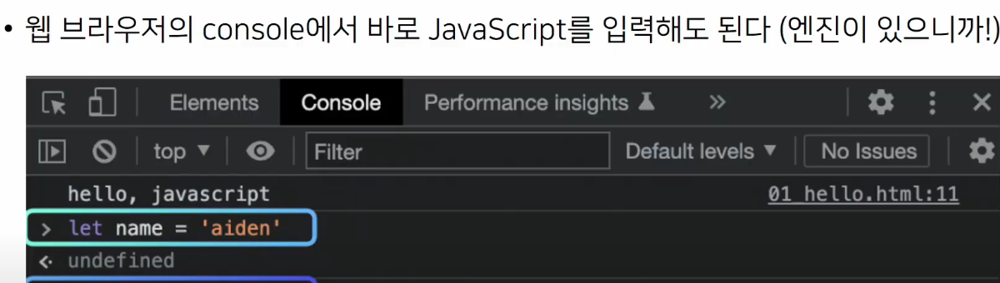
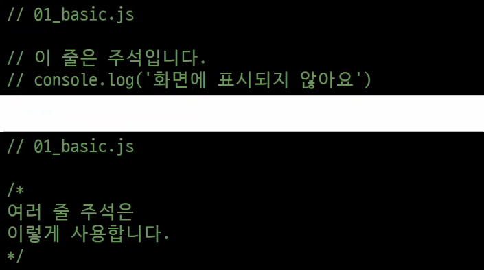
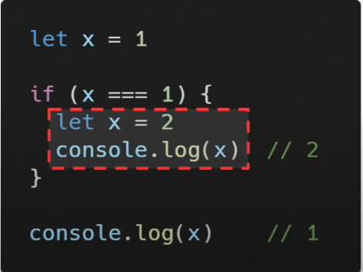
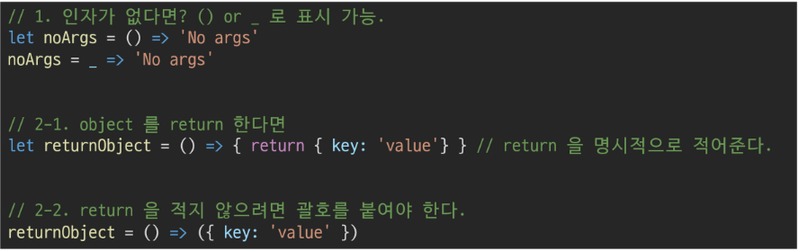
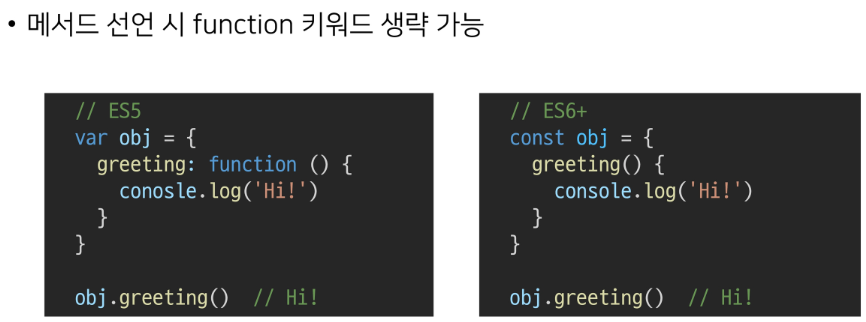

# Javascript

---

## Javascript를 배워야하는 이유

- web 기술의 기반이 되는 언어
  
  - HTML 문서의 콘텐츠를 **동적으로 변경**할 수 있는 언어
  
  - web이라는 공간에서 채팅, 게임 등 다양한 동작을 할 수 있게 된 기반

- 다양한 분야로 확장이 가능한 언어
  
  - javascript는 web을 위해 탄생한 언어
    
    - 초기에는 언어의 특성상 많은 개발자의 환영을 받지 못함
  
  - 버전이 올라가면서 하나의 단단한 언어로 자리매김
  
  - 단순히 web 조작을 넘어서 서버 프로그래밍, 모바일 서비스, 컴퓨터 응용프로그래밍, 블록체인, 게임 개발 등 **다양한 분야에서 활용이 가능한 언어**
  
  - 단순히 web front end 위해서만 Javascript 개발자를 필요로 했지만 이제는 그 영역이 매우 넓어짐

- 가장 인기 있는 언어
  
  - 확장성이 뛰어나 큰 인기를 얻고 있는 언어

---

## Javascript 역사

- 개요
  
  - web을 조작하기 위한 언어
    
    - **web browser**와 깊은 연관 관계

- 웹 브라우저의 역할
  
  - URL을 통해 Web(WWW) 탐색
  
  - **HTML/CSS/Javascript를 이해한 뒤 해석**해서 사용자에게 하나의 화면으로 보여줌
  
  - 웹 서비스 이용 시 클라이언트의 역할
  
  - 웹 페이지 코드를 이해하고, 보여주는 역할

- 웹브라우저와 스크립트 언어
  
  - 1993, Mosaic Web Browser
    
    - 유저가 웹을  쉽게 탐색할 수 있게 버튼을 탑재한 GUI 기반의 웹 브라우저
  
  - 1994, Netscape Navigator
    
    - Mosaic Web Browser를 개선한 후속작, 시장 점유율 80%
    
    ---
  
  - 이때까지 정적 웹페이지를 단순히 보여주는 용도
  
  - 웹 브라우저에 탑재해서 웹페이지를 동적으로 바꿔줄 script 언어 개발 필요
    
    - script언어
      
      - 소스 코드를 기계어로 바꿔주는 컴파일러 없이 바로 실행 가능한 언어
        
        - 속도가 느린 단점
  
  - Netscape에서 약 10일의 개발 기간을 통해 script언어인 Mocha 개발
    
    - 이후 Livescript로 이름 변경 후 브라우저에 Livescript를 해석해주는 engine 내장
    
    - 당시에 인기 있던 JAVA의 명성을 이용해서 Javascript로 이름 변경
    
    ---

- 1995, Microsoft의 internet explorer
  
  - Javascrip를 그대로 복사한 JScript라는 언어 제작 후 이를 탑재한 web browser인 internet explorer 출시
  
  - 이후 Javascript와 JScript는 각자의 기능을 추가
  
  - 개발자는 Netscape Navigator와 internet explorer 각각에 대한 코드를 작성해야하는 상황

- 1996-2000, ECMA 표준 발의
  
  - Netscape가 정보통신에 관한 규약을 만드는 비영리 단체 ECMA에게 Javascrip 기반의 표준안 발의 제안, ECMAscript1 출시
  
  - 문법이 추가되며 ECMAscript 버전이 올라감
  
  - Microsoft가 windows에 internet explorer를 기본적으로 탑재
    
    - 시장점유율이 95% 이상으로 증가
    
    - ECMAscript 표준안 지키지 않는다 선언

- 2001-2004, 다양한 웹 브라우저의 등장 
  
  - ActionScript3 라는 스크립트 언어를 기반으로 한 firefox 웹 브라우저 출시
  
  - 개발자 : 스탠든 나이트
    
    - Netscape Navigator & internet explorer & firefox 지원을 위해 고통
  
  - 이후 opera 등의 다양한 웹 브라우저가 계속 출시
  
  - 다양성으로 더더욱 많은 개발자 필요 

- jQuery 등의 라이브러리 등장
  
  - 각 브라우저의 엔진에 맞는 스크립트를 여러번 작성하는 것이 고통스러움
  
  - 중간에 하나의 레이어를 두고 코딩하는 것 = jQuery
    
    - jQuery 문법에 맞춰 작성하면 브라우저별 엔진에 맞는 스크립트 변환은 jQuery가 알아서 변환해줌
  
  - 이후 많은 코드가 jQuery로 작성

- 2008, google의 chrome 등장과 대통합의 시대
  
  - V8이라는 강력한 엔진을 탑재한 chrome 등장
    
    - javascript 해석이 다른 웹 브라우저에 비해 월등히 빠름
    
    - 이로 인해 웹 브라우저가 버벅임이 없고 매우 빠른 동작
  
  - chrome의 성능 앞에서 다른 웹 브라우저들이 함께 표준안을 만들자고 제안

- 2009, ECMAscript5(ES5) 표준안 제정

- 2015, ECMAscript6(ES6) 표준안 제정 == Javascript 대격변(현재 모습)

- 이후에도 버전이 업데이트 되고 있으나, 큰 변화는 ES6에서 

---

- 정리

- 웹 브라우저는 Javascript를 해석하는 엔진을 가지고 있음

- 현재의 Javascript는 이제 시장에서 자리를 잡은 언어, 개발에서 큰 축을 담당

- 더 이상 jQuery등의 라이브러리를 사용할 필요가 없음(모든 브라우저가 표준안을 따름)

- chrome의 V8의 경우 Javascript를 번역하는 속도가 매우 빠름
  
  - web browser를 번역하는 속도가 매우 빠름
  
  - node.js, react.js, electron 등의 내부 엔진으로 사용
  
  - back-end, mobile, desktop app 등을 모두 Javascript 언어로 사용

---

## Javascript 실행환경 구성

1. Web Browser 실행
   
   
   
   
   
           
   
   
   
   

2. Node.js로 실행하기
   
   - 웹 브라우저를 이용하지 않고, Javascript를 실행할 수 있음(엔진)
   
   - node.js 설치
     
     - 설치확인
       
       - `$ node -v`
       
       - `$ npm -v`
         
         
     
     - js 파일 실행
       
       - `$ node 02_hello.js`

---

## Javascript 기초 문법

---

## 코드작성법

- 세미콜론(semicolon)
  
  - 자바스크립트는 세미콜론을 선택적으로 사용 가능
  
  - 세미콜론이 없으면 ASI에 의해 자동으로 세미콜론이 삽입됨
    
    - ASI(Automatic Semicolon Insertion, 자동 세미콜론 삽입 규칙)

- 들여쓰기와 코드 블럭
  
  - Javascript는 2칸 들여쓰기 사용
    
    - python은 4칸 들여쓰기를 사용
  
  - 블럭(block)은 if, for 함수에서 중괄호 {} 내부를 말함
    
    - python은 들여쓰기를 이요해서 코드 블럭을 구분
    
    - Javascript는 중괄호 {}를 사용해 코드 블럭을 구분
      
      

- 코드 스타일 가이드
  
  - 코딩 스타일의 핵심은 합의된 원칙과 일관성
  
  - 코드의 품질에 직결되는 중요한 요소
    
    - 코드의 가동성, 유지보수 또는 팀원과의 커뮤니케이션 등 개발 과정 전체에 영향
  
  - python에도 PEP8이라는 코드 스타일 가이드가 있었듯, Javascript에도 코드 스타일 가이드 존재
  
  - Javascript는 여러 코드 스타일 가이드가 회사마다 존재
    
    - airbnb style guide 기반으로 사용해서 학습
    
    - 가이드의 일부 항목은 문법 및 개념적 측면에 집중하기 위해 변형해서 사용하는 경우가 있음

- 주석
  
  - 한줄주석(//)
  
  - 여러줄 주석(/**/)
    
    

---

## 변수와 식별자

- 식별자 정의와 특징
  
  - 식별자(identifier)는 변수를 구분할 수 있는 변수명을 말함
  
  - 식별자는 반드시 문자, 달러($) 또는 밑줄(_)로 시작
  
  - 대소문자를 구분, 클래스명 외에는 모두 소문자로 시작
  
  - 예약어 사용 불가능
    
    - ex) for, if, function
  
  - 카멜케이스(camelCase, lower-camel-case)
    
    - 변수, 객체, 함수에사용
      
      
  
  - 파스칼케이스(PascalCase, upper-camel-case)
    
    - 클래스, 생성자에 사용
      
      
  
  - 대문자 스네이크 케이스(SNAKE_CASE)
    
    - 상수(constants)에 사용
    
    - 상수 : 개발자의 의도와 상관없이 변경될 가능성이 없는 값을 의미
      
      

- 변수 선언 키워드
  
  - python과 다르게 Javascript는 변수를 선언하는 키워드가 정해져 있음
    
    1. let
       
       - 블록 스코프 지역변수를 선언 (추가로 동시에 값을 초기화)
       
       - 재할당 가능 & 재선언 불가능
         
         
       
       - 블록 스코프를 갖는 지역 변수를 선언, 선언과 동시에 원하는 값으로 초기화 할 수 있음
    
    2. coset
       
       - 블록 스코프 읽기 전용 상수를 선언 (추가로 동시에 값을 초기화)
       
       - 재할당 불가능 & 재선언 불가능
         
         
       
       - 선언 시 반드시 초기값을 설정, 이후 변경 불가능
       
       - let과 동일하게 블록스코프를 가짐
    
    3. var
       
       - 변수를 선언 (추가로 동시에 값을 초기화)
       
       - 재할당 가능 & 재선언 가능
       
       - ES6 이전에 변수를 선언할 때 사용되던 키워드
       
       - `호이스팅`되는 특성으로 인해 예기치 못한 문제 발생
         
         ---
         
         [참고] 호이스팅(hoisting)
         
         - 변수를 선언 이전에 참조할 수 있는 현상
         
         - var로 선언된 변수는 선언 이전에 참조할 수 있으며, 이러한 현상을 호이스팅이라고 한다
         
         - 변수 선언 이전의 위치에서 접근 시 undefined를 반환
           
           
         
         - Javascript에서 변수들은 실제 실행시에 코드의 최상단으로 끌어 올려지게 되며(hoisted) 이러한 이유 때문에 var 선언된 변수는 선언 시에 underdefined로 값이 초기화 되는 과정이 동시에일어남
         
         - 반면 let, const는 호이스팅이 일어나면 error 발생
           
           
         
         - 변수를 선언하기 전에 접근이 가능한 것은 코드의 논리적인 흐름을 깨뜨리는 행위
           
           - 이를 방지하기 위해 let, const 추가
           
           - var는 사용하지 않아야 하는 키워드
         
         - 아직까지도 많은 기존의 JavaScript 코드는 ES6 이전의 문법으로 작성되어 있으므로 호이스팅에 대한 이해가 필요
         
         ---
         
         - 따라서 ES6 이후부터는 var대신 const와 let을 사용하는 것을 권장
       
       - 함수스코프(function scope)를 가짐
         
         ---
         
         [참고] 함수 스코프
         
         - 함수의 중괄호 내부를 가리킴
         
         - 함수 스코프를 가지는 변수는 바깥에서 접근 불가능
           
           
         
         ---
       
       - 변수 선언 시 var ,const, let 키워드 중 하나를 사용하지 않으면 자동으로 var로 선언
    
    ---
    
    [참고] 선언, 할당, 초기화
    
    - 선언(Declaration)
      
      - 변수를 생성하는 행위 또는 시점
    
    - 할당(Assignment)
      
      - 선언된 변수에 값을 저장하는 행위 또는 시점
    
    - 초기화(Initialization)
      
      - 선언된 변수에 처음으로 값을 저장하는 행위 또는 시점
    
        
    
    [참고] 블록 스코프(block scope)
    
    - if, for, 함수 등의 중괄호 {} 내부를 가리킴
    
    - 블록 스코프를 가지는 변수는 블록 바깥에서 접근 불가능
      
      
    
    ---
  
  - 정리
    
    
    
    - 어디에 변수를 쓰고 상수를 쓸지 결정하는 것은 프로그래머의 몫
    
    - airbnb 스타일 가이드에서는 기본적으로 **const 사용을 권장**
      
      - 재할당 해야하는 경우만 let
    
    - 실습에서는 편의를 위해 재할당이 가능한 let을 기본적으로 사용

---

## 데이터 타입

- Javascript의 모든 값은 특정한 데이터 타입을 가짐

- 크게 `원시 타입(Primitive type)`과 `참조타입(Reference type)`으로 분류
  
  

---

- 원시타입(Primitive type)
  
  1. Number
     
     - 정수 또는 실수형 숫자를 표현하는 자료형
       
       
       
       - NaN
         
         - Not a Number(숫자가 아님)를 나타냄
         
         - `Number.isNaN()`의 경우 주어진 값의 유형이 Number이고 값이 NaN이면 true, 아니면 false 반환
           
           
       
       - NaN을 반환하는 경우
         
         
  
  2. string
     
     - 문자열을 표현하는 자료형
     
     - 작은 따옴표 또는 큰따옴표 모두 가능
       
       
     
     - 곱셈, 나눗셈, 뺄셈은 안되지만 덧셈을 통해 문자열을 붙일 수 있음
       
       
     
     - Quote를 사용하면 선언 시 줄 바꿈이 안됨
     
     - escape sequence를 사용할 수 있기 때문에 \n를 사용하야 함
       
       
     
     - `Template Literal`을 사용하면 줄바꿈이 되며, 문자열 사이에 변수도 삽입도 가능
     
     - (단, escape sequence를 사용할 수 없다) == python의 f-string
       
       
       
       - Template Literal
         
         - 내장된 표현식을 허용하는 문자열 작성 방식
         
         - ES6+ 부터 지원
         
         - backtick(``)을 이용하며, 여러 줄에 걸쳐 문자열을 정의할 수도 있고 Javascript의 변수를 문자열 안에 바로 연결할 수 있는 이점이 생김
         
         - 표현식을 넣을 수 있는데, 이는 $와 중괄호(\${expression})로 표기
           
           
  
  3. Empty value
     
     - 값이 존재하지 않음을 표현하는 값
       
       1. null
          
          - null 값을 나타내는 특별한 키워드
          
          - 변수의 **값이 없음을 의도적으로 표현**할 때 사용하는 데이터 타입
            
            
       
       2. undefined
          
          - 값이 정의되어 있지 않음을 표현하는 값
          
          - 변수 선언 이후 **직접 값을 할당하지 않으면 자동으로 할당**됨
            
            
     
     - 동일한 역할을 하는 이 두개의 키워드가 존재하는 이유는 단순한 Javascript의 설계 실수
     
     - 큰 차이를 두지 말고 interchangeable하게 사용할 수 있도록 권장
     
     - null과 undefined의 차이점
       
       - typeof 연산자를 통해 타입을 확인했을 때 나타남
         
         
       
       - null 이 원시 타입임이에도 불구하고 object로 출력되는 이유는 Javascript 설계 당시의 버그를 지금까지 해결하지 못한 것
       
       - 쉽게 해결할 수 없는 이유는 이미 null 타입에 의존성을 띄고 있는 많은 프로그램이 망가질 수 있기 때문(하위 호환 유지)
  
  4. Boolean
     
     - true와 false (소문자로 사용)
     
     - 참과 거짓을 표현하는 값
     
     - 조건문 또는 반복문에서 유용하게 사용
       
       - 조건문 또는 반복문에서 boolean이 아닌 데이터 타입은 **자동 형변환 규칙**에 따라 true 또는 false로 변환됨
     
     

---

## 연산자

- 할당연산자
  
  - 오른쪽에 있는 피연산자에 할당하는 연산자
  
  - 다양한 연산에 대한 단축 연산자 지원
  
  - increment 및 decrement 연산자
    
    - increment(++): 피연산자의 값을 1 증가시키는 연산자
    
    - decrement(--): 피연산자의 값을 1 감소시키는 연산자
    
    - += 또는 -=과 같이 더 분명한 표현으로 적을 것을 권장
    
    

- 비교연산자
  
  - 피연산자들(숫자, 문자, Boolean 등)을 비교하고 결과값을 boolean으로 반환하는 연산자
  
  - 문자열은 유니코드 값을 사용하며 표준 사전 순서를 기반으로 비교
  
  - ex) 알파벳끼리 비교할 경우
    
    - 알파벳 순서상 후순위가 더 크다
    
    - 소문자가 대문자보다 더 크다
      
      

- 동등 연산자(==)
  
  - 두 피연산자가 같은 값으로 평가되는지 비교 후 boolean 값을 반환
  
  - 비교할 때 암묵적 타입 변환을 통해 타입을 일치시킨 후 같은 값인지 비교
  
  - 두 피연산자가 모두 객체일 경우 메모리의 같은 객체를 바라보는지 판별
  
  - 예상치 못한 결과가 발생할 수 있으므로 특별한 경우를 제외하고 사용하지 않음
    
    

- 일치 연산자(===)
  
  - 두 피연산자의 값과 타입이 모두 같은 경우 true를 반환
  
  - 같은 객체를 가르키거나, 같은 타입이면서 같은 값인지를 비교
  
  - 엄격한 비교가 이뤄지며 암묵적 타입 변환이 발생하지 않음
    
    - 엄격한 비교 : 두 비교대상의 타입과 값 모두 같은 지 비교하는 방식
    
    

- 논리연산자
  
  - 세가지 논리 연산자로 구성
    
    - and 연산은 &&
    
    - or 연산은 ||
    
    - not 연산은 !
  
  - 단축평가지원
    
    - ex) false&&true => fasle
    
    - ex) true||false => true
      
      

- 삼향연산자(Ternary Operator)
  
  - 3개의 피연산자를 사용하여 조건에 따라 값을 반환하는 연산자
  
  - 가장 앞의 조건식이 참이면: 앞의 값이 반환되며
    
    - 그 반대일 경우 : 뒤의 값이 반환되는 연산자
  
  - 삼항 연산자의 결과 값이기 때문에 변수에 할당 가능
    
    

---

## 조건문

- 조건문 종류와 특징
  
  - if statement
    
    - 조건 표현식의 결과값을 boolean 타입으로 변환 후 참/거짓 판단
    
    - if / else if / else
      
      - 조건은 소괄호(condition) 안에 작성
      
      - 실행할 코드는 중괄호{} 안에 작성
      
      - 블록 스코프 생성
        
        
  
  - switch statement
    
    - 조건 표현식의 결과값이 어느 값(case)에 해당하는지 판별
    
    - 주로 특정 변수의 값에 따라 조건을 분기할 때 활용
      
      - 조건이 많아질 경우 if문보다 가독성이 나을 수 있음
    
    
  
  - if switch
    
    

---

## 반복문

- while
  
  - 조건문이 참이기만 하면 문장을 계속해서 수행
    
    
  
  - ex)
    
    

- for
  
  - 특정한 조건이 거짓으로 판별될 때까지 반복
    
    
  
  - ex)
    
    
    
    

- for ... in
  
  - 객체(object)의 속성을 순회할 때 사용
  
  - 배열도 순회 가능하지만 인덱스 순으로 순회한다는 보장이 없으므로 권장하지 않음
    
    
  
  - ex)
    
    

- for ... of
  
  - 반복 가능한 객체를 순회할 때 사용
  
  - 반복 가능한(iterable) 객체의 종류 : Array, Set, String 등
    
    
  
  - ex)
    
    

- for ... in 과 for ... of 차이
  
  - for ... in
    
    - 속성 이름을 통해 반복
  
  - for ... of
    
    - 속성 값을 통해 반복
  
  

- 정리
  
  

---

## 함수

- 참조 타입 중 하나로써 function 타입에 속함

- Javascript에서 함수를 정의하는 방법은 주로 2가지로 구분됨
  
  - 함수 선언식(function declaration)
  
  - 함수 표현식(function expression)

---

- 정의
  
  - 함수 선언식(function declaration)
    
    - 일반적인 프로그래밍 언어의 함수 정의 방식
      
      
    
    - ex)
      
      
  
  - 함수 표현식(function expression)
    
    - 표현식 내에서 함수를 정의하는 방식
    
    - 함수 표현식은 함수의 이름을 생략한 익명 함수로 정의 가능
      
      
    
    - ex)
      
      
    
    - 표현식에서 함수 이름을 명시하는 것도 가능
    
    - 다만 이 경우 함수 이름은 호출에 사용 되지 못하고 디버깅 용도로 사용됨
      
      
  
  - 기본 인자(default arguments)
    
    - 인자 작성 시 '=' 문자 뒤 기본 인자 선언 가능
      
      
  
  - 매개변수와 인자의 개수 불일치 허용
    
    - 매개변수보다 인자의 개수가 많을 경우 
      
      - 설정된 매개변수만큼만 나옴
      
      
    
    - 매개변수보다 인자의 개수가 적을 경우
      
      - undefined로 나옴
      
      
  
  - spread syntax(...)
    
    - '전개 구문'
    
    - 전개 구문을 사용하면 배열이나 문자열과 같이 반복 가능한 객체를 배열의 경우는 요소, 함수의 경우는 인자로 확장할 수 있음
      
      1. 배열과의 사용
         
         
      
      2. 함수와의 사용(rest parameters)
         
         - the rest parameter syntax를 사용하여 정해지지 않은 수의 매개변수를 배열로 받을 수 있음
         
         

---

## 선언식과 표현식

- 함수의 타입
  
  - 선언식 함수와 표현식 함수 모두 타입은 function으로 동일하다
    
    

- 선언식 - 호이스팅
  
  - 선언식으로 정의한 함수는 var로 정의한 변수처럼 호이스팅이 발생
  
  - 즉, 함수 호출 이후에 선언해도 동작
    
    

- 표현식 호이스팅
  
  - 표현식으로 정의한 함수는 함수 정의 전에 호출시 에러 발생
  
  - 표현식으로 정의된 함수는 변수로 평가되어 변수의 scope 규칙을 따름
    
    

- 정리
  
  

---

## Arrow function

- **화살표함수(arrow function)**
  
  - 함수를 비교적 간결하게 정의할 수 있는 문법
  
  - function 키워드와 중괄호를 이용한 구문을 짧게 사용하기 위해 탄생
    
    1. function 키워드 생략가능
    
    2. 함수의 매개변수가 하나뿐이라면 '()'도 생략가능
    
    3. 함수의 내용이 한줄이라면 '{}'와 return도 생략가능
  
  - 화살표 함수는 항상 익명함수
    
    - == 함수 표현식에서만 사용가능
  
  - ex)
    
    
  
  - 응용
    
    

- 즉시 실행 함수 (IIFE, Immediately Invoked Function Expression)
  
  - 선언과 동시에 실행되는 함수
  
  - 함수의 선언 끝에 ()를 추가하여 **선언되자 마자 실행**하는 형태
  
  - ()에 값을 넣어 인자로 넘겨줄 수 있음
  
  - 즉시 실행 함수는 선언과 동시에 실행되기 때문에 **같은 함수를 다시 호출할 수 없음**
  
  - 이러한 특징을 살려 초기화 부분에 많이 사용
  
  - 일회성 함수이므로 **익명함수로 사용하는 것이 일반적**
    
    

---

## Array와 Object

- 개요
  
  - Javascript의 데이터 타입 중 참조 타입(reference)에 해당하는 타입은 array와 object이며, 객체라고 말함
  
  - 객체는 속성들의 모음(collection)
    
    - [참고] 객체 안쪽의 속성들은 메모리에 할당되어있고 해당 객체는 메모리의 시작 주소 값을 가리키고 있는 형태로 이루어져 있다.

---

## 배열(Array)

- 키와 속성들을 담고 있는 참조 타입의 객체(object)

- 순서를 보장하는 특징이 있음

- 주로 대괄호를 이용하여 생성하고, 0을 포함한 양의 정수 인덱스로 특정 값에 접근 가능

- 배열의 길이는 array, length 형태로 접근가능
  
  - [참고]배열의 마지막 원소는 array, length -1로 접근
  
  

---

## 배열 메서드 기초

- array.reverse()
  
  - 원본 배열 요소들의 순서를 반대로 정렬
    
    

- array.push()
  
  - 배열의 가장 뒤에 요소 추가

- array.pop()
  
  - 배열의 마지막 요소제거
    
    

- array.includes(value)
  
  - 배열에 특정 값이 존재하는지 판별 후 참 또는 거짓 반환
    
    

- array.indexOf(value)
  
  - 배열에 특정 값이 존재하는지 확인 후 가장 첫번째로 찾은 요소의 인덱스 반환
  - 만약 해당 값이 없을 경우 -1 반환
    
    

- array.join([separator])
  
  - 배열의 모든 요소를 연결하여 반환
  
  - separator(구분자)는 선택적으로 지정 가능하며, 생략 시 쉼표를 기본값으로 사용
    
    

---

## 배열 메서드 심화

- Array Helper Methods
  
  - 배열을 순회하며 특정 로직을 수행하는 메서드
  
  - 메서드 호출 시 인자로 callback 함수를 받는 것이 특징
    
    - callback함수
      
      - 어떤 함수의 내부에서 실행될 목적으로 인자로 넘겨받는 함수
      
      
  
  - [참고] django로 보는 콜백함수 예시
    
    

- Array Helper Methods -forEach
  
  
  
  

- Array Helper Methods -map
  
  
  
  

- Array Helper Methods -filter
  
  
  
  

- Array Helper Methods -reduce
  
  
  
  
  
  
  
  

- Array Helper Methods -find
  
  
  
  

- Array Helper Methods -some
  
  
  
  

- Array Helper Methods -every
  
  
  
  

---

- 배열 순회 비교
  
  

---

## 객체(object)

- 개요
  
  

- ex)
  
  

---

## 객체 관련 문법

- ES6에 새로 도입된 문법들로 객체 생성 및 조작에 유용하게 사용 가능
  
  1. 속성명 축약
     
     
  
  2. 메서드명 축약
     
     
  
  3. 계산된 속성명 사용
     
     
  
  4. 구조 분해 할당
     
     
  
  5. 객체 전개 구문(spread operator)
     
     

---

- JavascriptON (Javascript Object Notation)
  
  - key - value 형태로 이루어진 자료 표기법
  
  - Javascript의 object와 유사한 구조를 가지고 있지만 object는 그 자체로 타입이고, JavascriptON은 형식이 있는 문자열
  
  - 즉, JavascriptON을 object로 사용하기 위해서는 변환 작업이 필요
    
    
  
  - [참고] 배열은 객체다
    
    
