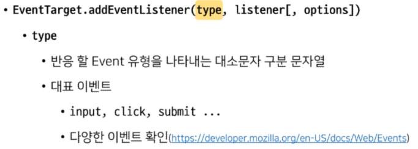
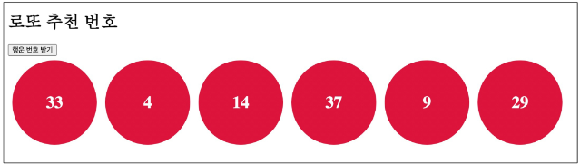
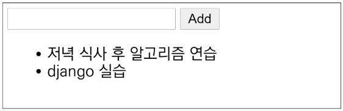
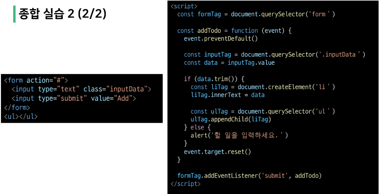

# Javascript

---

## DOM

- 브라우저에서의 Javascript
  
  - 웹페이지에서 복잡한 기능을 구현하는 스크립트 언어
  
  - 정적인 정보만 보여주는 것이 아닌 
    
    - 주기적으로 갱신되거나 
    
    - 사용자와 상호 작용이 가능하거나
    
    - 애니메이션이 적용된 그래픽 등에 관여

- [참고] 스크립트 언어(script Language)
  
  - 응용 소프트웨어를 제어하는 컴퓨터 프로그래밍 언어

---

- Browser APIs
  
  - 웹 브라우저에 내장된 API
    
    - 현재 컴퓨터 환경에 관한 데이터를 제공하거나 
    
    - 여러가지 유용하고 복잡한 일을 수행
  
  - 종류
    
    - DOM
    
    - Geolocation API(지도)
    
    - WebGl(그래픽)

---

- DOM
  
  - 문서 객체 모델(Document Object Model)
  
  - 문서의 구조화된 표현을 제공하며 프로그래밍 언어가 DOM 구조에 접근할 수 있는 방법을 제공
    
    - 문서 구조, 스타일, 내용 등을 변경할 수 있게 도움
    
    - HTML 콘텐츠를 추가, 제거, 변경하고, 동적으로 페이지에 스타일을 추가하는 등 HTML/CSS를 조작할 수 있음
  
  - 문서가 구조화되어 있으며 각 요소는 객체(object)로 취급
  
  - 단순한 속성 접근, 메서드 활용 뿐만 아니라 프로그래밍 언어적 특성을 활용한 조작 가능
    
    
    
    - DOM은 문서를 논리 트리로 표현
    
    - DOM 메서드를 사용하면
      
      - 프로그래밍적으로 트리에 접근할 수 있고 이를 통해 문서의 구조, 스타일, 컨텐츠를 변경할 수 있음
    
    - 웹 페이지는 일종의 문서(document)
    
    - 이 문서는 웹 브라우저를 통해 그 내용이 해석되어 웹 브라우저 화면에 나타나거나 HTML 코드 자체로 나타나기도 함
    
    - DOM은 동일한 문서를 표현하고, 저장하고, 조작하는 방법을 제공
    
    - DOM은 웹 페이지의 객체 지향 표현이며, JavaScript와 같은 스크립트 언어를 이용해 DOM을 수정할 수 있음

- DOM에 접근하기
  
  - DOM을 사용하기 위해 특별히 해야 할 일은 없음
  
  - 모든 웹 브라우저는 스크립트 언어가 접근할 수 있는 웹페이지를 만들기 위해 DOM을 항상 사용함
  
  - DOM의 주요 객체들을 활용하여 문서를 조작하거나 특정 요소들을 얻을 수 있음

- DOM의 주요 객체
  
  - `window`object
    
    - DOM을 표현하는 창
    
    - 가장 최상위 객체(작성시 생략 가능)
    
    - 탭 기능이 있는 브라우저에서는 각각의 탭을 각각의 window 객체로 나타냄
      
      
    
    - window의 메서드 예시
      
      
  
  - `document` object
    
    - 브라우저가 불러온 웹페이지
    
    - 페이지 컨텐츠의 진입점 역할을 하며, <body> 등과 같은 수많은 다른 요소들을 포함하고 있음
    
    - document의 속성 예시
      
      
    
    - [참고] document는 window의 속성이다
      
      
    
    - [참고] 파싱(Parsing)
      
      - 구문 분석, 해석
      
      - 브라우저가 문자열을 해석하여 DOM Tree로 만드는 과정
        
        
  
  - navigatior, location, history, screen

---

## DOM 조작

- Document가 제공하는 기능을 사용해 웹 페이지 문서 조작하기

- DOM 조작 순서
  
  1. 선택(select)
  
  2. 조작(manipulation)
     
     - 생성, 추가, 삭제

- 선택관련 메서드
  
  - `document. querySelector(selector)`
    
    - 제공한 선택자와 일치하는 element 한 개 선택
    
    - 제공한 CSS selector를 만족하는 첫 번째 element 객체를 반환(없다면 null 반환)
  
  - `document.querySelectorAll(selector)`
    
    - 제공한 선택자와 일치하는 여러 element를 선택
    
    - 매칭 할 하나 이상의 셀렉터를 포함하는 유효한 CSS selector를 인자(문자열)로 받음
    
    - 제공한 CSS selector를 만족하는 NodeList 반환

- 선택 관련 메서드 실습
  
  
  
  

- [참고] NodeList
  
  - index로만 각 항목에 접근 가능
  
  - 배열의 forEach 메소드 및 다양한 배열 메서드 사용가능
  
  - querySelectorAll()에 의해 반환되는 NodeList는 DOM의 변경사항을 실시간으로 반영하지 않음

---

- 조작 관련 메서드(생성)
  
  - `document.createElement(tagName)`
    
    - 작성한 tagName의 HTML 요소를 생성하여 반환

- 조작 관련 메서드(입력)
  
  - `Node.innerText`
    
    - Node 객체와 그 자손의 텍스트 컨텐츠(DOMstring)를 표현
      
      - 해당 요소 내부의 raw text
    
    - 사람이 읽을 수 있는 요소만 남김
    
    - 줄 바꿈을 인식하고 숨겨진 내용을 무시하는 등 최종적으로 스타일링이 적용된 모습으로 표현

- 조작 관련 메서드(추가)
  
  - `Node.appendChild()`
    
    - 한 Node를 특정 부모 Node의 자식 NodeList 중 마지막 자식으로 삽입
    
    - 한번에 오직 하나의 Node만 추가할 수 있음
    
    - 추가된 Node 객체를 반환
    
    - 만약 주어진 Node가 이미 문서에 존재하는 다른 Node를 참조한다면 현재 위치에서 새로운 위치로 이동

- 조작 관련 메서드(삭제)
  
  - `Node.removeChild()`
    
    - DOM에서 자식 Node를 제거
    
    - 제거된 Node를 반환

- 조작 관련 메서드 실습
  
  
  
  

- 조작 관련 메서드 (속성 조회 및 설정)
  
  - `Element.getAttribute(attributeName)`
    
    - 해당 요소의 지정된 값(문자열)을 반환
    
    - 인자(attributeName)는 값을 얻고자 하는 속성의 이름
  
  - `Element.setAtrribute(name, value)`
    
    - 지정된 요소의 값을 설정
    
    - 속성이 이미 존재하면 값을 갱신, 존재하지 않으면 지정된 이름과 값으로 새 속성을 추가

- 조작 관련 메서드 실습
  
  
  
  

---

- DOM 조작 정리
  
  1. 선택한다
     
     - querySelector()
     
     - qeurySelectorAll()
  
  2. 조작한다
     
     - innerText
     
     - setAttibute()
     
     - getAttribute()
     
     - createElement()
     
     - appendChild()

---

## EVENT

- Event란 프로그래밍을 하고 있는 시스템에서 일어나는 사건(action) 혹은 발생(occurrence)인데, 우리가 원한다면 그것들에 어떠한 방식으로 응답할 수 있도록 시스템이 말해주는 것
  
  - 예를들어 사용자가 웹 페이지의 버튼을 클릭한다면 우리는 클릭이라는 사건에 대한 결과를 응답 받기를 원할 수 있음

- 클릭 말고도 웹에서는 각양각색의 Event가 존재
  
  - 키보드 키 입력, 브라우저 닫기, 데이터 제출, 텍스트 복사

---

## Event intro

- Event object
  
  - 네트워크 활동이나 사용자와의 상호작용 같은 사건의 발생을 알리기 위한 객체

- Event 발생
  
  - 마우스를 클릭하거나 키보드를 누르는 등 사용자 행동으로 발생할 수도 있고
  
  - 특정 메서드를 호출하여 프로그래밍적으로도 만들어 낼 수 있음

- DOM 요소는 Event를 받고(수신)

- 받은 Event를 처리 할 수 있음
  
  - Event 처리는 주로 addEventListener()라는 Event 처리기(Event handler)를 사용해 다양한 html 요소에 부착하게 됨

---

- Event handler - addEventListener()
  
  
  
  
  
  
  
  

---

## Event 실습

- 01_button.html
  
  
  
  

- 02_input.html
  
  
  
  

- 03_button_input.html
  
  
  
  

- addEventListener 정리
  
  - ~하면~한다
    
    - 클릭하면, 경고를 띄운다
    
    - 특정 event가 발생하면 할일(콜백함수)를 등록한다

---

## Event 취소

    

---

## Event 취소 실습

- 04_prevent.html
  
  
  
  

---

## Event 종합 실습

- 05_lotto.html
  
  - 버튼을 클릭하면 랜덤 로또 번호 6개를 출력하기
    
    
  
  

- [참고]lodash
  
  

- 06_todo.html
  
  - CREATE, READ 기능을 충족하는 todo app 만들기
    
    
    
    

---

## this

- this
  
  

- this index
  
  1. 전역 문맥에서의 this
     
     
  
  2. 함수 문맥에서의 this
     
     
     
     - 단순호출
       
       
     
     - Method(객체의 메서드로서)
       
       
     
     - Nested
       
       
       
       
       
       
     
     - 화살표 함수
       
       
     
     - this와 addEventListener
       
       
       
       

