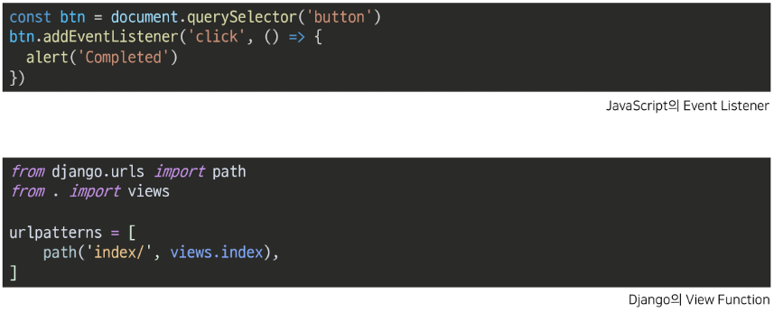

# Javascript_Asynchronous

---

## 동기와 비동기

- 동기(synchronous)
  
  - 모든 일을 순서대로 하나씩 처리
  
  - 순서대로 처리한다 == 이전 작업이 끝나야 다음 작업을 시작한다
  
  - python은 모두 공기식
  
  - 요청과 응답이 동기식이라면
    
    - 응답이 올때까지 기다렸다가 다음 로직을 처리

- 비동기(Asynchronous)
  
  - 작업을 시작한 후 결과를 기다리지 않고 다음 작업을 처리(병렬적 수행)
  
  - 시간이 필요한 작업들은 요청을 보낸 뒤 응답이 빨리 오는 작업부터 처리
  
  - 사용이유
    
    - 사용자 경험
      
      - 아주 큰 데이터를 불러온 뒤 실행되는 앱에서 동기로 처리한다면 데이터를 모두 불러와야 앱의 실행 로직이 수행되므로 앱이 멈춘 경험을 하게 됨
      
      - 동기식 처리는 특정 로직이 실행되는 동안 다른 로직 실행을 차단하기 때문에 마치 프로그램이 응답하지 않는 듯한 경험을 하게 됨
      
      - 비동기식 처리는 먼저 처리되는 부분부터 보여주므로, 사용자 경험에 긍정적인 효과

---

## javascript의 비동기 처리

- javascript
  
  - 한 번에 하나의 일만 수행할 수 있는 single thread 언어로 동시작업이 불가
    
    - [참고] thread
    
    - 작업을 처리할 때 실제로 작업을 수행하는 주체 / multi-thread라면 업무를 수행할 수 있는 주체가 여러개라는 의미
  
  - Javascript는 하나의 작업을 요청한 순서대로 처리 할 수 밖에 없다

- Javascript runtime
  
  - Javascript 자체는 single thread이므로 비동기 처리를 할 수 있도록 도와주는 환경이 필요
  
  - 런타임(Run time) : 특정 언어가 동작할 수 있는 환경
  
  - Javascript에서 비동기와 관련한 작업은 브라우저 또는 Node 환경에서 처리
  
  - 브라우저 환경에서의 비동기 동작
    
    1. Call back (Javascript engine)
       
       - 요청이 들어올 때마다 순차적으로 처리하는 Stack(LIFO)
       
       - 기본적인 Javascript의 single thread 작업 처리
    
    2. Web API
       
       - Javascript 엔진이 아닌 브라우저에서 제공하는 runtime 환경으로 시간이 소요되는 작업을 처리 (setTimeout, DOM Event, AJAX 요청)
    
    3. Task Queue
       
       - 비동기 처리된 Callback 함수가 대기하는 Queue(FIFO)
    
    4. Event Loop
       
       - Call stack과 Task Queue를 지속적으로 모니터링
       
       - Call stack이 비어 있다면 Task Queue에서 대기 중인 오래된 작업을 Call back으로 Push

- 비동기 처리 동작 방식
  
  1. 모든 작업은 Call stack(LIFO)으로 들어간 후 처리된다
  
  2. 오래 걸리는 작업이 Call Stack으로 들어오면 Web API로 보내서 처리하도록 한다
  
  3. Web API에서 처리가 끝난 작업들은 Task Queue(FIFO)에 순서대로 들어간다
  
  4. Event Loop가 Call stack이 비어 있는 것을 체크하고, Task Queue에서 가장 오래된 작업을 Call stack으로 보낸다
     
     
  - 정리
    
    - Javascript는 한번에 하나의 작업을 수행하는 single thread 언어
      
      - 동기적 처리
    
    - 브라우저 환경은 Web API에서 처리된 작업이 지속적으로 Task Queue를 거쳐 Event Loop에 의해 Call stack에 들어와 순차적으로 실행 됨
      
      - 비동기 처리
  
  ---
  
  ## Axios 라이브러리
  
  - Axios
    
    - Javascript의 HTTP 웹 통신을 위한 라이브러리
    
    - 확장 가능하나 인터페이스와 쉽게 사용할 수 있는 비동기 통신 기능을 제공
    
    - node 환경은 npm을 이용해서 설치 후 사용
      
      - browser 환경은 CDN을 이용해서 사용
  
  ---
  
  ## Axios 기본 구조
  
  - 고양이 사진 가져오기
    
    
    
    
    
    - 결과 비교
      
      - 동기식 코드(python)는 위에서부터 순서대로 처리가 되기 때문에 첫번째 print가 출력되고 이미지를 가져오는 처리를 기다렸다가 다음 print가 출력
      
      - 비동기식 코드(Javascript)는 바로 처리가 가능한 작업(console.log)은 바로 처리, 오래걸리는 작업은 요청을 보내고 기다리지 않고, 다음 코드를 진행 시켜 진행이 완료가 된 시점에서 다시 결과 출력이 진행

- 고양이 사진 가져오기
  
  
  
  - 정리 
    
    - axios는 비동기로 데이터 통신을 가능하게 하는 라이브러리
    
    - 같은 방식으로 우리가 배운 django REST API로 요청을 보내서 데이털ㄹ 받아온 후 처리할 수 있음

---

## Callback과 Promise

- 비동기 처리의 단점
  
  - 비동기 처리의 핵심은 Web API로 들어오는 순서가 아니라 
    
    - **작업이 완료되는 순서에 따라 처리**
  
  - 개발자 입장에서는 코드의 실행 순서가 불명확 하다는 단점
    
    - 콜백 함수를 활용하여 단점 해결

---

## Callback function

- **다른 함수의 인자로 전달되는 함수**

- 비동기에만 사용되는 함수가 아니며, 동기 / 비동기 상관 없이 사용

- 비동기 콜백(asynchronous call back)
  
  - **비동기 작업이 완료된 후 실행할 작업을 명시하는데 사용**되는 콜백함수

- 예시
  
  

- 콜백함수를 사용하는 이유
  
  - 명시적인 호출이 아닌 특정한 조건 혹은 행동에 의해 호출되도록 작성
  
  - 조건으로 로직을 제어
  
  - **비동기 처리를 순차적으로 동작**

- 콜백 지옥 (Callback Hell)
  
  - 콜백 함수는 연쇄적으로 발생하는 비동기 작업을 순차적으로 동작시킴
  
  - 실행 결과를 받아서 다른 기능을 수행하기 위해 많이 사용해서 다음과 같은 문제가 발생
    
    
  
  - 비동기 처리를 위한 콜백을 작성할 때 마주하는 문제
    
    - 콜백지옥 = 파멸의 피라미드(pyramid of doom)
    
    
  
  - 정리
    
    - 콜백 함수는 작업을 순차적으로 실행할 수 있게 하는 반드시 필요한 로직
    
    - 비동기 코드를 작성하다 보면 콜백 함수로 인한 콜백 지옥(callback hell)은 반드시 나타나는 문제
      
      - 코드의 가독성을 해치고 유지보수가 어려워짐

---

## 프로미스(Promise)

- Callback Hell 문제를 해결하기 위해 등장
  
  - 비동기 처리를 위한 객체
  
  - '작업이 끝나면 실행 시켜줄게'라는 약속
  
  - 비동기 작업의 완료 또는 실패를 나타내는 객체

- Promise 기반의 클라이언트가 바로 이전에 사용한 Axios 라이브러리
  
  - then(callback) : 성공에 대한 약속
    
    - 요청한 작업이 성공하면 callback 실행
    
    - callback : 이전 작업의 성공 결과를 인자로 전달 받음
  
  - catch(callback) : 실패에 대한 약속
    
    - 요청한 작업이 하나라도 실패하면 callback 실행
    
    - callback : 이전 작업의 실패 객체를 인자로 전달 받음

- then과 catch 모두 항상 promise 객체를 반환 / 계속해서 **chaining 가능**

- **axios로 처리한 비동기 로직이 항상 promise 객체를 반환**
  
  - then을 계속 이어나가면서 작성
    
    

- 작성방식
  
  

    

---

## AJAX

- 비동기 통신을 사용하여 화면을 새로고침 하지 않아도 
  
  - 서버로 요청을 보내고, 데이터를 받아 화면의 일부분만 업데이트 가능

- AJAX(Asynchronous Javascript And XML)
  
  - 비동기 통신 웹 개발 기술
  
  - 특징
    
    1. 페이지 새로고침 없이 서버에 요청
    
    2. 서버로부터 응답(데이터)을 받아 작업을 수행
  
  - 비동기 웹 통신을 위한 라이브러리

---

## 
