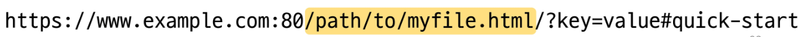
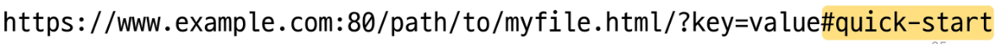
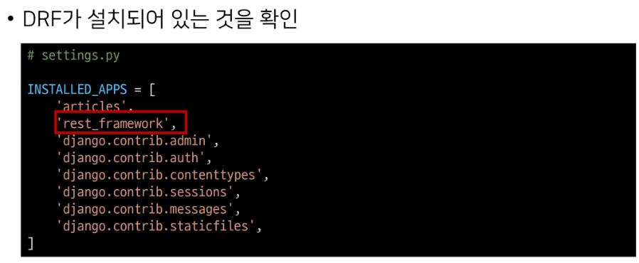
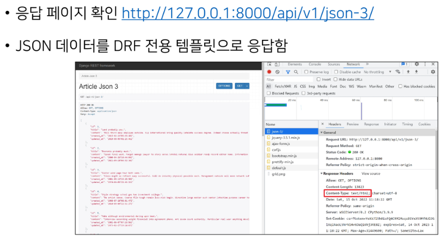
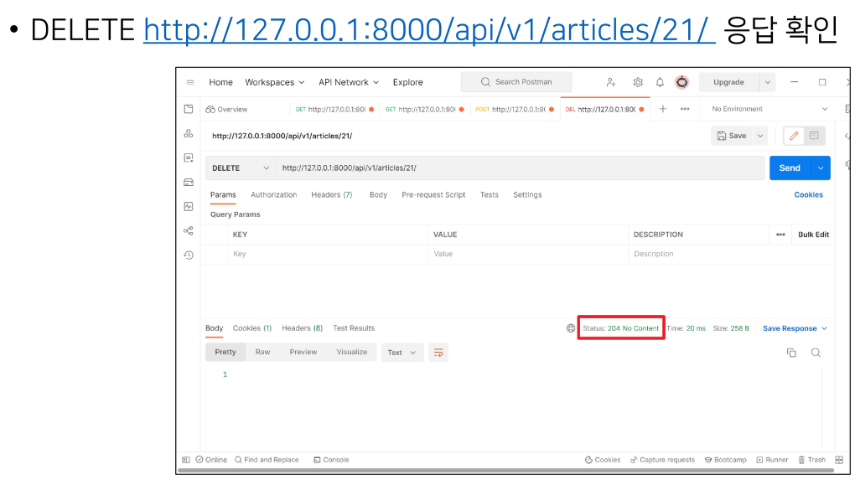
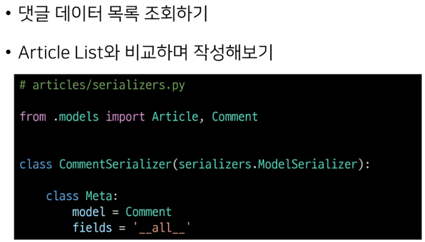

# REST_API

---

## HTTP

- hypertext transfer protocol

- HTML 문서와 같은 리소스(resource 자원)들을 가져올 수 있도록 하는 프로토콜(규칙,약속)

- 웹 상에서 컨텐츠를 전송하기 위한 약속

- 웹에서 이루어지는 모든 데이터 교환의 기초가 됨

- 클라이언트-서버 프로토콜이라 부름

- 클라이언트와 서버는 다음과 같은 개별적인 메세지 교환에 의해 통신
  
  - 요청(request)
    
    - 클라이언트에 의해 전송되는 메세지
  
  - 응답(response)
    
    - 서버에서 응답으로 전송되는 메세지

---

- 특징
  
  - stateless( 무상태)
    
    - 동일한 연결(connection)에서 연속적으로 수행되는 두 요청 사이에 링크없음
    
    - 응답을 마치고 연결을 끊는 순간 클라이언트 서버 간 통신이 끝남
      
      - 상태정보가 유지되지 않음
  
  - 특정 페이지와 일관되게 상호작용 하려는 사용자에게 문제 될 수 있음
    
    - ex) 장바구니    
    
    - 해결방법 : 쿠키와 세션을 사용해 서버 상태를 요청과 연결

- HTTP Request Methods
  
  - 리소스에 대한 행위(수행하고자 하는 동작)를 정의
  
  - 리소스에 대해 수행할 원하는 작업을 나타나는 메서드 모음을 정의
  
  - HTTP verbs라고도 함
  
  - HTTP Method 예시 
    
    - **GET, POST, PUT, DELETE**

---

- 리소스(resource)
  
  - HTTP 요청의 대상을 리소스(resource, 자원)라고 함

---

- 대표 HTTP Request Methods
  
  1. GET
     
     - 서버에 **리소스의 표현**을 요청
     
     - GET을 사용하는 요청은 데이터만 **검색**해야 함
  
  2. POST
     
     - 데이터를 지정된 **리소스에 제출**
     
     - 서버의 **상태를 변경**
  
  3. PUT
     
     - 요청한 주소의 **리소스를 수정**
  
  4. DELETE
     
     - 지정된 **리소스를 삭제**

---

- HTTP response status codes
  
  - 특정 HTTP 요청이 성공적으로 완료 되었는지 여부를 나타냄
  
  - 응답은 5개의 그룹으로 나뉨
    
    1. Informational responses(100-199)
    
    2. Successful responses(200-299)
       
       - 200 성공
    
    3. Redirection responses(300-399)
    
    4. Client error responses(400-499)
       
       - 403 forbidden
       
       - 404
    
    5. Server error responses(500-599)
       
       - 500

---

## Identifying resources on the web

- 웹에서 리소스 식별
  
  - HTTP 요청의 대상을 리소스(resource, 자원)라고 함
  
  - 리소스 문서, 사진 또는 기타 어떤 것이든 될 수 있음
  
  - 각 리소스는 식별을 위해 URI로 식별

---

## URI

- URI (Uniform Resource Identifier) - **통합 자원 식별자**

- 인터넷에서 하나의 리소스를 가리키는 **문자열**
1. **URL** : 가장 일반적인 URI(웹 주소)
   
   
   
   - Uniform Resource Locator(통합 자원 위치)
     
     - 웹에서 주어진 리소스의 주소
     
     - 네트워크 상에 리소스가 어디 있는지(주소)를 알려주기 위한 약속
       
       - 리소스는 HTML, CSS, 이미지 등이 될 수 있음
     
     - URL은 다음과 같이 여러 부분으로 구성되며 일부는 필수, 나머지 선택사항
       
       
   
   - 구조
     
     - Scheme(or protocol)
       
       - 브라우저가 리소스를 요청하는 데 사용해야 하는 프로토콜
       
       - URL의 첫 부분은 브라우저가 어떤 규약을 사용하는지를 나타냄
       
       - 기본적으로 웹은 HTTP(S)를 요구하며 메일을 열기 위한 `mailto:,` 파일을 전송하기 위한 `frp:` 등 다른 프로토콜도 존재
         
         
     
     - Authority
       
       - scheme 다음은 문자 패턴 `://`으로 구분된 Authority(권한)이 작성 됨
       
       - Authority는 domain과 port를 모두 포함하며 둘은 :(콜론)으로 구분
         
         
       1. Domain name
          
          - 요청 중인 웹 서버를 나타냄
          
          - 어떤 웹 서버가 요구되는 지를 가르키며 직접 IP 주소를 사용하는 것도 가능
            
            - 사람이 외우기 어렵기 떄문에 주로 Domain Name으로 사용
          
          - ex) 도메인 google.com의 IP 주소는 142.251.42.142
            
            
       
       2. Port
          
          - 웹 서버의 리소스에 접근하는데 사용되는 기술적인 문 (gate)
          
          - HTTP 프로토콜의 표준 포트는 다음과 같고 생략이 가능
            
            - HTTP - 80
            
            - HTTPS - 443
            
            - 나머지는 생략불가
          
          - Django의 경우 8000(80+00)이 기본 포트로 설정되어 있음
            
            
     
     - Path
       
       - 웹 서버의 리소스 경로
       
       - 초기에는 실제 파일이 위치한 물리적 위치를 나타냈지만, 오늘날은 실제 위치가 아닌 추상화된 형태의 구조를 표현
       
       - ex) /articles/create/가 실제 articles 폴더 안에 create 폴더안을 나타내는 것은 아님
         
         
     
     - Parameters
       
       - 웹 서버에 제공하는 추가적인 데이터
       
       - 파라미터는 & 기호로 구분되는 key-value 쌍 목록
       
       - 서버는 리소스를 응답하기 전에 이러한 파라미터를 사용하여 추가 작업 수행할 수 있음
         
         
     
     - Anchor
       
       - 리소스의 다른 부분에 대한 앵커
       
       - 리소스 내부 일종의 '북마크'를 나타내며 브라우저에 해당 북마크 지점에 있는 콘텐츠를 표시
         
         - ex) HTML 문서에서 브라우저는 앵커가 정의한 지점으로 스크롤함
       
       - fragment identifier(부분 식별자)라고 부르는`#`이후 부분은 서버에 전송되지 않음
         
         
         
         
       
       - [참고] anchor: 하이퍼링크와 비슷한 기능을 하는 인터넷상의 다른 문서와 연결된 문자 혹은 그림

---

2. **URN** : 특정 이름공간에서 이름으로 리소스를 식별하는 URI
   
   
   
   - Uniform Resource Name(통합 자원 이름)
     
     - URL과 달리 자원의 위치에 영향을 받지 않는 유일한 이름 역할을 함(독립적 이름)
     
     - URL의 단점을 극복하기 위해 등장했으며 자원이 어디에 위치한지 여부와 관계없이 이름만으로 자원을 식별
     
     - **이름만으로 실제 리소스를 찾는 방법은 보편화 되어있지 않아 현재는 URL을 대부분 사용**
     
     - ex)
       
       - ISBN(국제표준 도서번호)
         
         - 국제적으로 책에 붙이는 고유 식별자
       
       - ISAN(국제표춘 시청각 자료번호)
         
         - 도서의 ISBN과 유사한 시청각 작품 및 관련 버전의 고유 식별자

---

- 정리
  
  - 웹에서의 리소스 식별
    
    - 자원의 식별자(URI)
      
      - URL : 자원의 **위치**로 자원을 식별
      
      - URN : 자원의 **이름**으로 자원을 식별

---

## REST API

- API
  
  - application programming interface
  
  - 애플리케이션과 프로그래밍으로 소통하는 방법
    
    - 개발자가 복잡한 기능을 보다 쉽게 만들 수 있도록 프로그래밍 언어로 제공되는 구성
  
  - API를 제공하는 애플리케이션과 다른 소포트웨어 및 하드웨어 등의 것들 사이의 간단한 계약(인터페이스)이라고 볼 수 있음
  
  - API는 복잡한 코드를 추상화하여 대신 사용할 수 있는 몇 가지 쉬운 구문을 제공
    
    - ex) 집의 가전 제품에 전기를 공급할 때
      
      - 가전 제품의 플러그에 소켓을 꽂으면 작동
      
      - 전기를 공급하기 위해 직접 배선을 하지 않음
        
        - 이는 비효율적이고 위험한 일

---

- Web API
  
  - 웹 서버 또는 웹 브라우저를 위한 API
  
  - 현재 웹 개발은 모든 것을 하나부터 열까지 직접 개발하기 보다 여러 OPEN API를 활용하는 추세
  
  - 대표적인 Third Party Open API 서비스 목록
    
    - youtube api
    
    - naver papago api
    
    - kakao map api
  
  - API는 다양한 타입의 데이터를 응답
    
    - HTML, XML, JSON
  
  - [참고] Open API
    
    

---

- REST
  
  - Representational State Transfer
  
  - API server를 개발하기 위한 일종의 소프트웨어 설계 방법론
    
    - 2000년 로이 필딩의 박사학위 논문에서 청므으로 소개 된 후 네트워킹 문화에 널리 퍼짐
  
  - 소프트웨어 아키텍쳐 디자인 제약 모음
    
    
  
  - REST 원리를 따르는 시스템을 RESTful 하다고 부름
  
  - REST의 기본 아이디어는 리소스 즉 자원
    
    - 자원을 정의하고 자원에 대한 주소를 지정하는 전반적인 방법을 서술

- REST에서 자원을 정의하고 주소를 지정하는 방법
  
  1. 자원의 식별
     
     - URI
  
  2. 자원의 행위
     
     - HTTP Method
  
  3. 자원의 표현
     
     - 자원과 행위를 통해 궁극적으로 표현되는 (추상화된) 결과물
     
     - JSON으로 표현된 데이터를 제공

---

- JSON
  
  - java script의 표기법을 따른 단순 문자열
  
  - 파이썬의 dictionary, 자바스크립트의 object처럼 C계열의 언어가 갖고 있는 자료구조로 쉽게 변환할 수 있는 key-value 형태의 구조
  
  - 사람이 읽고 쓰기 쉽게 기계가 파싱(해석&분석)하고 만들어내기 쉽기 때문에 현재 API에서 가장 많이 사용하는 데이터 타입
  
  - 예시
    
    

---

- 정리
  
  - 자원을 정의하고 자원에 대한 주소를 지정하는 방법의 모음
    
    1. 자원의 식별
       
       - URI
    
    2. 자원의 행위
       
       - HTTP Method
    
    3. 자원의 표현
       
       - JSON
    
    

---

## Response JSON

- 서버가 응답하는 것
  
  - 지금까지 django로 작성한 서버는 사용제에게 페이지(html)만 응답
  
  - 서버가 응답할 수 있는 것은 페이지 뿐만 아니라 다양한 데이터 타입을 응답할 수 있음
    
    

- 준비
  
  
  
  
  
  

---

## Response

- 다양한 방법으로 JSON 응답
  
  1. HTML 응답
     
     - 문서(HTML) 한 장을 응답하는 서버 확인
       
       
     
     - 응답
       
       
     
     
     
     
  
  2. JsonResponse()를 사용한 JSON 응답
     
     - 문서(HTML) 한장을 응답하는 것이 아닌 JSON 데이터를 응답하기
     
     - django가 기본적으로 제공하는 JSONResponse 객체를 활용하여 python 데이터 타입을 손쉽게 JSON으로 변환하여 응답 가능
       
       
     
     
     
     
  
  3. django serializer를 사용한 JSON 응답
     
     
     
     ---
     
     - serialization
       
       
     
     ---
  
  4. django REST framework를 사용한 JSON 응답
     
     
     
     
     
     
     
     
  
  ---
  
  - 직접 requests 라이브러리를 사용하여 json 응답 받아보기
    
    
    
    
  
  - 정리
    
    - DRF를 활용하여 JSON 데이터를 응답하는 django 서버를 구축할 것

---

## django REST framework - single model

- postman
  
  

- postman 화면구성
  
  

    

    

---

## modelserializer

- modelserializer 작성
  
  

- modelserializer
  
  

- serializer 연습
  
  
  
  
  
  
  
  

- modelserializer의 `many` option
  
  

---

## build RESTful API - Article

- url과 http requests methods 설계
  
  

---

- GET - list
  
  - 게시글 목록 조회
  
  - DRF에서 `api_view` 데코레이터 작성은 필수
    
    
  
  - `api_view` 데코레이터
    
    

- GET - Detail
  
  - 단일 게시글 데이터 조회
  
  - 각 데이터의 상세 정보를 제공하는 ArticleSerializer 정의
    
    
  
  - url 및 view 함수 작성
    
    
    
    

- POST
  
  
  
  
  
  
  
  
  
  ---
  
  - Raising an exception on invalid data
    
    
    
    
  
  ---

- DELETE
  
  
  
  

- PUT
  
  
  
  
  
  

---

## django REST framework - N:1 Relation

- N:1 관계에서의 모델 data를 serializtion 하여 JSON으로 변환하는 방법 학습

- 준비
  
  
  
  
  
  

- GET - list
  
  
  
  
  
  

- GET - detail
  
  
  
  

- POST
  
  
  
  ---
  
  - Passing additional attributes to `.save()`
    
    
  
  ---
  
  
  
  
  
  

- DELETE & PUT
  
  
  
  - delete
    
    
  
  - put
    
    

___

## N:1 - 역참조 데이터 조회

1. 특정 게시글에 작성된 댓글 목록 출력하기
   
   - 기존 필드 override - article detail
     
     
   
   
   
   
   
   
   
   
   
   
   
   

2. 특성 게시글에 작성된 댓글의 개수 출력하기
   
   - 새로운 필드 추가 - article detail
     
     
     
     
     
     
     
     

 ___

## django shortcuts functions

- 사용해야 하는 이유
  
  
  
  

