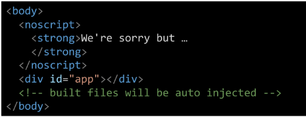

# Vue

---

## Front-end Development

- FE(Front-End) 개발
  
  - 사용자에게 보여주는 화면 만들기

- Web App(SPA)을 만들 때 사용하는 도구
  
  - 개발자 도구 > 디바이스 모드
  
  - 웹페이지가 그대로 보이는 것이 아닌 설치된 app처럼 보이는 것
  
  - 웹페이지가 디바이스에 맞는 적절한 UX / UI로 표현되는 형태
  
  - SPA = Single Page Application
    
    - Web App과 함께 자주 등장할 용어 SPA
    
    - 이전까지 사용자의 요청에 적절한 페이지 별 template을 반환
    
    - SPA는 서버에서 최초 1장의 HTML만 전달 받아 모든 요청에 대응하는 방식
      
      - 한 페이지로 요청에 대응하는 방법
        
        - CSR(Client Side Rendering) 방식으로 요청을 처리하기 때문
  
  ---
  
  1. [참고] SSR(Server Side Rendering)
     
     - 기존의 요청처리 방식(사용자의 요청에 적절한 페이지 별 template을 반환)
     
     - Server가 사용자의 요청에 적합한 HTML을 렌더링 하여 제공하는 방식
     
     - 전달 받은 새 문서를 보여주기 위해 브라우저는 새로고침을 진행
       
       
  
  2. CSR(Client Side Rendering)
     
     - 최초에 한장을 받아오는 것은 동일
     
     - 단 server로 부터 최초로 받아오는 문서는 빈 html
     
     - 각 요청에 대한 대응을 JavaScript를 사용하여 필요한 부분만 다시 렌더링
       
       1. 새로운 페이지를 서버에 AJAX 요청
       
       2. 서버는 화면을 그리기 위해 필요한 데이터를 JSON 방식으로 전달
       
       3. JSON 데이터를 Javascript로 처리
          
          - DOM 트리에 반영(렌더링)
          
          
       
       
     
     - CSR 방식을 사용하는 이유
       
       1. 모든 HTML 페이지를 서버로부터 받는 것이 아니기 때문
          
          - 클라이언트 - 서버 간 통신 (트래픽 감소)
          
          - 트래픽 감소 = 응답속도 증가
       
       2. 매번 새 문서를 받아 새로고침하는 것이 아니라 필요한 부분만 고쳐 나가므로 각 요청이 끊김없이 진행
       
       3. BE와 FE의 작업 영역을 명확히 분리할 수 있음
          
          - 각자 맡은 역할을 명확히 분리한다 = 협업 용이
     
     - CSR 방식의 단점
       
       1. 첫 구동 시 필요한 데이터가 많을수록 최초 작동 시작까지 오랜 시간 소요
       
       2. Naver, Netflix. Disney+ 등 모바일에 설치되 web-app을 실행할 때 로딩이 필요
       
       3. 검색 엔진 최적화(SEO, Search Engine Optimization)가 어려움
          
          - 서버가 제공하는 것은 텅 빈 HTML
          
          - 내용을 채우는 것은 AJAX 요청으로 얻은 JSON 데이터로  클라이언트(브라우저)가 진행
       
       4. HTML에 작성된 내용을 기반으로 하는 검색 엔진에 빈 HTML을 공유하는 SPA 서비스가 노출되기는 어려움
     
     - [참고] SEO(Search Engine Optimization)
       
       - google, bing과 같은 검색 엔진에 내 서비스나 제품이 효율적으로 노출되도록 개선하는 작업
       
       - 검색 = 각 사이트가 운용하는 검색 엔진에 의해 이루어지는 작업
       
       - 검색 엔진 = 웹 상에 존재하는 가능한 모든 정보들을 긁어 모으는 방식으로 동작
         
         - 정보의 대상은 주로 HTML에 작성된 내용
         
         - JavaScript가 실행된 이후의 결과를 확인하는 과정이 없음
       
       - 최근에는 SPA, 즉 CSR로 구성된 서비스의 비중이 증가
         
         - SPA 서비스도 검색 대상으로 넓히기 위해 JS를 지원하는 방식으로 발전
       
       - 단순 HTML만을 분석하는 것보다 몇배의 리소스가 필요한 작업이라 여전히 CSR의 검색 엔진 최적화 문제가 모두해결되진 않음
  
  ---
  
  - CSR vs SSR
    
    - CSR과 SSR은 상반된 것이 아님
      
      - 서비스에 적합한 렌더링 방식을 적절하게 활용해야 한다
    
    - SPA 서비스에서도 SSR을 지원하는 Framework도 바전
      
      

---

## Vue

- 장점
  
  - 구조가 직관적
  
  - FE Framework를 빠르고 쉽게 학습하고 활용 가능
  
  - 다른 FE Framework 학습 시 빠르게 적응 가능
    
    

- Vue 없이 코드를 작성한다면
  
  
  
  

- Vue를 사용하기 위한 사전작업
  
  
  
  

- Vue를 사용하여 코드 작성
  
  
  
  - [참고] Dev tools 확인
    
    
  
  

---

ex) facebook

---

## Vue2 vs Vue3

