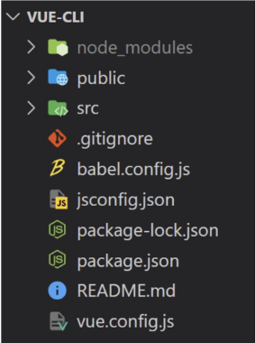

# Vue

---

## Vue CLI

- Node.js
  
  - 자바스크립트 : 브라우저를 조작하는 유일한 언어
    
    - 브라우저 밖에서는 구동 불가
      
      - Node.js로 런타임환경을 구성하여 브라우저가 아닌 환경에서 구동할 수 있게 함
        
        - chrome V8엔진을 제공하여 여러 OS환경에서 실행 가능하고
        
        - 브라우저 뿐만 아니라 server side programming도 가능

- NPM(Node Package Manage)
  
  - 자바스크립트 패키지 관리자
    
    - python에 pip가 있다면 Node.js에는 npm
    
    - 다양한 의존성 패키지를 관리

- Vue CLI
  
  - Vue 개발을 위한 표준 도구
  
  - 프로젝트의 구성을 도와주는 역할
  
  - 확장 플러그인, GUI, Babel등 tool 제공

- Vue CLI quick start
  
  - 설치 `npm install -g @vue/cli`
  
  - 프로젝트 생성 `vue create 프로젝트명`
    
    - 버전선택
  
  - 폴더 이동 `cd vue-cli`
  
  - run serve `npm run serve`

---

## Vue CLI 프로젝트 구조

- node_modules
  
  - node.js 환경의 여러 의존성 모듈
  
  - python의 venv와 비슷한 역할을해서 .gitignore로 관리

- babel
  
  - javascript compiler
  
  - 자바스크립트의 ES6+ 코드를 구버전으로 번역
  
  - 원시코드(최신버전)를 목적코드(구버전)으로 옮기는 번역기
    
    - 버전에 따라 문법이 달라 작동하지 않는 브라우저가 발생
      
      - 코드가 특정 브라우저에서 동작하지 않는 상황을 해결

- node_modules  폴더 안 webpack
  
  - static module bundler
  
  - 모듈 간의 의존성 문제를 해결하기 위한 도구
  
  - 프로젝트에 필요한 모듈을 매핑하고 내부적으로 종속성 그래프를 빌드

---

- Module
  
  - 개발하는 애플리케이션 크기가 복잡해지면 파일 하나에 모든 기능을 담기 어려워짐
  
  - 자연스럽게 파일을 여러 개로 분리하여 관리
    
    - 분리된 파일 각각이 모듈 / js 파일 하나가 하나의 모듈
  
  - 모듈은 대개 기능 단위로 분리
    
    - 클래스 하나 혹은 특정 목적을 가진 복수의 함수로 구성된 라이브러리 하나로 구성
  
  - 여러 모듈 시스템
    
    - ESM(ECMA Script Module), AMD, CommonJS, UMD

- module 의존성 문제
  
  - 모듈 수가 많아지고 라이브러리 혹은 모듈 간의 의존성(연결성)이 깊어지면서 특정한 곳에서 발생한 문제가 어떤 모듈 간의 문제인지 파악하기 어려움
  
  - webpack은 이 모듈간의 의존성 문제를 해결하기 위해 등장

---

- Bundler
  
  - 모듈 의존성 문제를 해결해주는 작업이 bundling
  
  - 이러한 일을 해주는 도구가 bundler이고, webpack은 다양한 bundler중 하나
  
  - 모듈을 하나로 묶어주고 묶인 파일은 하나(혹은 여러개)로 만들어짐
  
  - bundling된 결과물은 개별 모듈의 실행 순서에 영향을 받지 않고 동작
  
  - snowpack, parcel, rollup.js 등의 webpack 이외에도 다양한 모듈 번들러 존재
  
  - Vue CLI는 이러한 babel, webpack에 대한 초기 설정이 자동

- webpack - static module bundler
  
  - 의존성을 webpack이 담당해 주므로 개발자는 npm install을 사용해 다양한 모듈을 한번에 설치하고 각 모듈을 사용해 개발에 집중

---

- package.json
  
  - 프로젝트의 종속성 목록과 지원되는 브라우저에 대한 구성 옵션을 포함
  
  - 

