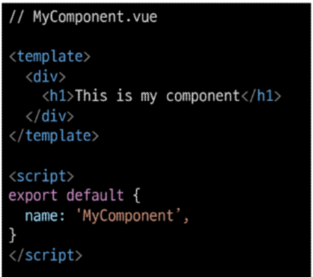
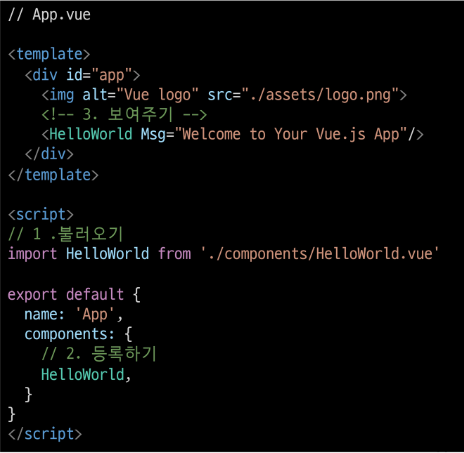
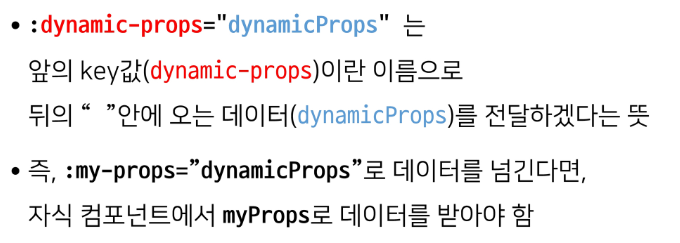
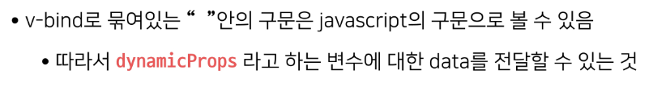
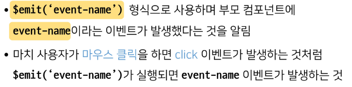
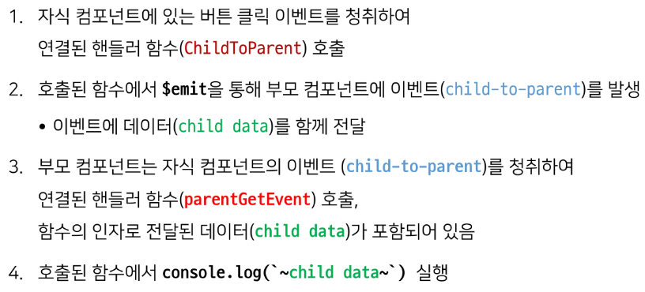
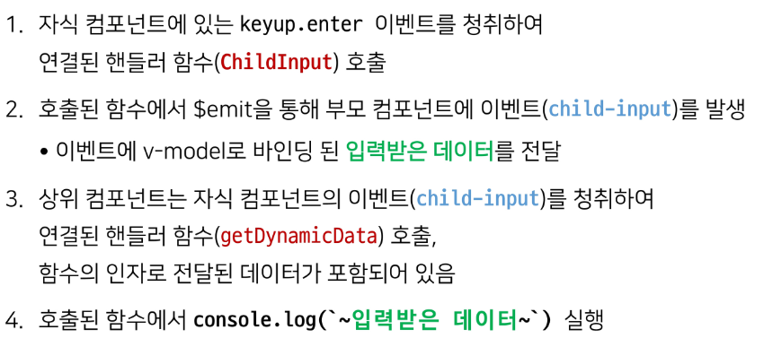
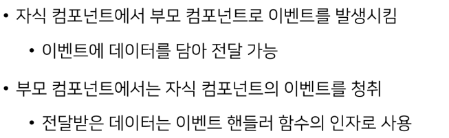
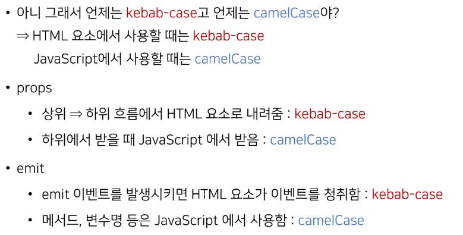

# Vue

---

## Vue CLI

- Node.js
  
  - 자바스크립트 : 브라우저를 조작하는 유일한 언어
    
    - 브라우저 밖에서는 구동 불가
      
      - Node.js로 런타임환경을 구성하여 브라우저가 아닌 환경에서 구동할 수 있게 함
        
        - chrome V8엔진을 제공하여 여러 OS환경에서 실행 가능하고
        
        - 브라우저 뿐만 아니라 server side programming도 가능

- NPM(Node Package Manage)
  
  - 자바스크립트 패키지 관리자
    
    - python에 pip가 있다면 Node.js에는 npm
    
    - 다양한 의존성 패키지를 관리

- Vue CLI
  
  - Vue 개발을 위한 표준 도구
  
  - 프로젝트의 구성을 도와주는 역할
  
  - 확장 플러그인, GUI, Babel등 tool 제공

- Vue CLI quick start
  
  - 설치 `npm install -g @vue/cli`
  
  - 프로젝트 생성 `vue create 프로젝트명`
    
    - 버전선택
  
  - 폴더 이동 `cd vue-cli`
  
  - run serve `npm run serve`

---

## Vue CLI 프로젝트 구조


- node_modules
  
  - node.js 환경의 여러 의존성 모듈
  
  - python의 venv와 비슷한 역할을해서 .gitignore로 관리

- babel
  
  - javascript compiler
  
  - 자바스크립트의 ES6+ 코드를 구버전으로 번역
  
  - 원시코드(최신버전)를 목적코드(구버전)으로 옮기는 번역기
    
    - 버전에 따라 문법이 달라 작동하지 않는 브라우저가 발생
      
      - 코드가 특정 브라우저에서 동작하지 않는 상황을 해결

- node_modules  폴더 안 webpack
  
  - static module bundler
  
  - 모듈 간의 의존성 문제를 해결하기 위한 도구
  
  - 프로젝트에 필요한 모듈을 매핑하고 내부적으로 종속성 그래프를 빌드

---

- Module
  
  - 개발하는 애플리케이션 크기가 복잡해지면 파일 하나에 모든 기능을 담기 어려워짐
  
  - 자연스럽게 파일을 여러 개로 분리하여 관리
    
    - 분리된 파일 각각이 모듈 / js 파일 하나가 하나의 모듈
  
  - 모듈은 대개 기능 단위로 분리
    
    - 클래스 하나 혹은 특정 목적을 가진 복수의 함수로 구성된 라이브러리 하나로 구성
  
  - 여러 모듈 시스템
    
    - ESM(ECMA Script Module), AMD, CommonJS, UMD

- module 의존성 문제
  
  - 모듈 수가 많아지고 라이브러리 혹은 모듈 간의 의존성(연결성)이 깊어지면서 특정한 곳에서 발생한 문제가 어떤 모듈 간의 문제인지 파악하기 어려움
  
  - webpack은 이 모듈간의 의존성 문제를 해결하기 위해 등장

---

- Bundler
  
  - 모듈 의존성 문제를 해결해주는 작업이 bundling
  
  - 이러한 일을 해주는 도구가 bundler이고, webpack은 다양한 bundler중 하나
  
  - 모듈을 하나로 묶어주고 묶인 파일은 하나(혹은 여러개)로 만들어짐
  
  - bundling된 결과물은 개별 모듈의 실행 순서에 영향을 받지 않고 동작
  
  - snowpack, parcel, rollup.js 등의 webpack 이외에도 다양한 모듈 번들러 존재
  
  - Vue CLI는 이러한 babel, webpack에 대한 초기 설정이 자동

- webpack - static module bundler
  
  - 의존성을 webpack이 담당해 주므로 개발자는 npm install을 사용해 다양한 모듈을 한번에 설치하고 각 모듈을 사용해 개발에 집중

---

- package.json
  
  - 프로젝트의 종속성 목록과 지원되는 브라우저에 대한 구성 옵션을 포함

- package.-lock.json
  
  - node-modules에 설치되는 모듈과 관련된 모든 의존성을 설정 및 관리
  
  - 협업과 배포 환경에서 동일한 종속성을 보장하는 표현
  
  - 사용할 패키지를 고정하여 개발과정 간의 의존성 패키지 충돌방지
  
  - python의 requirements.txt 역할

- public/index.html
  
  - vue 앱의 뼈대가 되는 html
  
  - vue 앱과 연결될 요소가 있음

- src/
  
  - src/assets
    
    - 정적 파일을 저장하는 디렉토리
  
  - src/components
    
    - 하위 컴포넌트들이 위치
  
  - src/App.vue
    
    - 최상위 컴포넌트
    
    - public/index.html과 연결
  
  - src/main.js
    
    - webpack이 빌드를 시작할 때 가장 먼저 불러오는 entry point
    
    - public/index.html과 src/App.vue를 연결시키는 작업이 이루어지는 곳
    
    - vue 전역에서 활용할 모듈을 등록할 수 있는 파일

---

## component

- UI를 독립적이고 재사용 가능한 조각들로 나눈 것
  
  - 기능별로 분화한 코드 조각

- CS에서는 다시 사용할 수 있는 범용성을 위해 개발된 소프트웨어 구성 요소를 의미

- 하나의 app을 구성할 때 중첩된 컴포넌트들의 tree로 구성하는 것이 보편적임
  
  - web시간에 배운 HTML 요소들의 중첩에서
    
    - body tag를 root node로 하는 tree 구조
    
    - vue에서는 src/App.vue를 root.node로 하는 tree 구조

- 컴포넌트는 유지보수를 쉽게 만들어 줄 뿐만 아니라 재사용성 측면에서도 강력한 기능
  
  - 하나의 컴포넌트를 활용하여 반복되는 UI를 쉽게 처리할 수 있음

---

- component based architecture 특징
  
  - 관리가 용이
    
    - 유지/보수 비용 감소
  
  - 재사용성
  
  - 확장 가능
  
  - 캡슐화
  
  - 독립적

---

## SFC

- component in vue
  
  - vue에서 말하는 component란 무엇일까
    
    - 이름이 있는 재사용 가능한 vue instance

- SFC(single file component)
  
  - 하나의 .vue 파일이 하나의 vue instance이고, 하나의 vue component
  
  - vue instance에서는 HTML, CSS, Jacascript 코드를 한번에 관리
    
    - vue instance 기능 단위로 작성하는 것이 핵심
  
  - 컴포넌트 기반 개발의 핵심 기능

---

## Vue component

- 템플릿(HTML)
  
  - HTML의 body 부분
  
  - 눈으로 보여지는 요소 작성
  
  - 다른 컴포넌트를 HTML 요소처럼 추가 가능

- 스크립트(javascript)
  
  - javascript 코드가 작성되는 곳
  
  - 컴포넌트 정보, 데이터, 메서드 등
  
  - vue 인스턴스를 구성하는 대부분이 작성

- 스타일(CSS)
  
  - CSS가 작성되며 컴포넌트의 스타일을 담당

---

- vue component 구조 정리
  
  - 컴포넌트들이 tree 구조를 이루어 하나의 페이지 구성
  
  - root에 해당하는 최상단의 component가 app.vue
    
    - app.vue가 index.html과 연결
    
    - index.html 파일 하나만 rendering하면 하위 컴포넌트들도 모두 랜더링
      
      - SPA(single page application)
        
        - 사용자 경험 개선 / 트래픽문제 해결

---

## Vue 실습

- Vue CLI quick start
  
  - 설치 `npm install -g @vue/cli`
  
  - 프로젝트 생성 `vue create 프로젝트명`
    
    - 버전선택
  
  - 폴더 이동 `cd vue-cli`
  
  - run serve `npm run serve`  

- component 생성
  
  
  
  - src/components/ 안에 .vue 파일 생성
  
  - script에 이름 등록
    
    ```html
    <script>
    export default {
        name: 'MyComponent',
    }
    </script>
    ```
  
  - template에 요소 추가
    
    - template 안에는 하나의 요소만 추가가능
      
      - 비어 있어도 안되고, 하나의 요소 안에 추가 요소를 작성해야 함

- component 등록 
  
  
  
  1. 불러오기
     
     - `import 컴포넌트에 등록한 이름 from '컴포넌트 경로'`
       
       - ex)`import MyComponent from '@/components/MyComponent'`
  
  2. 등록하기
     
     ```html
     <script>
     export default {
         name: 'MyComponent',
         components: {
             MyComponent,
         }
     }
     </script>
     ```
  
  3. 보여주기
     
     ```html
     <MyCoponent/>
     ```

---

## Pass Props & Emit Events

---

## Data in components

- 데이터가 필요한 컴포넌트끼리 데이터를 주고 받는다면
  
  - 흐름 파악이 어려움
  
  - 개발속도 저하
  
  - 유지보수 난이도 증가

- 부모 자식 관계만 데이터를 주고 받는다면
  
  - 데이터의 흐름을 파악하기 용이
  
  - 유지 보수하기 쉬워짐

- 부모 => 자식
  
  - pass props

- 자식 => 부모
  
  - emit event

---

## pass props

- 요소의 속성(property)을 사용하여 데이터 전달

- 부모의 정보를 자식에게 전달하며, 자식 컴포넌트는 props 옵션을 사용하여 수신하는 props를 명시적으로 선언해야함

---

- 정적 데이터 전달(static props)
  
  - 요소에 속성을 작성하듯 사용 가능
  
  - 부모 컴포넌트
    
    - `prop-data-name='value'` 형태로 데이터 전달
      
      ```html
      <HelloWorld static-props='props 전달'/>
      ```
      
      - 이때 속성의 키 값은 kebab-case
  
  - 자식 컴포넌트
    
    - ```html
      <template>
        <p>{{staticProps}}</p>
      </template>
      <script>
      export default {
        name: 'HelloWorld,
        props: {
          staticProps: String,
        }
      }
      </script>
      ```
    
    - props에 대해 명시적으로 작성(type과 함께 명시)
  
  - 부모 템플릿(HTML)에서 kebab-case로 넘긴 변수를 자식 스크립트(vue)에서 자동으로 camelCase로 변환하여 인식
    
    - 부모에서 넘겨주는 props
      
      - kebab-case(HTML 속성명은 대소문자를 구분하지 않기 때문)
    
    - 자식에서 받는 props
      
      - camelCase

---

- 동적 데이터 전달(dynamic props)
  
  - 변수를 props로 전달할 수 있음
  
  - v-bind directive를 사용해 데이터를 동적으로 바인딩
  
  - 부모 컴포넌트의 데이터가 업데이트 되면 자식 컴포넌트로 전달 되는 데이터도 자동으로 업데이트
  
  - 부모 컴포넌트
    
    - `:prop-data-name='value'` 형태로 데이터 전달
      
      ```html
      <HelloWorld :dynamic-props='PropsPass'/>
      <script>
        export default {
          data: function(){
          PropsPass: 'props 전달'
          }
        }
      </script>
      ```
    
    - 이때 속성의 키 값은 kebab-case
  
  - 자식 컴포넌트
    
    ```html
    <template>
      <p>{{dynamicProps}}</p>
    </template>
    <script>
    export default {
      name: 'HelloWorld,
      props: {
        dynamicProps: String,
      }
    }
    </script>
    ```
  
  
  
  

---

- 단방향 데이터 흐름
  
  - 모든 props는 부모에서 자식으로 단방향 바인딩을 형성
  
  - 부모 속성이 업데이트되면 자식으로 흐르지만 반대방향은 아님
    
    - 하위 컴포넌트가 실수로 상위 컴포넌트의 상태를 변경하여 앱의 흐름을 이해하기 어렵게 만드는 것을 방지
      
      - 하위 컴포넌트가 상위컴포넌트 변경을 시도하면 콘솔에서 경고를 출력함

---

## Emit Event

- 자식 컴포넌트에서 부모 컴포넌트로 데이터를 전달 할 때는 이벤트를 발생시켜서 전달
  
  1. 데이터를 이벤트 리스너의 콜백함수 인자로 전달
  
  2. 상위 컴포넌트는 해당 이벤트를 통해 데이터를 받음

- $emit 메서드를 통해 부모 컴포넌트에 이벤트를 발생
  
  

---

- 정적 데이터 전달
  
  - 자식 컴포넌트
    
    ```html
    <template>
      <div>
        <button @click="emitEvent">emit</button>
      </div>
    </template>
    
    <script>
    export default {
      name: 'HelloWorld',
      methods: {
        emitEvent(){
          const paylaod = {
            a: 1,
            b: 2,
          }
          this.$emit('from-hello', paylaod)
        },
      }
    }
    </script>
    ```
    
    - emit 이벤트 발생 시 인자(payload)로 데이터 전달이 가능하다
  
  - 부모 컴포넌트
    
    ```html
    <template>
      <div id="app">
        <HelloWorld @from-hello = 'listenEvent'/>
      </div>
    </template>
    
    <script>
    import HelloWorld from './components/HelloWorld.vue'
    
    export default {
      name: 'App',
      components: {
        HelloWorld
      },
      methods:{
        listenEvent(payload){
          console.log(payload)
        }
      }
    }
    </script>
    ```
    
    - 전달한 데이터는 부모 컴포넌트의 핸들러 함수의 인자로 사용 가능하다
  
  - 정적 emit 흐름
    
    

---

- 동적 데이터 전달
  
  - 자식 컴포넌트
    
    ```html
    <template>
      <div>
        <input
          type='text'
          v-model='childInputData'
          @keyup.enter='childInput'
        >
      </div>
    </template>
    
    <script>
    export default {
      name: 'HelloWorld',
      data: function(){
        return{
            childInputData: null,
      }
    },
      methods: {
        childInput(){
          this.$emit('child-input', this.childInputData)
          this.childInputData = ""
        }
      },
    }
    </script>
    ```
  
  - 부모 컴포넌트
    
    ```html
    <template>
      <div id="app">
        <HelloWorld @child-input= 'getDynamicData'/>
      </div>
    </template>
    
    <script>
    import HelloWorld from './components/HelloWorld.vue'
    
    export default {
      name: 'App',
      components: {
        HelloWorld
      },
      methods:{
        getDynamicData: function(inputData){
          console.log(S{inputData}를 입력받)
        }
      }
    }
    </script>
    ```
  
  - 동적 emit 흐름
    
    
  
  - 정리
    
    

---

- props/emit 컨벤션
  
  
