# Vue

---

## Vuex

---

## state Management

- 상태(state)
  
  - 현재에 대한 정보(data)

- web application에서 상태 표현
  
  - 현재 app이 가지고 있는 data로 표현

- 여러개의 component를 조합해서 하나의 app을 만듦

- 각 component는 독립적이기 때문에 각각의 상태(data)를 가짐

- component들이 모여 하나의 app을 구성
  
  - 상태관리(state management)
    
    - 여러개의 component가 같은 상태(data)를 유지할 필요가 있음

---

- pass props & emit event
  
  - props와 emit을 이용한 상태 관리
    
    - component 독립적으로 데이터 관리
    
    - 같은 데이터를 공유 / 각 component가 동이한 상태 유지
    
    - 데이터 흐름 직관적 파악
  
  - 단점
    
    - component 중첩이 깊어지면 데이터 전달이 쉽지 않음
    
    - 공통의 상태를 유지해야 하는 component가 많아지면 데이터 전달 구조 복잡

- Centralized store
  
  - 중앙 저장소에 데이터를 모아서 상태관리
  
  - 각 component는 중앙 저장소의 데이터를 사용
  
  - component의 계층에 상관 없이 중앙 저장소에 접근해서 데이터를 얻거나 변경
  
  - 중앙 저장소의 데이터가 변경되면 
    
    - 각각의 component는 해당 데이터의 변화에 반응하여 새로 변경된 데이터 반영

- Vuex
  
  - 상태관리 패턴 + 라이브러리
    
    - state management pattern + library for vue.js
  
  - 중앙 저장소를 통해 상태 관리를 할 수 있도록 하는 라이브러리
  
  - 데이터가 예측 가능한 방식으로만 변경 될 수 있도록 하는 규칙 설정
    
    - Vue의 반응성을 효율적으로 사용하는 상태 관리 기능 제공

---

## Vuex 시작하기

- 시작 설정
  
  

- `vue add vuex` 설치
  
  - src/store/index.js 생성
    
    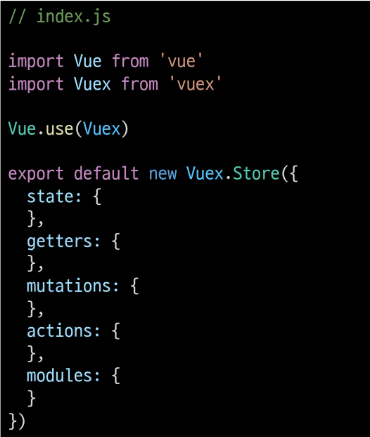
  
  - vue와 vuex의 비교
    
    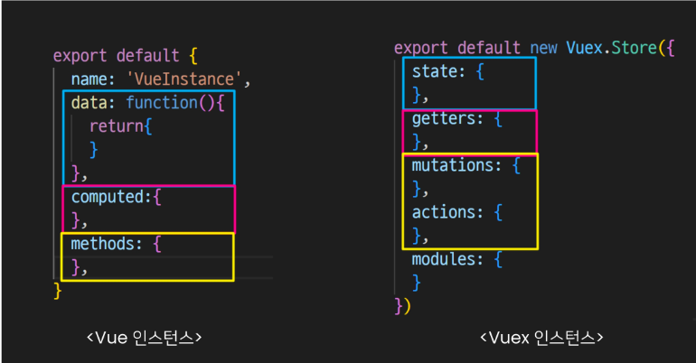

- vuex의 핵심 컨셉
  
  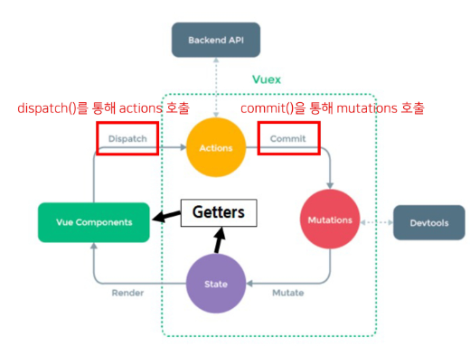
  
  1. state
     
     - vue 인스턴스의 data에 해당
     
     - 중앙에서 관리하는 모든 상태 정보
     
     - 개별 component는 state에서 데이터를 가져와서 사용
       
       - component가 관리하던 data를 중앙저장소(vuex store state)에서 관리
     
     - state 변경 시 해당 데이터를 공유하는 component도 자동으로 다시 렌더링
     
     - `$store.state`로 데이터에 접근
  
  2. mutations
     
     - 실제로 state를 변경하는 유일한 방법
     
     - vue 인스턴스의 methods에 해당
       
       - mutations에서 호출되는 핸들러 함수(mutation / action에서 호출되는 함수)는 반드시 동기적이어야 한다
         
         - 비동기 로직으로 mutations를 사용해서 state를 변경하는 경우
           
           - state변화시기를 특정할 수 없기 때문에
     
     - 첫번째 인자로 `state`를 받고 component 혹은 `actions`에서 `commit()` 메서드로 호출
  
  3. actions
     
     - mutations와 비슷하지만 비동기 작업을 포함할 수 있다는 차이
     
     - state를 직접 변경하지 않고 `commit()`메서드로 mutations를 호출해서 state 변경
     
     - `context`객체를 인자로 받고 이 객체를 통해 store.js의 모든 요소와 메서드에 접근 가능(state를 직접 변경 가능하지만 하지 않음(mutations를 통해야 함))
     
     - component에서 `dispatch()`를 통해 호출
  
  4. getters
     
     - vue의 computed에 해당
     
     - state를 활용하여 계산된 값을 얻고자 할 때 사용
       
       - state 원본은 건들지 않고 계산된 값을 얻을 수 있다
     
     - computed처럼 getters의 결과는 캐시(cache)되며, 종속된 값이 변경된 경우에만 재계산
     
     - getters에서 계산된 값은 state에 영향을 미치지 않음
     
     - 첫번째 인자로 `state`, 두번째 인자로 `getter`
  - 정리
    
    - state
      
      - 중앙에서 관리하는 모든 상태 정보
    
    - mutations
      
      - state를 변경하기 위한 methods
    
    - actions
      
      - 비동기 작업이 포함될 수 있는(외부 API 와의 소통 등) methods
      
      - state 변경하는 것 외의 모든 로직 수행
    
    - getters
      
      - state를 활용해 계산한 새로운 변수 값
    
    - component에서 데이터 조작
      
      - component => (actions) => mutations => state
    
    - component에서 데이터 사용
      
      - state => (getters) => component

---

## Vuex 실습

1. state
   
   1. 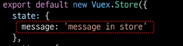
      
      - `$store.state`로 접근 가능
      
      - store의 state에 message 데이터 정의
   
   2. 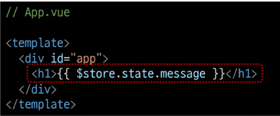
      
      - component에서 state 사용
   
   3. 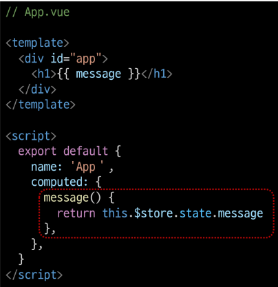
      
      - `$store.state`로 바로 접근하는 것보다 computed에 정의 후 접근 하는 것을 추천

2. actions
   
   1. state를 변경할 수 있는 mutations 호출
      
      - component에서 `dispatch()`에 의해 호출
        
        - `dispatch(A, B)`
          
          - A : 호출하고자 하는 actions 함수
          
          - B : 넘겨주는 데이터(payload) 
   
   2. 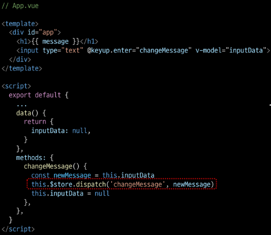
      
      - component에서 dispatch를 통해 actions를 호출 
   
   3. 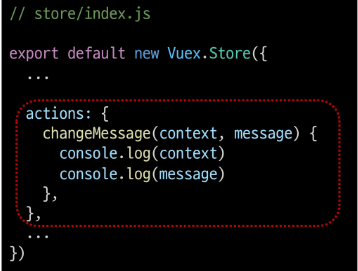
      
      - actions의 첫번째 인자 `context`
        
        - store의 전반적인 속성을 모두 가지고 있어 
          
          - context.state / context.getters를 통해 mutations를 호출 가능
        
        - `dispatch()`를 사용해 다른 actions도 호출 가능
        
        - actions에서 state를 직접 조작하는 것은 삼가야함
      
      - actions의 두번째 인자 `payload`
        
        - 넘겨준 데이터를 받아서 사용

3. mutations
   
   1. 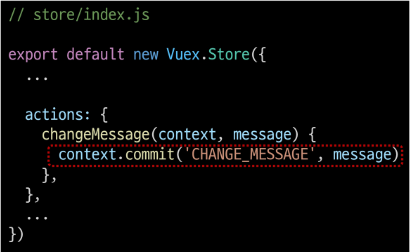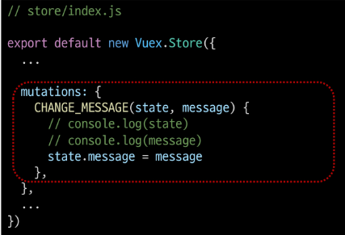
      
      - actions에서 `commit()`을 통해 mutations 호출
        
        - state를 변경하는 유일한 방법
        
        - coponent에서도 `commit()`을 통해 mutations 호출 가능
      
      - `commit(A, B)`
        
        - A : 호출하고자 하는 mutations 함수
        
        - B : payload

4. getters
   
   1. 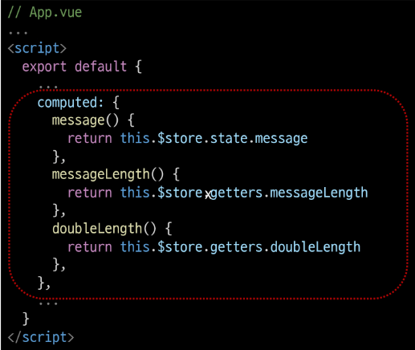
      
      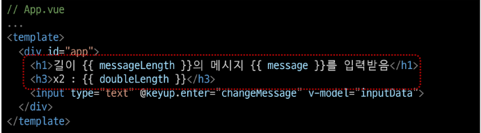
      
      - getters는 state를 활용한 새로운 변수
      
      - getters 함수의 첫번째 인자 `state` 두번째 인자 `getters`

---

## Lifecycle Hooks

- 각 vue 인스턴스는 생성과 소멸의 과정 중 단계별 초기화 과정을 거침
  
  - vue 인스턴스가 생성된 경우
  
  - 인스턴스를 DOM에 마운트 하는 경우
  
  - 데이터가 변경되어 DOM을 업데이트하는 경우

- 각 단계가 트리거가 되어 특정 로직 실행 가능

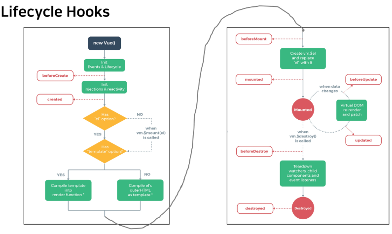

1. created
   
   - vue instance가 생성된 후 호출
   
   - data, computed 등 설정이 완료
   
   - 서버에서 받은 데이터를 vue instance의 data에 할당하는 로직을 구현
   
   - **mount 되지 않아 요소에 접근할 수 없음**
   
   - 실행 시 사진을 보여주고 싶으면 created 함수에 사진을 가져오는 함수를 추가하면 버튼을 누르지 않아도 기본사진이 출력

2. mounted
   
   - vue instance가 요소에 mount 된 후 호출
   
   - mount된 요소를 조작 가능
     
     - created에서 요소를 조작하면 mount 되기 전이기 때문에 DOM에 접근 할 수 없어 동작하지 않음

3. updated
   
   - 데이터가 변경되어 DOM에 변화를 줄 때 호출
- lifecycle hooks 특징
  
  - instance마다 각각의 lifecycle을 가지고 있음
  
  - life cycle hooks는 컴포넌트 별로 정의 가능
  
  - 부모 component의 mounted hook이 실행 되었다고 해서 
    
    - 자식이 mount 된 것이 아니고, 
  
  - 부모 component가 updated hook이 실행되었다고 해서
    
    - 자식이 updated된 것이 아님
  
  - 부착여부가 부모 자식 관계에 따라 순서를 가지고 있지 않음
    
    - instance마다 각각의 lifecycle을 가지고 있기 때문

---

## Local storage

- 브라우저의 local storage에 todo 데이터를 저장하여 브라우저를 종료하고 다시 실행해도 데이터가 보존될 수 있도록 하기

- `Window.localStorage`
  
  - 브라우저에서 제공하는 저장 공간 중 하나인 local storage에 관한 속성
  
  - 만료되지 않고 브라우저를 종료하고 다시 실행해도 데이터가 보존
  
  - 데이터가 문자열 형태로 저장
  
  - 관련 메서드
    
    - setItem(key, value) - key / value 형태로 데이터 저장
    
    - getItem(key) - key에 해당하는 데이터 조회
  
  - 저장하기
    
    - 데이터가 문자열 형태로 저장되어야 하기 때문에 JSON.stringify를 사용해 문자열로 변환해주는 과정 필요
    
    - state를 변경하는 작업이 아니기 때문에 mutations가 아닌 actions에 작성
    
    - 개발자도구 => application = > storage => local storage에 저장

- vuex-persistedstate
  
  - vuex state를 자동으로 브라우저의 local storage에 저장해주는 라이브러리
  
  - 페이지가 새로고침되어도 vuex state 유지
  
  - local storage에 저장된 data를 자동으로 state로 불러옴
  1. 설치
     
     `npm i vuex-persistedstate`
  
  2. 적용
     
     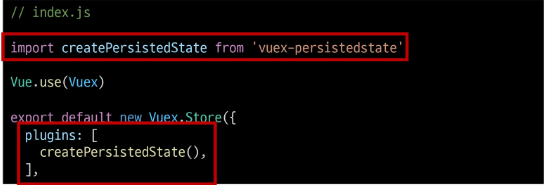
