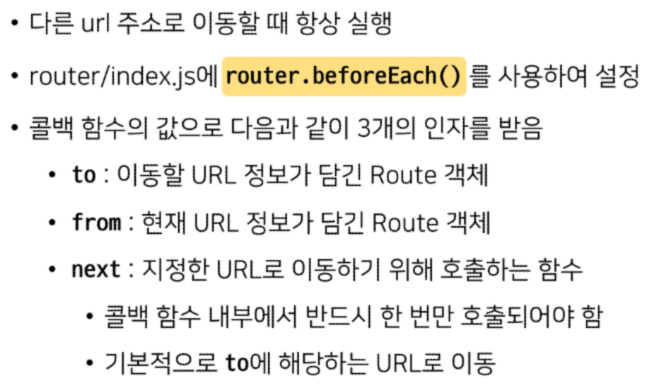

# Vue

---

## UX & UI

- UX(user experience)
  
  - 유저가 느끼는 느낌, 태도, 행동을 디자인
  
  - 사람들의 마음과 생각을 이해하고 정리해서 제품에 녹여내는 과정이 필요
  
  - 유저 리서치 데이터설계 및 정제 유저 시나리오, 프로토 타입 설계 등이 필요

- UI(User Interface)
  
  - 유저에게 보여지는 화면을 디자인
  
  - UX를 고려한 디자인을 반영, 이 과정에서 기능 개선 혹은 추가
  
  - interface
    
    - 서로 다른 두개의 시스템, 장치 사이에서 정보나 신호를 주고받는 경우의 접점
      
      - 사용자가 기기를 쉽게 동작 시키는데 도움을 주는 시스템
      
      - CLI (command line interface)
      
      - GUI (graphic user interface)
  
  - 심미적인 부분만 중요한 것이 아니라 사용자가 쉽고 편리하게 사용하는 것까지 고려해야함(통일성 중요)

---

## prototyping

- 애플리케이션의 프로토타입을 만드는 것

- 개발 중인 소프트웨어 프로그램 완성 전 버전을 만들어 중간마다 현재 상태 체크

---

## Vue router

- Routing
  
  - 네트워크에서 경로를 선택하는 프로세스
  
  - 웹 서비스에서의 라우팅
    
    - 유저가 방문한 URL에 대해 적절한 결과를 응답

- Routing in SSR
  
  - server가 모든 라우팅을 통제
  
  - URL로 요청이 들어오면 응답으로 완성된 HTML 제공
    
    - django로 보낸 요청의 응답 HTML은 완성본인 상태
  
  - URL(routing)에 대한 결정권을 서버가 가짐

- Routing in SPA/CSR
  
  - 서버는 하나의 HTML(index.html) 만을 제공
  
  - 이후에 모든 동작은 하나의 HTMl 문서 위에서 JavaScript 코드를 활용
    
    - dom을 그리는데 필요한 추가적인 데이터가 있다면 axios와 같은 AJAX 요청을 보낼 수 있는 도구를 사용하여 데이터를 가져오고 처리
    
    - 하나의 URL만 가질 수 있음

- Routing이 없다면
  
  - 유저가 URL을 통한 페이지의 변화를 감지할 수 없음
  
  - 페이지가 무엇을 렌더링 중인지에 대한 상태를 알 수 없음
    
    - 새로고침시 처음페이지로 돌아감
    
    - 링크를 공유할 시 처음 페이지만 공유 가능
  
  - 브라우저의 뒤로 가기 기능을 사용할 수 없음

---

## vue router

- SPA 상에서 라우팅을 쉽게 개발할 수 있는 기능 제공

- router 시작하기
  
  
  
  - history mode
    
    

---

- `router-link`
  
  

- `router-view`
  
  

- `src/Views`
  
  

---

- 프로그래밍 방식 네비게이션
  
  

- 선언적 방식 네비게이션
  
  

- lazy-loading
  
  

---

## Navigation Guard

- 종류
  
  - 전역 가드
    
    - 애플리케이션 전역에서 동작
    
    
  
  - 라우터 가드
    
    - 특정 URL에서만 동작
    
    
  
  - 컴포넌트 가드
    
    - 라우터 컴포넌트 안에 정의
    
    

---

