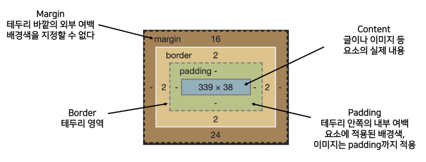

HTML은 무엇을 뜻할까요?

- Hyper Text Markup Language
  
  - hyperlinks and text markup language
  
  - home tool markup language
  
  - hyper tool markup language

---

마크업 스타일 가이드

- 2space
  
  - 1space
  
  - 3space
  
  - 4space

---

다음 중 닫는 태그가 없는 요소는

- br hr img input link meta는 닫는 태그가 없고
  
  - a div title h1 style 등은 있다

---

다음중 시맨틱 태그인 것은(의미적 가치를 지니는 것)

- h1 header nav aside section article footer a form table
  
  - nonsemantic : div spam 

---

인라인요소 / 블록요소

- 인라인 :글자처럼 취급

- 블록:  한줄 모두 사용

---

텍스트요소 : a b strong i em br img span

그룹컨텐츠 : p hr ol ul pre blockquote div

---

form : 데이터 제출용 태그

- attribute
  
  - action : 처리할 서버의 url
  
  - method : 제출할 때 사용할 http 메서드
  
  - enctype: 메서드가 포스트인 경우 데이터의 유형

---

CSS는 무엇을 뜻할까요?

- cascading style sheets
  
  - creative style sheets
  
  - computer style sheets
  
  - colorful style sheets

---

CSS 우선 순위

**!important > inline style > id선택자 > class선택자,속성선택자,pseudo-class > 요소 선택자,pseudo-elemnt> 소스 순서**

---

CSS 정의 방법

- 인라인 `<h1 style="color: blue; font-size:100px;">hello</h1>`

- 내부참조`<style>h1{color: blue; font-size:100px;}</style>`

- 외부참조`<link rel="stylesheet" href="xxx.css">`
  
  - `h1{color: blue; font-size:100px;}`

---

CSS selector

- selector 유형
  
  - 기본 선택자 
    
    - 전체 
    
    - 요소 : html 태그를 직접 선택 `태그명{}`
    
    - 클래스 : `.클래스명`으로 선택 `.클래스명{}`
    
    - 아이디 : 하나의 문서에 하나만 사용`#아이디명{}`
    
    - 속성
  
  - 결합자 
    
    - 자손결합자 인접형제결합자
  
  - 의사 클래스/요소
    
    - 링크 동적의사클래스
    
    - 구조적의사 기타의사 의사엘리먼트 속성선택자

---

```
a.html
<!DOCTYPE html>
<html lang="en">
<head>
    <meta charset="UTF-8">
    <meta http-equiv="X-UA-Compatible" content="IE=edge">
    <meta name="viewport" content="width=device-width, initial-scale=1.0">
    <title>Document</title>
    <link rel="stylesheet" href="a.css">
</head>
<body>
    <p>1</p>
    <p class="blue">2</p>
    <p class="green blue">3</p>
    <p class="blue green">4</p>
    <p id="red" class="blue">5</p>
    <h2 id="red" class="blue">6</h2>
    <p id="red" class="blue" style="color:yellow">7</p>
    <h2 id="red" class="blue" style="color:yellow">8</h2>    
</body>
</html>
```

```
a.css
h2{color: darkviolet !important}
p{color:orange}
.green{color:green}
.blue{color:blue}
#red{color:red}
```

orange

blue

blue **css 맨뒤에 있는 속성에 따라 결정됨**

blue **css 맨뒤에 있는 속성에 따라 결정됨**

orange

darkviolet

yellow

darkviolet

---

css 상속

- 상속되는것
  
  - text관련요소(color font text-align) opacity visibility

- 상속 안되는 것
  
  - box관련요소(width height margin padding border box-sizing,display)
  
  - position관련요소(position top right bottom left z-index)    

---

css 기본

- 크기단위
  
  - px(화소수 / 고정단위), %(백분율 / 가변단위) 
  
  - em(상속 영향 / 지정된 사이즈에 상대적인 배수단위)
  
  - rem(상속 안받음  **html의 사이즈 기준(16px)**으로 배수 단위 가짐)

```
<style>
 .font-big{font-size: 30px;}
 .em{font-size: 2em;}
 .rem{font-size: 2rem;}
</style>
<body>
    <ul class="font-big">
        <li>font-size</li>
        <li class="em">2em</li>
        <li class="rem">2rem</li>
    </ul>
</body>
```

30

60

32

---

크기단위

- viewport
  
  - 디바이스의 viewport 기준으로 상대적 사이즈 결정
    
    - 브라우저 크기에 따라 변함
  
  - vw / vh / vmin /vmx

---

색상단위

- background-color: red

- background-color: rgb(0,0,0)

- background-color: rgba(0,0,0,0.5) +투명도

- background-color: hsl(0,100%,100%) 색  채도 명도

- background-color: #000000 16진수로 표기

---

**결합자(combination)**

- 자손 결합자(**공백**)
  
  - A 하위의 모든 요소
  
  - ```
    <div>
        <span>1</span>
        <p>2</p>
        <p>
            <span>3</span>
        </p>
    </div>
    
    <style>
        div span{color: red}
    </style>
    ```
  
  - 1빨강 2흰 3빨강

- 자식결합자(**>**)
  
  - A 아래의 B요소
  
  - ```
    <div>
        <span>1</span>
        <p>2</p>
        <p>
            <span>3</span>
        </p>
    </div>
    
    <style>
        div > span{color: blue}
    </style>
    ```
  
  - 1파랑2흰3흰

- 일반형제 결합자(**~**)
  
  - A 형제요소 중 뒤에 위치하는 모든  B요소
  
  - ```
    <span>1</span>
    <p>2</p>
    <b>3</b>
    <span>4</span>
    <b>5</b>
    <span>6</span>
    
    <style>
        p ~ span{color: purple}
    </style>
    ```
  
  - 1흰2흰3흰4보라5흰6보라

- 인접형제 결합자(**+**)
  
  - A 형제요소 중 바로 뒤에 위치하는 B요소
  
  - ```
    <span>1</span>
    <b>2</b>
    <p>3</p>
    <span>4</span>
    <b>5</b>
    <span>6</span>
    
    <style>
        p + span{color: green}
    </style>
    ```
  
  - 1흰2흰3흰4초록5흰6흰

---

css 원칙

- 모든 요소는 박스모델(네모)

- 위에서 아래로(block direction) 왼쪽에서 오른쪽으로 쌓인다(inline direction)
  
  - normal flow(좌측 상단 시작)

- 네부분의 영역으로 이루어짐
  
  - margin : 배경 지정 불가
  
  - border : width/style/color 지정
  
  - padding : 배경 지정 가능
  
  - content
  
  - 
  
  - ```
    {margin :10px;}
    {margin :10px 20px;}
    {margin :10px 20px 30px;}
    {margin :10px 20px 30px 40px;}
    ```
    
    - 상10우10하10좌10
    
    - 상10우20하10좌20
    
    - 상10우20하30좌20
    
    - **상10우20하30좌40***
  
  - box-sizing
    
    - 일반적으로 박스 width를 설정하면 content 크기만 해당되어 보이는 크기는 content+border+padding이 더해져 더 큰 박스가 나온다
    
    - 박스크기를 설정하고 싶다면 border-box 크기인 content+border+padding의 합을 계산하여 설정한다.

---

CSS display

- display에 따라 크기와 배치가 달라진다

- {display: **block**}
  
  - **화면 전체 가로 차지**
  
  - **줄바꿈** 일어남
  
  - block 안에 lnline 들어갈 수 있음
  
  - div /ul /il /li /p /hr /form/ h1
    
    - div는 너비를 100% 차지
    
    - 너비를 px로 지정해주면 나머지는 margin으로 자동으로 차지
      
      - ```
        {text-align: left;} = {margin-right: auto;}
        {text-align: right;} = {margin-left: auto;}
        {text-align: center;} = {margin-right: auto; margin-left: auto;}
        ```

- {display: inline}
  
  - **content 너비만큼 가로 차지**
  
  - **줄바꿈 일어나지 않음**(행의 일부로 옆으로 쌓임)
  
  - width/height/margin-top/margin-bottom **지정 불가**
  
  - 상하 여백은 line-height로 지정
  
  - span / a / img / input / label / b / em / i / strong
    
    - 컨텐츠 영역만큼 너비 차지

- {display: inline-block}
  
  - block/inline 특성 모두 갖는다
    
    - inline처럼 한줄로 표시되나 block처럼 width/height/margin 속성 지정 가능

- {display: none}
  
  - 화면에 표시하지 않고 공간도 부여 안함
  
  - 차이점 : **visibility: hidden**은 화면은 표시하지 않고 공간은 차지함

___

CSS position

- 문서상 요소의 위치 설정

- static : 모든 태그의 기본값(기준위치)
  
  - 좌측상단(normal flow)
  
  - 부모요소 내에 배치 시 부모 요소의 위치 기준

- 이동 가능한 property
  
  - relative : 상대위치
    
    - 자기자신의 static 위치를 기준으로 이동(normal flow 유지)
    
    - relative요소가 차지하는 공간은 static일 때와 같다(offset으로 이동)
    
    - ```
      .relative{position:relative; top:100px; left:100px;}
      ```
      
      - 기존 위치를 사수한 후 이동한다(기존위치에 있지만 나타내는 것만 이동한것에 나타내는 효과)
  
  - absolute : 절대위치
    
    - 요소의 문서흐름을 제거 후 레이아웃에 공간을 차지하지 않음(normal flow 벗어남) - 공중에 떠 있음
    
    - static이 아닌 가장 가까이 있는 **부모/조상 요소를 기준으로 이동**(없으면 화면을 기준으로 이동)
    
    - ```
      .parent{position:relative;}
      
      .absolute{position:absolute; top:100px; left:100px;}
      ```
      
      - 부모를 기준으로 이동
      
      - 기존 위치를 내어주고 이동한다.(기존위치를 벗어나 실제로 이동하는 효과)
  
  - fixed : 고정위치
    
    - 요소의 문서흐름을 제거 후 레이아웃에 공간을 차지하지 않음(normal flow 벗어남) - 공중에 떠 있음
    
    - 부모요소에 관계 없이 viewport 기준으로 이동(스크롤해도 항상 같은 위치)
    
    - ```
      .fixed{postision:fixed; bottom:0px; right:0px;}
      ```
  
  - sticky : 스크롤에 따라 static에서 fixed로 변경
    
    - 속성을 적용한 박스는 평소에 position: static 상태이지만 스크롤을 하면 position:fixed로 박스를 화면에 고정하는 속성

---

css 원칙

1,2 normal flow 

- 좌측 상단 배치 / 디스플레이에 따라 크기와 배치 달라짐

3 position기준으로 위치변경

- relative

- absolute

- fixed

- sticky

---

크롬 개발자 도구

- elements 
  - dom 탐색 및 css 확인 변경
    
    - 추가 삭제 이동 편집 가능
  
  - 해당 요소의 html 태그
- style
  - 요소에 적용된 css 확인
- computed
  - 스타일이 계산되 최종 결과
- event listeners
  - 해당요소에 적용된 이벤트(JS)

---

float

- 박스를 이동시켜 텍스트를 포함 인라인 요소들이 주변을 wrapping 하도록 함

- normal flow를 벗어남
  
  - none 기본값
  
  - left 왼쪽으로 띄움
  
  - right 오른쪽으로 띄움

---

flexbox

- 행과 열 형태로 아이템을 배치하는 1차원 레이아웃 모델
  
  - flexbox에서 가능해진 것
  1. 수직 정렬 
  
  2. 아이템의 너비와 높이 혹은 간격을 동일하게 배치가 가능해짐

- 축
  
  - main axis
  
  - cross axis

- 구성요소
  
  - flex container(부모요소)
    
    - .flex-container{**display: flex**(or inline-flex);}
    
    - flexbox 레이아웃의 가장 기본적인 모델
    
    - flex item이 놓여지는 영역
  
  - flex item(자식요소)
    
    - 컨테이너에 속해 있는 컨텐츠
    
    - **{flex-item}**
  
  - **flex-direction(배치설정)**
    
    - main axis 기준 방향 설정
    
    - {flex-direction:row}
      
      - main 왼 오
      
      - cross 위 아래
    
    - {flex-direction:row-reverse}
      
      - main 오 왼
      
      - cross 위 아래
    
    - {flex-direction:column}
      
      - main 위 아래
      
      - cross 왼 오
    
    - {flex-direction:column-reverse}
      
      - main 아래 위
      
      - cross 왼 오
  
  - **flex-wrap(배치설정)**
    
    - 요소들이 강제로 한줄에 배치될 것인지 여부 설정
    
    - {flex-wrap:wrap}
      
      - 줄바뀜이 일어남(아이템이 컨테이너 내에 배치되도록 설정)
    
    - {flex-wrap:nowrap}(기본값)
      
      - 한줄로 모두 표시
  
  - **flex-flow(배치설정)**  = flex-direction + flex-wrap
    
    - {flex-flow:row norwrap;}
  
  - **justify-content(main-axis/공간나누기)**
    
    - {justify-content:flex-start}
      
      - main axis 시작으로 배치
    
    - {justify-content:flex-end}
      
      - main axis 끝으로 배치
    
    - {justify-content:center}
      
      - main axis 중간으로 배치
    
    - {justify-content:space-between}
      
      - main axis 양옆으로 배치
    
    - {justify-content:space-around}
      
      - main axis 기준으로 아이템 양 옆이 같게 배치
    
    - {justify-content:space-evenly}
      
      - main axis 기준으로 간격이 모두 같게 배치
  
  - **align-content(cross-axis/공간나누기)**
    
    - 두줄 이상일 때만 확인가능
    
    - {align-content:flex-start}
      
      - cross axis 시작으로 배치
    
    - {align-content:flex-end}
      
      - cross axis 끝으로 배치
    
    - {align-content:center}
      
      - cross axis 중간으로 배치
    
    - {align-content:space-between}
      
      - cross axis 양옆으로 배치
    
    - {align-content:space-around}
      
      - cross axis 기준으로 아이템 양 옆이 같게 배치
    
    - {align-content:space-evenly}
      
      - cross axis 기준으로 간격이 모두 같게 배치
  
  - **align-items(모든 아이템을 cross-axis기준으로 정렬)**
    
    - {align-items:strech}
      
      - cross axis 방향으로 늘림(컨테이너 가득 채움)
    
    - {align-items:flex-start}
      
      - cross axis 방향 시작
    
    - {align-items:flex-end}
      
      - cross axis 방향 끝
    
    - {align-items:center}
      
      - cross axis 방향 가운데
    
    - {align-items:baseline}
      
      - cross axis 방향으로 텍스트 baseline으로 기준선 맞춤
  
  - **align-self(개별 아이템을 cross-axis기준으로 정렬)**
    
    - {align-self:strech}
    
    - {align-self:flex-start}
    
    - {align-self:flex-end}
    
    - {align-self:center}
  
  - **flex-grow**
    
    - 남은 영역을 아이템에 분배
    
    - {**flex-grow:남은 영역에서 배분할만큼의 숫자**}
  
  - **order**
    
    - 배치순서
    
    - order 설정 안하면 0으로 취급
    
    - {**order:숫자**}
  
  ---
  
  bootstrap
  
  - 빠르고 가장인기 있는 responsive site
  
  - CDN
    
    - content delivery(distribution) network
    
    - 컨텐츠(css,js,image,text) 효율적 전달
    
    - 장점
      
      - end user의 가까운 서버를 통해 빠르게 전달
      
      - 외부 서버를 활용하여 본인 서버 부하 감소
  
  - html에 사용시 download link를 설정해주어야 함
  
  ---
  
  
  
  - spacing
    
    - **class={property}{sides}-{size}**
      
      - {property}
        
        - margin = m
        
        - padding = p
      
      - {sides}
        
        - top = t
        
        - bottom = b
        
        - start = s
        
        - end = e
        
        - left, right = x
        
        - top, bottom = y
        
        - 빈칸 = 모든 방향 전부
      
      - **{size}**
        
        - 0 = 0
        
        - 1 =spacer(16px) *.25  = 4px
        
        - 2 = spacer *.5 = 8px
        
        - 3 = spacer  = 16px
        
        - 4 = spacer *1.5 = 24px
        
        - 5 = spacer 3 = 48px
        
        - auto
          
          - mx-auto = 수평 중앙 정렬
          
          - ms-auto = 오른쪽 정렬
          
          - me-auto = 왼쪽 정렬
  
  ---
  
  - color
    
    - bg-primary : 배경색
    
    - text-secondart : 글자색
  
  ---
  
  - text
    
    - class="text-start/center/end"
      
      - 위치 설정
    
    - class="text-decoration-none"
      
      - 밑줄제거
    
    - class="fw-bold/normal/light"
      
      - 글씨 굵기
    
    - class="fst-italic"
      
      - 글씨 스타일
  
  ---
  
  - display
    
    - class="d-inline"
      
      - {display: inline-flex}
    
    - class="fixed-top"
      
      - {position: fixed; top:0px}
  
  ---
  
  - component
    
    - html과 css가 모두 설정된 component 제공
    
    - button
      
      - type = "button" class="btn btn-색상"
    
    - dropdown
      
      - class = "dropdown"
    
    - form
      
      - <label for="a">for 와 <input id="a"> id를 같게 써서 연결 시켜준다
    
    - navbar
      
      - class="navbar"
    
    - carousel
      
      - 컨텐츠 순환시키기 위한 슬라이드쇼
    
    - modal
      
      - 사용자와 상호작용하여 긴급상황 알림
      
      - 현재 페이지 위에 또다른 알림
      
      - 이동시 다른 배경 클릭시 사라짐
      
      - modal 코드를 가장 상위에 써야 오류가 안생김
      
      - <button data-bs-target="a">과 modal의 <div id="a">를 같게 써서 연결
    
    - card
  
  ---
  
  - responsive web : 디바이스 크기에 따라 크기가 달라짐
    
    - 종류 media queries /flexbox / bootstrap grid system/ the viewport meta tag
  
  - **grid system**
    
    - 요소의 배치와 디자인
    
    - 기본요소
      
      - column : 실제 컨텐츠 포함하는 부분
      
      - gutter : column과 column 사이 공간
      
      - container : column을 담고 있는 공간
    
    - bootstrap grid system은 flexbox로 제작
      
      - 12개의 column / 6개의 grid breakpoints
      
      - column
        
        - 한줄에 12개가 들어가고 몇개를 배정해 줄것인지 정함
        
        - offset을 사용하면 요소 앞에 column 칸을 지정해 줌
      
      - ```
        <div class="container">
          <div class="row">
            <div class="col"></div>
            <div class="col"></div>
            <div class="col"></div>
          </div>
        </div>
        ```
      
      - breakpoint
        
        - col-{breakpoint}-{원하는 크기(1~12)}
        
        - | Breakpoint        | Class infix | Dimensions |
          | ----------------- | ----------- | ---------- |
          | Extra small       | *None*      | <576px     |
          | Small             | `sm`        | ≥576px     |
          | Medium            | `md`        | ≥768px     |
          | Large             | `lg`        | ≥992px     |
          | Extra large       | `xl`        | ≥1200px    |
          | Extra extra large | `xxl`       | ≥1400px    |
    
    
